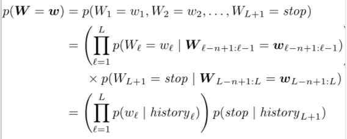
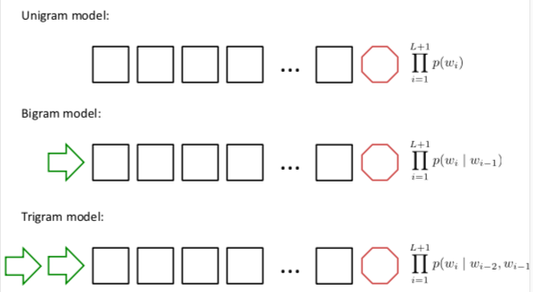
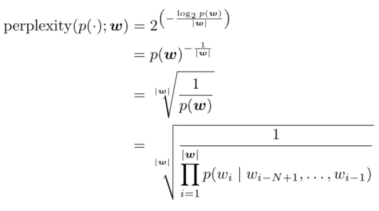
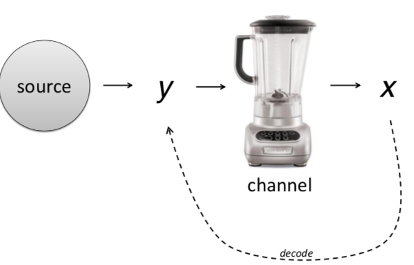

This course is taught [Alan Black](http://www.cs.cmu.edu/~awb/) by from [here](http://demo.clab.cs.cmu.edu/NLP/). He is an excellent professor.  

### Language Model

- In natural language, there are multiple layers, including morphology (analysis of words into meaningful components), lexemes(part of speech tagging, words with multiple meanings), syntax, semantics(deal with scope ambiguity), pragmatics(non-local meaning), discourse(context sequence). 

- NLP application: information extraction, NER, reference resolution, relation detection, information retrieval, question-answer system.

- NL morphology: use finite state automaton to represent the word regular form, plural, or irreg-sg-noun. Besides, finite state transducers can also represented for morphological parsing. (Table, trie, fst) -> stemming, tokenization. So morphology can be used for word parsing in sentences. 

- Language model: see one sentence probability. So even the words in two sentences may be the same, but the real sentence should be higher probability. Be careful about the stoped word. With language model, we can get the generated sentence. Unigram, bigram, trigram model. 

  

  

   To know the perplexity:

  

  - LM smoothing: add one to all with known vocabulary. But for OOV, it can not be represented. Can set one word, UNKNOWN. 

  - Good-Turing Smoothing: update count number. $c = (c+1) \frac {(N_{c+1)}} {N_c}$

  - Backoff: no trigram, using bigram, no bigram, use unigram, no unigram, smooth.

### Classification

- Noise channel: 

  it means the results y will go through channel and we will observe X, then we can get y from the observed X. 

In NLP, there are syntax, parsing, treebank, lexical semantics, interpretation and etc. 

To learn the NLP domain, you can learn the following the courses:

UCB： [CS 294-5: Statistical Natural Language Processing](https://link.zhihu.com/?target=https%3A//people.eecs.berkeley.edu/~klein/cs294-5/index.html)

JHU：[Natural Language Processing](https://link.zhihu.com/?target=http%3A//www.cs.jhu.edu/~jason/465/)

Columbia： [COMS W4705: Natural Language Processing](https://link.zhihu.com/?target=http%3A//www.cs.columbia.edu/~cs4705/)

UIUC： [Machine Learning and Natural Language](https://link.zhihu.com/?target=http%3A//l2r.cs.uiuc.edu/~danr/Teaching/CS598-05/)

UP： [CSE477-Ling549: Mathematical Techniques in Linguistics, Fall 2008](https://link.zhihu.com/?target=http%3A//www.cis.upenn.edu/~cis477/)

UTAH： [CS 5340/6340: Natural Language Processing](https://link.zhihu.com/?target=http%3A//www.eng.utah.edu/~cs5340/)

WISC： [CS 838-1: Advanced Natural Language Processing](https://link.zhihu.com/?target=http%3A//pages.cs.wisc.edu/~jerryzhu/cs838.html)

CMU： [11-611： NLP](https://link.zhihu.com/?target=http%3A//demo.clab.cs.cmu.edu/NLP/)

​    

I think in NLP domain, the most commercial applications are search engine(Google), recommendation system(Facebook). The other domains like interpretation, question answering, consersation assistant are also the excellent points for future career. But I will stick to the Autonomous Driving Domain~
