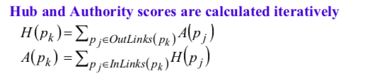

All following knowledge is conclusion from [Jamie Callan](https://boston.lti.cs.cmu.edu/classes/11-642/). By the way, he is the most friendly and helpful professor I have met. 

## Basic Rules 

**Bag of word model:** ignore word order, discard some meaningless words like "the", transfrom words into terms. 

**Heap's law** predict the number of vocabulary size. 

**Zipf's law:** the ratio of the item in the word collection is relative to its ranking. A/R. 

Term frequency: number of term appear in one document (tf)

Document frequency: the number of documents contain a spedific term (df)

Search engine is to satisfy the information need (with query) with a corpus of documents (with structured documents)

## Query Operator 

- "AND", "OR", "NEAR/n".

- Query can be represented as tree. Like (tomorrow OR today) AND rain. Most of the time the query is represented as prefix representation like cat AND dog is AND (cat dog)
- document can be represented as free-text indexing and full-text indexing. And every term can be represented as inverted lists. The list of document is a vector which is sparse. So the inverted list is used(binay, frequency, positional). Inverted index consists of inverted lists and access mechanism.  (B-Tree and hash table). 
- Ranked boolean and unranked boolean: wetather the term frequency is considered or not. In ranked boolean, tf*idf is used, term frequency and inverted document frequency. Log(N/df). 
- Ranked method is hard to get good balance of precision and recall. 
- Query processing order: TAAT(Term-at-a-time, memory will not suitable) and DAAT(document at one time, more complex implementation like nested loops, using recursive tree).  
- Query parsing: QryEval is excellent abstract class, the heritage class can be operation subclass or term subclass. This is a kind of DAAT query parsing. Complex query like: #AND(a #OR(b c) d). First build object #AND, and eliminate "()". And get "a #OR(b c) d", if it's a term, build term object and append it to the current operator object. If it's a operator, call recursive.  

## Evaluation Results 

- Compare the top retrieved documents with top relative documents. So the precision and recall can be used. If ranking is not consideted. We call it P@n. The P and R will produce F measure. 

- If rankind is considered, NDCG@k is used. Gain divide discount(rank). RBP considers ranking than NDCG. 

- In web search, to compare two methods, we can use interleaving method combining ranking results from two methods. Like d11, d22, d16, d25, …. Use random bit to produce documents. The clicked results can be used for verification of better method. Like IoU.

## Information Need 
- Informational, transactional, navigation, commercial, local. 
- Web query: 1 to 3 words. 
- Unstructured query transform to structured queries with query language. 
- Use query will be formed into structured query by query processing and query reformulation. Query processing includes case conversion, stopword removal and stemming, abbreviations, phrases, spelling correction. Some search engine will consider the sequential dependency models. 

## Document Representation and Structure

- Description: convert documents tokens into index term. 
- Steps: format parsing(parse different page format into canonical format), then using NLP lexical analyzer transforms into index terms. Finally, the index terms will be indexed structure data. 
- Know controlled vocabulary. On the contrary, there is free text indexing. Using an uncontrolled vocabulary, and may miss sth. In Google, the full text indexing is used. The methods like tokens, stopwords, morphological processing is used in full text indexing. There are also urls, title, body and inlinks.  
- Document can be structured into fields(divide the document into different domain). Divede the webpage into different field, then combining them together(Like Lucene). So there is more operator like #WAND and #WSUM for ranking. So the retrieval methods vector spaces, Okapi BM25F, Indtri can work well. Field is independet. 
- Hierarchical documents structrue: XML. Indri support elements retrieval. 

## Best Match Method 

- Vector space retrieval model: 
  - consine similarity: the dot product of two document vectors divide the multiple of two documents vector norm2. Only term frequency is considered, but the term weight, document term weight, lenght normalization is not included. 
  - vector space model: Inc.Itc. Invrse document frequency(idf), df: number of documents
  - 
  - 
  - Lucene: two stages-> Boolean query first hen rank the documents. The above qtf can be page rank weight. 
  - 
  - Okapi BM25: consider document length. Support unstructured queries.
  - 
  - language model: n gram model 
  - query likelihood: p(d | q) equal p(q | d) p(d) equal  p(q | d). 
  - 
  - KL-Divergence:
  -  
  - Compare with Likelihood: 
  - 
  - Indri: statistical language models with Bayesian inference networks. There is WAND and WSUM in indri.
  - 
  - Support following operator:
  - 

##Indexing 

- To build the search engine, the architecture looks like below:
- 
- Inverted list optimizations: skip lists. 
- Forward indexes: know one document what terms appears. With form docid->[iterms id]->[location]
- In Indri, we can get the forward indexes from **indri::index** or **QueryEnvironment class**. There will include fields, stems and positions. 
- Documents structure: explicit markup(html); multiple repersentation(fileds); annotations(NER). Store in separate vocabularies. Parse documents as trees. 
- Indri index: manifest(metadata); statistics; term dictiionary; inverted lists; compressed collection. A sequence of documents. 
- Lucene indexs: segments; segment info(segment info, field names, stored field values, dictionary, frequency data, proximity data, term vector and etc).
- Index update: divide static/dynamic components.
- Delete documents: create deleted lists. When deleted lists becomes large, use garbage collect.
- Web search index: using **distributed indexes**. Partitioned index like shards. Many copies are used replication(improve parallelism and fault tolerance). The partition index assignments can be random assignment and source based assignment. **Tiered Indexes** uses two tiers for web search. Tier 1 first, then tier 2 next. Pages ranks are used to rank documents for which tier. The map-reduce framework can be used here. Caching popular results and inverted lists. Score can be qtf/dtf.

## Pseudo Document Retrieval 

- unsupervised learning method, make query more similar to relative documents. 
- Okapi relevance feedback: (the term is assigned with new weight)
- 
- Indri pseudo relevance feedback:
- 
- calculate score for every term then choose top m terms. 
- 
- Conclusion: select n top documents; then select top m terms based on tf.idf or similar. Form new queries and retrieve documents.

## LeToR and CNN Ranking 

- Training data can be binay assessment, document score, preference of two documents, rankings. 
- Pointwise: {rel, irrel}, is -1 or +1. Or relevance levels. {4,3,2,1,0}. The classifier can only judge the relevance level, not the ranking. 
- Pairwise: input two documents (di, dj), produce the preference of these two documents. 
- Listwise: train with a list of documents and produce ranking. The optimization score can be the ranking probability. Training data is not easy. 
- In CNN ranking, there are representation-based and interaction-based. Each text can be expressed as word2vec like DSSM,C-DSSM. Then neural network. Interaction based will produce pattern match between two text like cosine similarity. (DRMM)
- DSSM:
- 
- DRMM: 
- 

## Authority 

- Pagerank: random walk algorithms for web page follow or choose another in the datasets(teleportation). It can regard as voting algorithms. 
- 
- Pesudo code:
- 
- Topic-sensitive pageRank(TSPR): the teleportation probability is not random. Every page is assigned to one page. The query term can be reweight to different topic, then sum them up.
- T-Fresh: when new pages added. For old pages, there is a decay exponentially. 
- HITS: hyperlink-induced topic search. Two important web pages, like hub(contain other good contents) and authority(a page that has good content). 
- 

## Spam Webpage Filter 

- Web spam: web pages designed to deceive or manipulate search engines. Deliver misleading content to crawler(web servers deliver different content to differnt request; redirect page); manipulate authority metrics(PageRank); manipulate content based ranking of the page. 
- Content: URL features(stealing a domain name or the domain name that expired recently, domain packing, URL length, top level domain, IP address). Content based feature(number of words; number of words in page title, average lenght of words, manifactired web pages)  

## Diversity

- Short query will have multiple definition. But if we just follow the document ranking, we may get nothing we want. So the retrieval results should have diversity to improve the recall. 
- To diversity, interpretation of the origin query. Different tasks for each interpretation. 
- Diversity metrics: precision-IA@k. Consider different intents. 
- Implicit Diversity methods: MMR. Choose the documents is not relevant to previous choosed documents. 
- 
- 
- For similarity comparing, the KL divergence can be used. 
- Explicit Methods: expand the query from different meaning. So there are suggested queries and related queries. 
- Explicit xQuAD, PM-2, DSP Approx.

