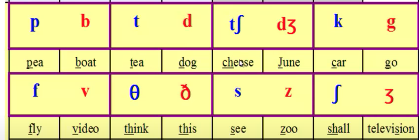
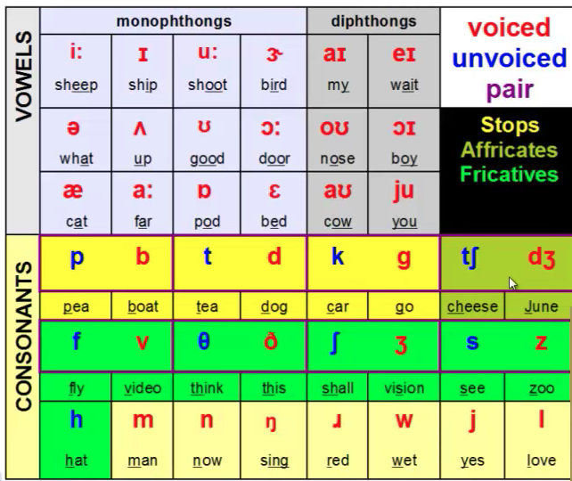

```
r: rain /rein/, drain /drein/, berry /'beri/, turn /tern/, will not drop r. 
t: table /ta/, attain, what, cut. drop the t. 
t in the middle will become d. Saturday /saderdei/, waiter /weide/, matter /mader/, ata /ade/, what about /wadebaut/, party /pardi/, sort of /sodaf/, part of /pardaf/, centre /sene/, interview /inevju/, internet /inernet/ 两个元音之间

z: /zi/; new: /nu/; adult /edult/, brochure /broufur/, garage /ge'rag/, address /adress/, laboratory /labre, tori/, route /raute/, advertisement /adver'taizment/, contravercy /kontre' vercy/, patent /'patent'/, vase /veis/, enquiry /'inkweri/, leisure /'liger/, either /'ger/, neither /'niger/, 
```


```c++
ou. Large jaw
a: hot /hat/, honest /anist/, mom /mam/, top /ta/
e: Can /ken/, ham 夸张的那种e那种。thanks。
3: girl, world, first, worst.   
```


https://www.youtube.com/watch?v=LIZ78RwhSPc


```
sounds ds -> z.
```


Basics: https://www.youtube.com/watch?v=BuXQHr5LaSE


Mountain -> en, [ref](https://www.zhihu.com/zvideo/1381651295405703168) [Ref2](https://www.youtube.com/watch?v=6cobicdw98o)

```c++
dent, tain, ton, tant -> en
```







