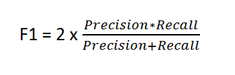
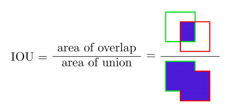

### Precision && Recal


### F1




### IOU



Calculate IoU:  calculate overlap area & all area. 


heading error.


### Polygon

```c++
// Area
// Using cross prod & divide by 2(triangle)
// https://zhuanlan.zhihu.com/p/110025234

// Interaction area

// Point in polygon
// using cross prod to get direction.

// 角度跳变。 0 - 360，使用sin值进行平滑，不存在跳变，使用 arc sin计算0 - 360度。
```


Ref：

A Comparative Analysis of Object Detection Metrics with a Companion Open-Source Toolkit

https://towardsdatascience.com/evaluating-performance-of-an-object-detection-model-137a349c517b

A Survey on Performance Metrics for Object-Detection Algorithms


