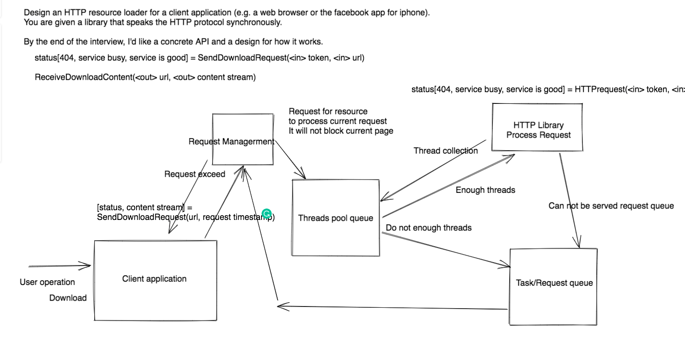

```c++
// Onsite preparation
// 26. Remove Duplicates from Sorted Array
int removeDuplicates(vector<int>& nums) {
  int slow = 0;
  int fast = 1;
  while (fast < nums.size()) {
    if (nums[fast] != nums[slow]) {
      ++slow;
      nums[slow] = nums[fast];
    }
    ++fast;
  }
  return nums.empty()?0:slow + 1;
}

// 297. Serialize and Deserialize Binary Tree
class Codec {
 public:
  string serialize(TreeNode* root) {
    queue<TreeNode*> que({root});
    string str;
    while (!que.empty()) {
      int size = que.size();
      for (int i = 0; i < size; ++i) {
        const auto tp = que.front();
        que.pop();
        if (tp) {
          que.push(tp->left);
          que.push(tp->right);
          str += to_string(tp->val) + ",";  
        } else {
          str += "n,";
        }
      }
    }
    return str;
  }

  // Decodes your encoded data to tree.
  TreeNode* deserialize(string data) {
    if (data.empty()) return nullptr;
    TreeNode* root = nullptr;
    queue<TreeNode*> que;
    int cur = 0;
    int count = 0;
    bool neg = false;
    for (int i = 0; i < data.size(); ++i) {
      if (data[i] == ',') {
        TreeNode* tmp = cur < -1000? nullptr:new TreeNode(neg?-cur:cur);
        if (!root) {
          root = tmp;
        } else {
          while (!que.empty()) {
            auto tp = que.front();
            if (!tp) {
              que.pop();
              continue;
            }
            if (!count) tp->left = tmp;
            else tp->right = tmp;
            ++count;
            if (count == 2) {
              count = 0;
              que.pop();
            }
            break;
          }
        }
        que.push(tmp);
        cur = 0;
        neg = false;
      } else if (data[i] == 'n') {
        cur = -1001;
      } else if (data[i] == '-') {
        neg = true;
      } else {
        cur = cur*10 + data[i] - '0';
      }
    }
    return root;
  }
};

// 695. Max Area of Island
int maxAreaOfIsland(vector<vector<int>>& grid) {
  if (!grid.size() || !grid[0].size()) {
    return 0;
  }
  int row = grid.size();
  int col = grid[0].size();
  priority_queue<int> cur_island; 
  int cnt_res = 0;
  const int MAX_SIZE = 50;
  int dirs[4][2] = { {-1, 0}, {0, 1}, {1, 0}, {0, -1} };
  const int NUM_DIR = 4;
  for (int r = 0; r < row; ++r) {
    for (int c = 0; c < col; ++c) {
      if (!grid[r][c]) {
        continue;
      }
      cur_island.push(r*MAX_SIZE + c);
      grid[r][c] = 0;
      int cnt = 1;
      while (!cur_island.empty()) {
        int tp = cur_island.top();
        cur_island.pop();
        for (int idx = 0; idx < NUM_DIR; ++idx) {
          int cur_r = tp/MAX_SIZE + dirs[idx][0];
          int cur_c = tp%MAX_SIZE + dirs[idx][1];
          if (cur_r < 0 || cur_c < 0 || 
              cur_r >= row || cur_c >= col ||
              !grid[cur_r][cur_c]) {
            continue;
          }
          ++cnt;
          cur_island.push(cur_r*MAX_SIZE + cur_c);
          grid[cur_r][cur_c] = 0;
        }
      }
      cnt_res = max(cnt_res, cnt);  
    }
  }
  return cnt_res;
}

// 20. Valid Parentheses
bool isValid(string s) {
  stack<char> record;
  unordered_map<char, char> pattern;
  pattern[')'] = '('; 
  pattern[']'] = '[';
  pattern['}'] = '{';      
  for (auto c:s) {
    if (c == '(' || c == '[' || c == '{') {
      record.push(c);
    } else {
      if (record.empty() || record.top() != pattern[c]) {
        return false;
      }
      record.pop();
    }
  }
  return record.empty();
}

// 31. Next Permutation
void nextPermutation(vector<int>& nums) {
  int index = nums.size() - 1;
  while (index - 1 >= 0 && nums[index - 1] >= nums[index]) 
    --index;
  --index;
  if (index < 0) {
    reverse(nums.begin(), nums.end());
    return;
  }
  int k = index + 1;
  while (k < nums.size() && nums[k] > nums[index]) 
    ++k;
  --k;
  swap(nums[k], nums[index]);
  reverse(nums.begin() + index + 1, nums.end());
}

// 34. Find First and Last Position of Element in Sorted Array
int BinarySearch(vector<int>& nums, int target, bool status) {
  if (!nums.size()) return -1;
  int stt_idx = 0;
  int fin_idx = nums.size() - 1;
  int mid = -1;
  while (stt_idx + 1 < fin_idx) {
    mid = stt_idx + (fin_idx - stt_idx) / 2;
    if (nums[mid] > target) fin_idx = mid;
    else if (nums[mid] < target) stt_idx = mid;
    else if (!status) fin_idx = mid;
    else stt_idx = mid;
  }
  bool stt_status = nums[stt_idx] == target;
  bool fin_status = nums[fin_idx] == target;
  if (!status) {
    if (stt_status) return stt_idx;
    if (fin_status) return fin_idx;  
  } else {
    if (fin_status) return fin_idx;
    if (stt_status) return stt_idx;
  }
  return -1;
}  
vector<int> searchRange(vector<int>& nums, int target) {
  int left_idx = BinarySearch(nums, target, 0);
  int right_idx = BinarySearch(nums, target, 1);
  return {left_idx, right_idx};
}

// 1428. Leftmost Column with at Least a One
int leftMostColumnWithOne(BinaryMatrix &bm) {
  const auto& dims = bm.dimensions();     
  const int row = dims[0];
  const int col = dims[1];
  int l = 0;
  int r = col - 1;
  unordered_map<int, int> record;
  while (l + 1 < r) {
    const int mid = l + (r - l)/2;
    int cnt = 0;
    for (int i = 0; i < row; ++i) {
      if (bm.get(i, mid)) {
        ++cnt;
      }
    }
    record[mid] = cnt;
    if (cnt >= 1) {
      r = mid;
    } else {
      l = mid;
    }
  }
  if (record.find(l) == record.end()) {
    for (int i = 0; i < row; ++i) {
      if (bm.get(i, l)) {
        ++record[l];
      }
    }
  }
  if (record.find(r) == record.end()) {
    for (int i = 0; i < row; ++i) {
      if (bm.get(i, r)) {
        ++record[r];
      }
    }
  }
  if (record[l] >= 1) return l;
  if (record[r] >= 1) return r;
  return -1;
}

// 953. Verifying an Alien Dictionary
bool isAlienSorted(vector<string>& words, string order) {
  unordered_map<char, int> order_map;
  for (int i = 0; i < order.size(); ++i)
    order_map[order[i]] = i;
  for (int i = 1; i < words.size(); ++i) {
    if (Bigger(words[i-1], words[i], order_map))
      return false;
  }
  return true;
}
bool Bigger(const string& s1, const string& s2, 
            unordered_map<char, int>& order_map) {
  for (int i = 0; i < s1.size(); ++i) {
    if (s2.size() <= i) return true;
    if (order_map[s1[i]] > order_map[s2[i]])
      return true;
    else if (order_map[s1[i]] < order_map[s2[i]])
      return false;
  }
  return false;
}  

// 42. Trapping Rain Water
int trap(vector<int>& heights) {
  if (heights.empty()) return 0;
  stack<int> record;
  int count = 0;
  for (int i = 0; i < heights.size(); ++i) {
    while (!record.empty() && heights[i] >= heights[record.top()]) {
      const int mid = record.top();
      record.pop();
      if (record.empty()) break;
      const int left = record.top();
      count += (min(heights[left], heights[i]) - heights[mid])*
               (i - left - 1);
    }
    if(record.empty() || heights[record.top()] > heights[i]) {
      record.push(i);
    } 
  }
  return count;
}

// 46. Permutations
void Permutate(const vector<int>& nums, vector<vector<int>>& ans,
              vector<int>& record, vector<int> tmp, idx) {
  if (tmp.size() == nums.size()) {
    ans.push_back(tmp);
    return;
  }
  for (int i = 0; i < nums.size(); ++i) {
    if (!record[i]) {
      tmp.push_back(nums[i]);
      record[i] = true;
      Permutate(nums, ans, record, tmp);
      record[i] = false;
      tmp.pop_back();
    }
  }
}  
vector<vector<int>> permute(vector<int>& nums) {
  vector<vector<int>> ans;
  vector<int> record(nums.size() + 1, false);
  vector<int> tmp;
  Permutate(nums, ans, record, tmp, idx);
  return ans;
}

// 47. Permutations II
void Permutate(vector<int>& nums, vector<vector<int>>& ans, 
               const int idx) {
  if (idx == nums.size()) {
    ans.emplace_back(nums);
    return;
  }
  for (int i = idx; i < nums.size(); ++i) {
    if (nums[i] != nums[idx] || i == idx) {
      swap(nums[i], nums[idx]);
      Permutate(nums, ans, idx+1);
      swap(nums[i], nums[idx]);
    }
  }
}  
vector<vector<int>> permuteUnique(vector<int>& nums) {
  vector<vector<int>> ans;
  Permutate(nums, ans, 0);
  return ans;
}

// 1198. Find Smallest Common Element in All Rows
int smallestCommonElement(vector<vector<int>>& mat) {
  if (!mat.size() || !mat[0].size()) {
    return -1;
  }
  int rows = mat.size();
  int cols = mat[0].size();
  vector<int> idxs(rows, 0);
  int cur_com = mat[0][0];
  int num_com = 0;
  while (true) {
    for (int idx = 0; idx < rows; ++idx) {
       bool meet = true;
       while (idxs[idx] < cols && mat[idx][idxs[idx]] < cur_com) {
         ++idxs[idx];
       }
       if (idxs[idx] < cols && mat[idx][idxs[idx]] == cur_com) {
         ++num_com;
         ++idxs[idx];
       } else {           
         if (idxs[idx] < cols) {
           if (mat[idx][idxs[idx]] == cur_com) {
             ++num_com;
             ++idxs[idx];
           } else {
             num_com = 1;
             cur_com = mat[idx][idxs[idx]];
             ++idxs[idx];
          }
        } else {
           meet = false;
        }
      }
      if (num_com == rows) {
        return cur_com;
      }
      if (idxs[idx] == cols && !meet) {
        return -1;
      }
    }
  }     
  return num_com;
}

// 246. Strobogrammatic Number
bool isStrobogrammatic(string num) {
  unordered_map<char, char> num_mp;
  num_mp['1'] = '1';
  num_mp['0'] = '0';
  num_mp['8'] = '8';
  num_mp['6'] = '9';
  num_mp['9'] = '6';      
  int fin_idx = num.size() - 1;
  int stt_idx = 0;
  while (stt_idx <= fin_idx) {
    if (num_mp.find(num[stt_idx])==num_mp.end() 
     || num_mp[num[stt_idx]] != num[fin_idx]) {
      return false;
    }
    ++stt_idx;
    --fin_idx;
  }
  return true;
}

// 347. Top K Frequent Elements
void QuickSelect(vector<pair<int, int>>& freqs, const int k, const int l,
                 const int r) {
  if (l >= r) return;
  int i = l - 1;
  int j = r + 1;
  const int mid = freqs[(r - l)/2 + l].second;
  while (i < j) {
    do {
      ++i;
    } while (freqs[i].second > mid);
    do {
      --j;
    } while (freqs[j].second < mid);
  
    if (i < j) {
      swap(freqs[i], freqs[j]);
    }
  }
  return j+1 >= k? QuickSelect(freqs, k, l, j) : QuickSelect(freqs, k, j + 1, r);
}  
vector<int> topKFrequent(vector<int>& nums, int k) {
  unordered_map<int, int> cnt;
  for (const auto& num : nums) {
    ++cnt[num];
  }
  vector<pair<int, int>> freqs;
  for (const auto& val : cnt) {
    freqs.emplace_back(val);
  }
  QuickSelect(freqs, k, 0, freqs.size() - 1);

  if (!freqs.empty()) {
    freqs.erase(freqs.begin() + k, freqs.end());
  }
  vector<int> ans;
  for (const auto& f : freqs) {
    ans.emplace_back(f.first);
  }
  return ans;
}

// 958. Check Completeness of a Binary Tree
// Method 1: bfs
bool isCompleteTree(TreeNode* root) {
  queue<TreeNode*> record;
  if (root)
    record.push(root);
  bool prev = false;
  while (!record.empty()) {
    int size = record.size();
    for (int i = 0; i < size; ++i) {
      auto tp = record.front();
      record.pop();
      if (!tp) {
        prev = true;
      } else {
        if (prev) return false;
        record.push(tp->left);
        record.push(tp->right);
      }
    }
  }
  return true;
}
// Method 2: 
pair<int, bool> CountNodes(TreeNode* root) {
  if (!root) return {0, true};
  auto left = root->left;
  int depth_left = 0;
  while (left) {
    ++depth_left;
    left = left->left;
  }
  auto right = root->right;
  int depth_right = 0;
  while (right) {
    ++depth_right;
    right = right->right;
  }
  if (depth_left == depth_right) {
    return {pow(2, depth_left + 1) -1, true};
  } else {
    if (depth_left < depth_right || depth_left > depth_right + 1) return {0, false};
    
    auto left = CountNodes(root->left);
    auto right = CountNodes(root->right);
    if (!left.second || !right.second || left.first < right.first) 
      return {0, false};
    else 
      return {left.first + right.first + 1, true};
  }
}  
bool DFS(TreeNode* node, int idx, vector<bool>& record) {
  if (!node) return true;
  if (idx > record.size()) return false;
  record[idx] = true;
  auto left = DFS(node->left, 2*idx, record);
  auto right = DFS(node->right, 2*idx+1, record);
  return left && right;
}    
bool isCompleteTree(TreeNode* root) {
  const auto [count, status] = CountNodes(root);
  if (!status) return false;
  vector<bool> record(count + 1, false);
  
  auto s = DFS(root, 1, record);
  if (!s) return false;
  for (int i = 1; i <= count; ++i)
    if (!record[i]) return false; 
  return true;
}

// 567. Permutation in String
bool checkInclusion(string s1, string s2) {
  unordered_map<int, int> record;
  for (const auto& c : s1) {
    ++record[c];
  }
  int i = 0; 
  int j = 0;
  int cnt = record.size();
  for (; i < s2.size(); ++i) {
    --record[s2[i]];
    if (!record[s2[i]]) {
      --cnt;
      if (!cnt) return true;
    } else {
      while (record[s2[i]] < 0) {
        ++record[s2[j]];
        if (record[s2[j]] == 1)
          ++cnt;
        ++j;
      }
    }
  }
  return false;
}

// 162. Find Peak Element
int findPeakElement(vector<int>& nums) {
  int stt_idx = 0;
  int fin_idx = nums.size() - 1;
  while (stt_idx + 1 < fin_idx) {
    int mid_idx = stt_idx + (fin_idx - stt_idx) / 2;
    if (nums[mid_idx] < nums[mid_idx+1]) stt_idx = mid_idx;
    else if (nums[mid_idx] < nums[mid_idx-1]) fin_idx = mid_idx;
    else return mid_idx;
  }
  return nums[fin_idx] > nums[stt_idx]?fin_idx:stt_idx;
}

// 1464. Maximum Product of Two Elements in an Array
int maxProduct(vector<int>& nums) {
  pair<int, int> max_nums = make_pair(INT_MIN, INT_MIN);
  pair<int, int> min_nums = make_pair(INT_MAX, INT_MAX);
  for (const auto& num : nums) {
    if (max_nums.first < num) {
      max_nums = make_pair(
        min(max_nums.second, num), 
        max(max_nums.second, num));
    }
    if (min_nums.first > num) {
      min_nums = make_pair(
        max(min_nums.second, num),
        min(min_nums.second, num));
    }
  }
  return max((max_nums.first-1)*(max_nums.second-1),
             (min_nums.first-1)*(min_nums.second-1));
}

// 278. First Bad Version
int firstBadVersion(int n) {
  int stt_idx = 1;
  int fin_idx = n;
  while (stt_idx + 1 < fin_idx) {
    int mid_idx = stt_idx + (fin_idx - stt_idx) / 2;
    if (isBadVersion(mid_idx)) fin_idx = mid_idx;
    else stt_idx = mid_idx;
  }
  if (isBadVersion(stt_idx)) return stt_idx;
  if (isBadVersion(fin_idx)) return fin_idx;
  return -1;
}

// 37. Sudoku Solver
__inline void findCandidates(vector<vector<char>> & candidates, vector<vector<char>> &board) {
  vector<int> tmp(9, 0);
  for(int i = 0, m = board.size(); i < m; i++) {
    for(int j = 0, n = board[0].size(); j < n; j++) {
      if(board[i][j] != '.') tmp[board[i][j]-'1'] = 1;
    }
    for(int j = 0, n = board[0].size(); j < n; j++) {
      if(tmp[j] == 0)    candidates[i].push_back(char('1' + j)); 
      else   tmp[j] = 0;
    }
  }
}
bool isQualify(vector<vector<char>> & board, int i, int j) {
  vector<int> tmp(9, 0);
  for(int c = 0; c < 9; c++) 
    if(board[i][c] != '.')  tmp[board[i][c]-'1']++;
  for(int c = 0; c < 9; c++) {
    if(tmp[c] > 1)    return false;   else tmp[c] = 0;
  }    
  for(int r = 0; r < 9; r++)
    if(board[r][j] != '.') tmp[board[r][j]-'1']++;
  for(int r = 0; r < 9; r++) {
    if(tmp[r] > 1)   return false;   else tmp[r] = 0;
  }
  for(int r = i/3*3; r < i/3*3+3; r++) {
    for(int c = j/3*3; c < j/3*3+3; c++) 
      if(board[r][c] != '.') tmp[board[r][c]-'1']++;
  }
  for(int r = 0; r < 9; r++) {
    if(tmp[r] > 1) return false;  else tmp[r] = 0;
  }        
  return true;
}
void fillSudoku(vector<vector<char>>&board, 
                vector<vector<char>>&candidates, 
                int row, int col, bool &isFind) {
  if(row == 9 && col == 0) {
    isFind = true;    
  }
  if(isFind) return;
  if(board[row][col] == '.') {
    for(int k = 0; k < candidates[row].size(); k++) {
      if(isFind) return;
      board[row][col] = candidates[row][k];
      if(isQualify(board, row, col) && !isFind) {
        fillSudoku(board, candidates, row+(col>>3), (col+1)%9, isFind);
      }    
      if(isFind) return;
      board[row][col] = '.';
    }
  } else {
    if(isQualify(board, row, col) && !isFind) 
      fillSudoku(board, candidates, row+(col>>3), (col+1)%9, isFind); 
  }
}
void solveSudoku(vector<vector<char>>& board) {
  vector<vector<char>> candidates(9);
  findCandidates(candidates, board);
  bool isFind = false;
  fillSudoku(board, candidates, 0, 0, isFind);
}

// 734. Sentence Similarity
bool areSentencesSimilar(vector<string>& words1, 
                         vector<string>& words2, 
                         vector<pair<string, string>> pairs) {
  int len1=words1.size();
  int len2=words2.size();
  if(len1!=len2){
    return false;
  }
  unordered_map<string,unordered_set<string>> rec;
  for(auto p:pairs){
    rec[p.first].insert(p.second);
    rec[p.second].insert(p.first);
  }
  for(int i=0;i<len1;i++){
    if(words1[i]==words2[i]){
      continue;
    }
    if(rec.find(words1[i])!=rec.end() && rec[words1[i]].count(words2[i])>0){
      continue;
    } else {
      return false;
    }
  }
  return true;
}

// 270. Closest Binary Search Tree Value
void Search(TreeNode* root, const double target,
            double& cur_diff, int& cur_num) {
  if (!root) return;
  const auto diff = abs(root->val - target);
  if (diff < cur_diff) {
    cur_diff = diff;
    cur_num = root->val;
  }
  if (target < root->val) {
    Search(root->left, target,
            cur_diff, cur_num);
  } else {
    Search(root->right, target,
            cur_diff, cur_num);
  }
}  
int closestValue(TreeNode* root, double target) {
  double cur_diff = INT_MAX; 
  int cur_num = 0;
  Search(root, target, cur_diff, cur_num);
  return cur_num;
}

// 252. Meeting Rooms
bool canAttendMeetings(vector<vector<int>>& intervals) {
  map<int, int> intervals_mp;
  for (const auto& interval : intervals) {
    ++intervals_mp[interval[0]];
    --intervals_mp[interval[1]];
  }
  int count = 0;
  for (const auto& interval : intervals_mp) {
    count += interval.second;
    if (count > 1) return false;
  }
  return true;
}
// 253. Meeting Rooms II
int minMeetingRooms(vector<vector<int>>& intervals) {
  map<int, int> record;
  for (const auto& interval : intervals) {
    ++record[interval[0]];
    --record[interval[1]];
  }
  int count = 0;
  int max_count = 0;
  for (const auto& interval : record) {
    count += interval.second;
    max_count = max(max_count, count);
  }
  return max_count;
}

// 173. Binary Search Tree Iterator
class BSTIterator {
 public:
  stack<TreeNode*> record;
  BSTIterator(TreeNode* root) {
    while (root != nullptr)  {
      record.push(root);
      root = root->left;
    }      
  }  
  /** @return the next smallest number */
  int next() {
    const auto tpr = record.top();
    const int tpr_val = tpr->val;
    record.pop();
    auto tpr_right = tpr->right;
    while (tpr_right != nullptr) {
      record.push(tpr_right);
      tpr_right = tpr_right->left;
    }
    return tpr_val;
  }  
  /** @return whether we have a next smallest number */
  bool hasNext() {
    return record.size() > 0;    
  }
};

// 138. Copy List with Random Pointer
// Method 1
Node* copyRandomList(Node* head) {
  unordered_map<Node*, Node*> record;
  record[nullptr] = nullptr;
  Node* new_head = new Node(0);
  auto copy_cur = new_head;
  auto cur = head;
  while (cur) {
    copy_cur->next = new Node(cur->val);
    copy_cur = copy_cur->next;
    record[cur] = copy_cur;
    cur = cur->next;
  }
  cur = head;
  copy_cur = new_head->next;
  while (cur) {
    copy_cur->random = record[cur->random];
    copy_cur = copy_cur->next;
    cur = cur->next;
  }
  return new_head->next;
}
// Method 2
unordered_map<Node*, Node*> record_;
Node* CopyRandomList(Node* head) {
  if (record_.find(head) != record_.end()) {
    return record_[head];
  }
  Node* cur = new Node(head->val);
  record_[head] = cur;
  cur->random = CopyRandomList(head->random);
  Node* next = CopyRandomList(head->next);
  cur->next = next;
  return cur;
}  
Node* copyRandomList(Node* head) {
  record_[nullptr] = nullptr;
  CopyRandomList(head);
  return record_[head];
}

// 839. Similar String Groups
int FindSet(const int num, vector<int>& record) {
  if (record[num] != num) {
    record[num] = FindSet(record[num], record);
  }
  return record[num];
}  
bool Similar(const string s1, const string s2) {
  int diff = 0;
  vector<int> idx;
  for (int i = 0; i < s1.size(); ++i) {
    if (s1[i] != s2[i]) {
      ++diff;
      idx.push_back(i);
    }
    if (diff > 2) return false;
  }
  return (diff == 2 && (s1[idx[0]] == s2[idx[1]] && s1[idx[1]] == s2[idx[0]])) || !diff;
}  
void Union(const int n1, const int n2, vector<int>& record,
           vector<int>& rank) {
  if (rank[n1] > rank[n2]) {
    record[n2] = n1;
  } else {
    record[n1] = n2;
    if (rank[n1] == rank[n2]) {
      ++rank[n2];
    }
  }
}
int numSimilarGroups(vector<string>& strs) {
  vector<int> record(strs.size(), 0);
  vector<int> rank(strs.size(), 0);
  for (int i = 0; i < strs.size(); ++i) 
    record[i] = i;
  int num_group = strs.size();
  for (int i = 0; i < strs.size(); ++i) {
    for (int j = 0; j < i; ++j) {
      if (Similar(strs[i], strs[j])) {
        const auto p_j = FindSet(j, record);
        const auto p_i = FindSet(i, record);
        if (p_i != p_j) {
          Union(p_i, p_j, record, rank);
          --num_group;
        }
      }
    }
  }
  return num_group;
}

// 114. Flatten Binary Tree to Linked List
TreeNode* GetRightMostNode(TreeNode* root) {
  if (!root) return nullptr;
  while (root->right != nullptr) {
    root = root->right;
  }  
  return root;  
}    
void flatten(TreeNode* root) {
  if (!root) return;
  if (!root->left) {
    flatten(root->right);
    return;
  }    
  TreeNode* right_most_node = GetRightMostNode(root->left);
  TreeNode* tmp_left = root->left;
  root->left = nullptr;
  TreeNode* tmp_right = root->right;
  root->right = tmp_left;
  right_most_node->right = tmp_right;
  flatten(root->right);  
}

// 163. Missing Ranges
string produceString(int stt, int fin) {
  string str=to_string(stt);
  if(fin-1>stt) 
    str += "->"+to_string(fin-1);
  return str;
}    
vector<string> findMissingRanges(vector<int>& nums, int lower, int upper) {
  int nums_len = nums.size();
  vector<string> ans;
  if(!nums_len) {
    ans.push_back(produceString(lower, upper+1));
    return ans;
  }
  if(lower<nums[0]) {
    ans.push_back(produceString(lower, nums[0]));
  }
  int ind = 0;
  long long int last = 0;
  for(ind=1; ind<nums_len; ind++) {
    if(nums[ind]>upper)
      break;
    last = nums[ind];
    last--;
    if(last>nums[ind-1]) {
      ans.push_back(produceString(nums[ind-1]+1, nums[ind]));
    }
  }
  if(ind>=1 && nums[ind-1]<upper) {
    ans.push_back(produceString(nums[ind-1]+1, upper+1));
  }      
  return ans;
}

// Find value from bitonic array

// 1. 给一个包含自然数的数组，要求找出数组内所有的连续数字序列，加起来等于给定的一个目标数字。
// 2. 给一个包含字符串的数组，然后要求找到这个数组里面所有符合某个pattern的字符串， pattern是"A.B.C.", 这里面每个“.”对应任意一个字符，字符串“ADBECF"符合，但是“ABECF”就不符合。

// 314. Binary Tree Vertical Order Traversal
vector<vector<int>> verticalOrder(TreeNode* root) {
  unordered_map<int, vector<int>> record;
  int min_idx = 0;
  int max_idx = 0;
  queue<pair<TreeNode*, int>> cur_level;
  if (root) {
    cur_level.push({root, 0});
  }
  while (!cur_level.empty()) {
    const int num = cur_level.size();
    for (int i = 0; i < num; ++i) {
      const auto tp = cur_level.front();
      cur_level.pop();
      record[tp.second].emplace_back(tp.first->val);
      const auto tp_node = tp.first;
      if (tp_node->left) {5
        cur_level.push({tp_node->left, tp.second - 1});
        min_idx = min(tp.second - 1, min_idx);
      }
      if (tp_node->right) {
        cur_level.push({tp_node->right, tp.second + 1});
        max_idx = max(tp.second + 1, max_idx);
      }
    }
  }
  vector<vector<int>> ans;
  if (!record.empty()) {
    for (int i = min_idx; i <= max_idx; ++i) {
      ans.emplace_back(record[i]);
    }
  }
  return ans;
}

// 523. Continuous Subarray Sum
bool checkSubarraySum(vector<int>& nums, int k) {
  unordered_set<int> record;
  for (int i = 1; i < nums.size(); ++i) {
    nums[i] += nums[i-1];
    const auto tp = nums[i] % k;
    if (record.count(tp) > 0 || !tp) {
      return true;
    }
    record.insert(nums[i-1]%k);
  }
  return false;
}  
  
// 621. Task Scheduler

// 973. K Closest Points to Origin
// Quick-select
// Priority-queue

// 301. Remove Invalid Parentheses

// 140. Word Break II


// 282. Expression Add Operators

// 691. Stickers to Spell Word

// 1091. Shortest Path in Binary Matrix
// 158  
  
// 919. Complete Binary Tree Inserter
class CBTInserter {
 public:
  CBTInserter(TreeNode* root) {
    queue<TreeNode*> tmp;
    tmp.push(root);
    while (!tmp.empty()) {
      const auto tp = tmp.front();
      if (!tp->left || !tp->right) {
        que_.push(tp);
      }
      tmp.pop();
      if (tp->left) {
        tmp.push(tp->left);
      } 
      if (tp->right) {
        tmp.push(tp->right);
      }
    }
    root_ = root;
  }  
  int insert(int val) {
    auto tp = que_.front();
    auto node = new TreeNode(val);
    if (!tp->left) {
      tp->left = node;
    } else {
      tp->right = node;
      que_.pop();
    }
    que_.push(node);
    return tp->val;
  }
    
  TreeNode* get_root() {
    return root_;    
  }
 
 private:
  queue<TreeNode*> que_;
  TreeNode* root_ = nullptr;
};

// 921

// 1541  
  
// 126  
  
// 286. Walls and Gates
int dir[2][4] = {{0,1,0,-1}, {-1,0,1,0}}; 
int num_dir = 4;     
void wallsAndGates(vector<vector<int>>& rooms) {
  int row = rooms.size();
  int col = !row?0:rooms[0].size();
  if (!row || !col) {
    return;
  }
  int INF = 2147483647;
  vector<vector<int>> dis(row, vector<int>(col, INF));
  for (int r = 0; r<row; r++) {
    for (int c = 0; c<col; c++) {
      if (rooms[r][c] == INF || rooms[r][c] == -1) {
        continue;
      }
      queue<pair<int,int>> que;
      que.push(make_pair(r,c));
      int cur_dis = 0;
      dis[r][c] = 0;
      while (!que.empty()) {
        const int size = que.size();
        for (int i = 0; i < size; ++i) {
          const auto tp = que.front();
          que.pop();
          for (int j = 0; j < num_dir; ++j) {
            const auto new_r = dir[1][j] + tp.first;
            const auto new_c = dir[0][j] + tp.second;
            if (new_r < 0 || new_r >= row || new_c < 0 || new_c >= col ||
                dis[new_r][new_c] <= cur_dis + 1 || rooms[new_r][new_c] == -1) {
              continue;
            }
            dis[new_r][new_c] = cur_dis + 1;
            que.push(make_pair(new_r, new_c));
          }
        }
        cur_dis++;
      }
    }
  }
  for (int r = 0; r < row; r++) {
    for (int c = 0; c < col; c++) {
      if (rooms[r][c] == -1) {
        dis[r][c] = -1;
      }
    }
  }
  rooms.swap(dis);
}
// Add all gates firstly then BFS
private static final int EMPTY = Integer.MAX_VALUE;
private static final int GATE = 0;
private static final List<int[]> DIRECTIONS = Arrays.asList(
        new int[] { 1,  0},
        new int[] {-1,  0},
        new int[] { 0,  1},
        new int[] { 0, -1}
);

public void wallsAndGates(int[][] rooms) {
    int m = rooms.length;
    if (m == 0) return;
    int n = rooms[0].length;
    Queue<int[]> q = new LinkedList<>();
    for (int row = 0; row < m; row++) {
        for (int col = 0; col < n; col++) {
            if (rooms[row][col] == GATE) {
                q.add(new int[] { row, col });
            }
        }
    }
    while (!q.isEmpty()) {
        int[] point = q.poll();
        int row = point[0];
        int col = point[1];
        for (int[] direction : DIRECTIONS) {
            int r = row + direction[0];
            int c = col + direction[1];
            if (r < 0 || c < 0 || r >= m || c >= n || rooms[r][c] != EMPTY) {
                continue;
            }
            rooms[r][c] = rooms[row][col] + 1;
            q.add(new int[] { r, c });
        }
    }
}
```


### Facebook

#### News Feed


#### Search bar


#### Live Comments





# Chat Server


```
设计 Facebook NewsFeed
Design Facebook News Feed:
In the Design Facebook News Feed question, design the following key features and their APIs.
1. Facebook users should see the news feed containing posts and statuses from their friends and pages that they have followed.
2. They can post and like statuses that may contain text, images, and videos.
3. They can send friend requests to other users and follow other pages.


设计 Facebook 状态搜索
Design Facebook Status Search:
Facebook provides a search bar at the top of its page to enable its users to search posts, statuses, videos, and other forms of content posted by their friends and the pages they follow. In this question,
1. Develop a service to enable the users to search the statuses posted on Facebook by their friends and followed pages.
2. Consider that these statuses will only contain text for this particular question.
Search status，或者叫twitter search，一般要求real time，仅限text post
、、 https://blog.twitter.com/engineering/en_us/a/2011/the-engineering-behind-twitter-s-new-search-experience


设计实时评论
Design Live Commenting:
This question is not related to Live Videos. This question is related to the active real-time feed of comments at the bottom of each post. Thus, in this question,
1. Design the backend of a system that can enable real-time commenting on Facebook posts.
2. The users should be able to see the new comments in real-time for the posts visible in front of their screen.
Live commenting system，个人感觉这个地方偏重考database;KV store，经典题，主要靠怎么满足三高

设计 Facebook Messenger 或 WhatsApp. Design WhatsApp crash log collection and analytic system
Design Facebook Messenger or WhatsApp:. 1point3acres
Develop the backend of a messenger system that can,
1. Support 1:1 conversations between two users.
2. Track the online or offline status of the users.
3. If time remains, discuss more complex features like Group conversations and Push notifications.
Design Facebook Messenge，要求能做到group chat

设计 Instagram, Instagram (Photo uploading, build timeline, followers, this is a read heavy system)
Design Instagram:
Design a simpler version of Instagram.
1 . Users can upload and share photos.
2. They can follow other users.
3. Like the photos posted on Instagram.
4. Instagram users should get a scrollable feed of photos that are posted by the users they follow.

Aggregation system，一般会考虑到fast和slow两种cases

设计 TypeAhead 建议
设计提前建议. check 1point3acres for more.
Google会根据我们已经在搜索框中输入的字符来预测并建议自动完成查询列表。这些建议称为提前输入建议，它们有助于增强用户体验并更好地表达其搜索查询。因此，在这个问题上：
1.开发一项服务，根据用户已经在搜索框中键入的字符来建议前十名搜索查询。
2.为简单起见，假设查询的受欢迎程度可以由过去搜索查询的频率来确定。
Design typeahead suggestions，也就是autocomplete，经典题
// 设计一个Auto search suggestion +  top K 常见题目 用Trie + hashMap 存prefix 解决

设计隐私设置
Facebook的设计隐私设置
在Facebook上，我们可以为发布的帖子设置不同的隐私级别，以仅对特定用户群（例如公共，朋友，朋友的朋友等）可见。
1.开发一项服务，使用户可以为帖子指定不同级别的隐私，以使其仅对Facebook上的特定用户可见。
2.为了使讨论简单，请针对此问题实施两个级别的隐私，即“公共”和“朋友”。
3.如果时间允许，可以在面试结束时讨论更复杂的级别，例如朋友的朋友和自定义组。
Design privacy settings at Facebook，几个privacy类型，比如说public可见，只能朋友看，只能朋友和朋友的朋友看，只能自己看

设计邻近服务器
设计邻近服务器
Design Yelp, Point of interests, Nearby Friends (Use Quadtree.  This is a read heavy system)
在Facebook上，邻近服务器用于发现附近的景点，例如地点和事件，然后将其推荐给用户。在这个问题中，开发具有以下功能的服务后端：
1.用户可以添加，更新和删除位置。
2.给定以纬度和经度表示的位置，用户可以查询给定距离内的所有附近地点。
3.对该问题的一种可选的后续措施是还查询特定时间在给定位置附近的事件。这基本上将时间的第三个维度添加到了问题上。
Design Yelp，经典题目，quadtree或者grid，geohash我自己没多看，觉着重点不在这里
- Proximity server backend，参考design Yelp
- Design load balancer，要求包含balance servers的workload的功能

Design a system to return top hashtag of the feeds with a week (or some period)
设计前N首歌曲
设计前N首歌曲
这个问题与为“前N大趋势”主题设计系统非常相似。在这个问题上：
1.开发服务的后端，以在过去X天内为用户获得前N首歌曲。
2.为简单起见，假定一首歌曲的受欢迎程度可以由过去收听该歌曲的频率来确定。
Hashtag trend，类似于topK，YouTube上有个视频讲的挺好

设计网络爬虫
设计网络爬虫
像许多搜索引擎一样，Google使用名为Web Crawler的软件程序来扫描万维网。它下载并索引所有网页，以供用户提交的搜索查询使用。
1.设计Web爬网程序的后端。给定种子网页的列表，它应该下载所有网页并将它们编入索引以供将来检索。
2.该服务应处理重复的网页，以便存储唯一的URL。

# Design Leetcode website, 面的是design刷题网站，出乎意料，没准备过，但给出了可行的solution，面试官告诉了要做什么features，根据这些要求给出了需要的components, components的 apis, db 设计，db的选择 sql vs nosql, 算了capacity, 面试官问了几个问题，都答上来了，大概是加了更多的application servers, 然后怎么load balancing
# Design Spotify

Collaborative doc editing，就是设计个google doc

Crawler: Crawl by 10k hacked machines with minimum communication between machines, no duplicate crawl, and evenly distribute the load.  (A blog explains it in details. )
http://zhentao-li.blogspot.com/2020/10/design-web-crawler-using-10k-hacked.html
Web crawler，看到大家提到的都是需要跑在botnet上，我自己能想到的就是中控server负责存储、判重，还有负责给bot们发命令，命令里面包括url。Bots们接收命令，下载网页，解析文字和urls，然后把网页文字内容和URLs发回给中控server。另外中控server要能做到三高。

Design a translation system (I guess this Product/API design)
ranslation syste，两种思路，一个是google translate这种，你可以assume已经有一个现成可用的translation service，然后你要设计一个系统满足三高。另外一个思路可以借鉴一下airbnb的翻译系统
https://medium.com/airbnb-engineering/building-airbnbs-internationalization-platform-45cf0104b63c

Design craigslist (User, product catalog, scaling)

machine learning design: find out who is likely to attend an event

Design system for ad click count
Ad click counter，参考前面的hashtag trend，只是有相似之处并不完全相同，考虑slow和fast两种实现可能都需要

Design Dropbox

Design a job scheduler
https://engineering.fb.com/2020/08/17/production-engineering/async/

图片浏览器 (not sure what this means, but most likely it is Product/API design)


Design Youtube/Netflix. Subscription system，比如说youtube的subscription

4. System Design
Design a system that returns nearby places (similar to Yelp Design)

5. ML System Design
Design a ML system for delecting / hiding violent posts

6. System Design (Shadow Interview)
Design a system that crawls websites

2. Design simplified tweeter that supports post and search with exact match. for search, we can utilize trie structure for space-efficient search
5. Find famous Facebook user in a group that 1. Does not follow anyone 2. Every one else is ollowing him/her 3. May be 0 or 1 famous person 这个应该是拓扑排序  
```


[An Unorthodox Approach To Database Design : The Coming Of The Shard](http://highscalability.com/blog/2009/8/6/an-unorthodox-approach-to-database-design-the-coming-of-the.html) 


> conflict, difficult temamate, why fb, why leaving, project and role.


------------------


```c++
// 97. Interleaving String

// 25. Reverse Nodes in k-Group

// 30. Substring with Concatenation of All Words

// 87. Scramble String

// 93. Restore IP Addresses

// 115. Distinct Subsequences

// 126. Word Ladder II

// 158. Read N Characters Given Read4 II - Call multiple times

// 159. Longest Substring with At Most Two Distinct Characters

// 164. Maximum Gap

// 174. Dungeon Game
```


```c++
// Top list https://leetcode.com/problemset/all/?listId=7p59281

// 124. Binary Tree Maximum Path Sum
int MaxPathSum(TreeNode* root, int& max_sum) {
  if (root == nullptr) return 0;
  int left_sum = max(MaxPathSum(root->left, max_sum), 0);
  int right_sum = max(MaxPathSum(root->right, max_sum), 0);
  int root_val = root->val;
  max_sum = max(root_val + left_sum + right_sum, max_sum);
  return max(root_val + left_sum, root_val + right_sum);
}    
int maxPathSum(TreeNode* root) {
  int max_sum = INT_MIN;
  if (root != nullptr) 
    MaxPathSum(root, max_sum);
  return max_sum;
}

// 953. Verifying an Alien Dictionary
bool isAlienSorted(vector<string>& words, string order) {
  unordered_map<char, int> order_map;
  for (int i = 0; i < order.size(); ++i)
    order_map[order[i]] = i;
  for (int i = 1; i < words.size(); ++i) {
    if (Bigger(words[i-1], words[i], order_map))
      return false;
  }
  return true;
}
bool Bigger(const string& s1, const string& s2, 
            unordered_map<char, int>& order_map) {
  for (int i = 0; i < s1.size(); ++i) {
    if (s2.size() <= i) return true;
    if (order_map[s1[i]] > order_map[s2[i]])
      return true;
    else if (order_map[s1[i]] < order_map[s2[i]])
      return false;
  }
  return false;
}  

// 146. LRU Cache
// LRU cache
class LRUCache {
 public:
  unordered_map<int, pair<int, list<int>::iterator>> record_;
  list<int> key_;
  int capacity_ = 0;
  LRUCache(int capacity) {
    capacity_ = capacity;
  }
  int get(int key) {
    auto it = record_.find(key);
    if (it == record_.end()) return -1;
    const auto value = it->second;
    record_.erase(it);
    key_.erase(value.second);
    key_.push_front(key);
    record_[key] = make_pair(value.first, key_.begin());
    return value.first;
  } 
  void put(int key, int value) {
    auto it = record_.find(key);
    if (it != record_.end()) {
      const auto [_, it_list] = it->second;
      record_.erase(it);
      key_.erase(it_list);
    }
    if (key_.size() >= capacity_) {
      auto back_it = prev(key_.end());
      record_.erase(*back_it);
      key_.erase(back_it);
    }
    key_.push_front(key);
    record_[key] = std::make_pair(value, key_.begin());
  }
};

// 824. Goat Latin
bool isVowel(char c) {
  char c_ = tolower(c);
  return c_=='a' || c_=='e' || c_=='i' || c_=='o' || c_=='u'; 
}        
void procesString(string& str_cur, string& padding, string& ans) {
  if(!isVowel(str_cur[0]))
    str_cur = str_cur.substr(1) + str_cur[0];
    str_cur += "ma";        
    ans += " " + str_cur + padding;
    str_cur = "";
    padding += 'a';
}        
string toGoatLatin(string S) {
  string ans = "";
  string str_cur = "";
  string padding = "a";
  for(auto c:S) {
    if(isalpha(c)) {
      str_cur +=c;
    }    
    else if(str_cur.size()){
      procesString(str_cur, padding, ans);        
    }    
  }    
  if(str_cur.size()) {
    procesString(str_cur, padding, ans); 
  }              
  return ans.substr(1);
}

// Binary tree -> inorder, preorder, postorder.
// http://yuchenspace.info/tree-2/

// 24. Swap Nodes in Pairs
ListNode* swapPairs(ListNode* head) {
  ListNode* dummy_node = new ListNode(0);
  ListNode* cur_node = dummy_node;    
  while (head != nullptr && head->next != nullptr) {
    ListNode* next = head->next;
    ListNode* next_next= next->next;
    cur_node->next = next;
    next->next = head;
    head->next = next_next;
    cur_node = head;
    head = head->next;
  }    
  cur_node->next = head;    
  return dummy_node->next;
}

// 278. First Bad Version
int firstBadVersion(int n) {
  int stt_idx = 1;
  int fin_idx = n;
  while (stt_idx + 1 < fin_idx) {
    int mid_idx = stt_idx + (fin_idx - stt_idx) / 2;
    if (isBadVersion(mid_idx)) fin_idx = mid_idx;
    else stt_idx = mid_idx;
  }
  if (isBadVersion(stt_idx)) return stt_idx;
  if (isBadVersion(fin_idx)) return fin_idx;
  return -1;
}

// Merge intervals.
void Merge(std::vector<std::pair<int, int>>& segs) {
  std::vector<std::pair<int, int>> res;
  std::sort(begin(segs), end(segs)); 
  int st = -2e9;
  int ed = -2e9;
  for (const auto& seg : segs) {
    if (ed < seg.first) {
      if (st != -2e9) res.push_back({st, ed});
      st = seg.first;
      ed = seg.second;
    }
    else {
      ed = std::max(seg.second, ed);
    }  
  }
  if (st != -2e9) {
    res.push_back({st, ed});
  }
  res.swap(segs);
}

// 20. Valid Parentheses
bool isValid(string s) {
  stack<char> record;
  unordered_map<char, char> pattern;
  pattern[')'] = '('; 
  pattern[']'] = '[';
  pattern['}'] = '{';      
  for (auto c:s) {
    if (c == '(' || c == '[' || c == '{') {
      record.push(c);
    }
    else {
      if (record.empty() || record.top() != pattern[c]) {
        return false;
      }
      record.pop();
    }
  }
  return record.empty();
}

// 1120. Maximum Average Subtree
double max_ave_ = 0.0;
pair<int, double> CalculateMaxAverageSubtree(TreeNode* root) {
  if (!root) {
    return {0, 0};
  }
  const auto& [num_left, left] = CalculateMaxAverageSubtree(root->left);
  const auto& [num_right, right] = CalculateMaxAverageSubtree(root->right);
  if (num_left) {
    max_ave_ = max(max_ave_, left);
  }
  if (num_right) {
    max_ave_ = max(max_ave_, right);
  }
  const int ttl = num_left + num_right + 1;
  const double s = num_left * left + num_right * right + root->val;
  return {ttl, s/ttl};
}  
double maximumAverageSubtree(TreeNode* root) {
  const auto& [c, s] = CalculateMaxAverageSubtree(root);
  return max(max_ave_, c?s:0.0);
}

// 295. Find Median from Data Stream
class MedianFinder {
 public:
  priority_queue<int> low_part;
  priority_queue<int, vector<int>, greater<int>> high_part;  
  /** initialize your data structure here. */
  MedianFinder() {}
  void addNum(int num) {
    low_part.push(num);
    while (low_part.size() - high_part.size() > 1) {
      high_part.push(low_part.top());
      low_part.pop();
    }
  }  
  double findMedian() {
    if (low_part.size() > high_part.size()) {
      return low_part.top();
    }
    else {
      return low_part.top()*0.5 + high_part.top() * 0.5;
    }
  }
};

// 680. Valid Palindrome II
bool validPalindrome(string s) {
  int low=0;
  int high=s.size()-1;
  bool skip=false;
  while(low<high) {
    if(s[low]!=s[high]) {
      if(skip) {
        return false;
      }    
      if(s[low+1]==s[high] && s[low+2]==s[high-1]) {
        low+=2;
        high--;
        skip=true;
      }    
      else if(s[low]==s[high-1] && s[low+1]==s[high-2]) {
        high-=2;
        low++;
        skip=true;
      }    
      else {
        if(high-low==1 && !skip)
          return true;
        return false;
      }    
    }
    else {
      low++;
      high--;
    }    
  }    
  return true;
}

// 236. Lowest Common Ancestor of a Binary Tree
TreeNode* lowestCommonAncestor(TreeNode* root, 
                                   TreeNode* p, TreeNode* q) {
  if (!root || p == root || q == root) return root;
  const auto left = lowestCommonAncestor(root->left, p, q);
  const auto right = lowestCommonAncestor(root->right, p, q);
  return left && right? root:(left?left:right);
}

// 3. Longest Substring Without Repeating Characters
int record[256] = {0};  
int lengthOfLongestSubstring(string s) {
  int max_len = 0;
  memset(record, 0, sizeof record);
  for (int i = 0, j = 0; i < s.size(); ++i) {
    ++record[s[i]];
    while (record[s[i]] > 1) {
      --record[s[j]];
      ++j;
    } 
    max_len = max(max_len, i - j + 1);
  }
  return max_len;
}

// 415. Add Strings
string addStrings(string num1, string num2) {
  int cf = 0;
  string ans;
  int idx1 = num1.size() - 1;
  int idx2 = num2.size() - 1;
  while (cf || idx1 >= 0 || idx2 >= 0) {
    int cur = 0;
    cur += idx1 >= 0? num1[idx1] - '0':0;
    cur += idx2 >= 0? num2[idx2] - '0':0;
    cur += cf;
    --idx1;
    --idx2;
    ans = to_string(cur%10) + ans; 
    cf = cur/10;
  }
  return ans;
}

// 50. Pow(x, n)
double myPow(double x, int n) {
  if (!n) return 1;
  if (n == 1) return x;    
  if (n < 0) return 1.0 / (myPow(x, 1) * myPow(x, -1-n));    
  const auto half = myPow(x, n/2);
  return half * half * myPow(x, n & 1);
}
// https://blog.csdn.net/aaasssdddd96/article/details/111070875
// https://www.zhihu.com/question/51026869

// 173. Binary Search Tree Iterator
class BSTIterator {
 public:
  stack<TreeNode*> record;
  BSTIterator(TreeNode* root) {
    while (root != nullptr)  {
      record.push(root);
      root = root->left;
    }      
  }  
  /** @return the next smallest number */
  int next() {
    const auto tpr = record.top();
    const int tpr_val = tpr->val;
    record.pop();
    auto tpr_right = tpr->right;
    while (tpr_right != nullptr) {
      record.push(tpr_right);
      tpr_right = tpr_right->left;
    }
    return tpr_val;
  }
  /** @return whether we have a next smallest number */
  bool hasNext() {
    return record.size() > 0;    
  }
};

// 67. Add Binary
string addBinary(string a, string b) {
  string s = "";      
  int c = 0, i = a.size() - 1, j = b.size() - 1;
  while(i >= 0 || j >= 0 || c == 1) {
    c += i >= 0 ? a[i --] - '0' : 0;
    c += j >= 0 ? b[j --] - '0' : 0;
    s = char((c & 1) + '0') + s;
    c = c >> 1;
  }       
  return s;
}

// 210. Course Schedule II
vector<int> findOrder(int numCourses, vector<vector<int>>& prerequisites) {
  unordered_map<int, vector<int>> graph;
  vector<int> indegrees(numCourses + 1, 0);
  for (const auto& pre : prerequisites) {
    graph[pre[1]].emplace_back(pre[0]);
    ++indegrees[pre[0]];
  }
  vector<int> ans;
  queue<int> que;
  for (int i = 0; i < numCourses; ++i) {
    if (!indegrees[i]) {
      ans.push_back(i);
      que.push(i);
    }
  }
  while (!que.empty()) {
    const int tp = que.front();
    que.pop();
    for (const auto& node : graph[tp]) {
      --indegrees[node];
      if (!indegrees[node]) {
        ans.push_back(node);
        que.push(node);
      }
    }
  }
  return ans.size() == numCourses? ans : vector<int>();
}

// 766. Toeplitz Matrix
bool isToeplitzMatrix(vector<vector<int>>& matrix) {
  for (int i = 1; i < matrix.size(); ++i) {
    for (int j = 1; j < matrix[0].size(); ++j) {
      if (matrix[i][j] != matrix[i-1][j-1])
        return false;
    }
  }        
  return true;
}

// 34. Find First and Last Position of Element in Sorted Array
int BinarySearch(vector<int>& nums, int target, bool status) {
  if (!nums.size()) return -1;
  int stt_idx = 0;
  int fin_idx = nums.size() - 1;
  int mid = -1;
  while (stt_idx + 1 < fin_idx) {
    mid = stt_idx + (fin_idx - stt_idx) / 2;
    if (nums[mid] > target) fin_idx = mid;
    else if (nums[mid] < target) stt_idx = mid;
    else if (!status) fin_idx = mid;
    else stt_idx = mid;
  }
  bool stt_status = nums[stt_idx] == target;
  bool fin_status = nums[fin_idx] == target;
  if (!status) {
    if (stt_status) return stt_idx;
    if (fin_status) return fin_idx;  
  } else {
    if (fin_status) return fin_idx;
    if (stt_status) return stt_idx;
  }
  return -1;
}
vector<int> searchRange(vector<int>& nums, int target) {
  int left_idx = BinarySearch(nums, target, 0);
  int right_idx = BinarySearch(nums, target, 1);
  return {left_idx, right_idx};
}

// 340. Longest Substring with At Most K Distinct Characters
int lengthOfLongestSubstringKDistinct(string s, int k) {
  int res = 0;
  unordered_map<int, int> record;
  for (int i = 0, j = 0; i < s.size(); ++i) {
    ++record[s[i]];
    while (record.size() > k) {
      --record[s[j]];
      if (!record[s[j]])
        record.erase(s[j]);
      ++j;
    }
    res = max(res, i - j + 1);
  }
  return res;
}

// 938. Range Sum of BST
int rangeSumBST(TreeNode* root, int L, int R) {
  if (root == nullptr) return 0;
  const auto cur_val = root->val;
  const bool in_range = cur_val >= L && cur_val <= R;
  return ((cur_val > R || in_range)? rangeSumBST(root->left, L, R) : 0) +
             ((cur_val < L || in_range)? rangeSumBST(root->right, L, R) : 0) +
             (in_range ? cur_val : 0);
}

// 311. Sparse Matrix Multiplication
vector<vector<int>> multiply(vector<vector<int>>& mat1, vector<vector<int>>& mat2) {
  unordered_map<int, unordered_set<int>> sparse_index1;
  unordered_map<int, unordered_set<int>> sparse_index2;
  const int k = mat1.size();
  const int n = mat2[0].size();
  for (int i = 0; i < mat1.size(); ++i) {
    for (int j = 0; j < mat1[0].size(); ++j) {
      if (mat1[i][j]) {
        sparse_index1[i].insert(j);
      }
    }
  } 
  for (int i = 0; i < n; ++i) {
    for (int j = 0; j < mat2.size(); ++j) {
      if (mat2[j][i]) {
        sparse_index2[i].insert(j);
      }
    }
  }
  vector<vector<int>> ans(k, vector<int>(n, 0));
  for (int i = 0; i < k; ++i) {
    for (int j = 0; j < n; ++j) {
      if (!sparse_index1[i].empty() && !sparse_index2[j].empty()) {
        const auto& j_col = sparse_index2[j];
        for (const auto& ele : sparse_index1[i]) {
          if (i == 1) cout << ele << " " << i << " " << j << endl;
          if (j_col.count(ele) > 0) {
            ans[i][j] += mat1[i][ele]*mat2[ele][j];
          }
        }
      }
    }
  }
  return ans;
}

// 339. Nested List Weight Sum
int depthSum2(vector<NestedInteger>& nestedList, int depth) {
  int cnt_sum = 0;    
  for (auto nest_list: nestedList) {
    if (nest_list.isInteger()) {
      cnt_sum += depth*nest_list.getInteger();
    }
    else {
      cnt_sum += depthSum2(nest_list.getList(), depth + 1);
    }
  }
  return cnt_sum;
}        
int depthSum(vector<NestedInteger>& nestedList) {
  int cnt_sum = depthSum2(nestedList, 1);     
  return cnt_sum;
}

// 285. Inorder Successor in BST
void inorderSuccessorNode(TreeNode* const root, TreeNode* const p, TreeNode* &ans) {
  if(!root) return;
  if (root->val > p->val) {
    if (ans == nullptr || root->val < ans->val) {
      ans = root;
    }
    inorderSuccessorNode(root->left, p, ans);  
  } else {
    inorderSuccessorNode(root->right, p, ans); 
  }
}
TreeNode* inorderSuccessor(TreeNode* root, TreeNode* p) {
  TreeNode* ans = nullptr;
  inorderSuccessorNode(root, p, ans);
  return ans;
}

// 268. Missing Number
int missingNumber(vector<int>& nums) {
  int num_len = nums.size();      
  nums.push_back(num_len);      
  if (!num_len) {
    return 0;
  }      
  for (int idx =0; idx < num_len; ++idx) {
    auto num = abs(nums[idx]);
    nums[num] = -abs(nums[num]);
  }      
  bool meet_zero = false;
  int idx_m = -1;
  for (int idx = 0; idx < nums.size(); ++idx) {
    if (nums[idx] > 0) {
      return idx;
     }
     else if(!nums[idx]) {
       meet_zero =true;
       idx_m = idx;
    }
  }  
  return meet_zero?idx_m:0;
}

// 270. Closest Binary Search Tree Value
void Search(TreeNode* root, const double target,
            double& cur_diff, int& cur_num) {
  if (!root) return;
  const auto diff = abs(root->val - target);
  if (diff < cur_diff) {
    cur_diff = diff;
    cur_num = root->val;
  }
  if (target < root->val) {
    Search(root->left, target,
            cur_diff, cur_num);
  } else {
    Search(root->right, target,
            cur_diff, cur_num);
  }
}  
int closestValue(TreeNode* root, double target) {
  double cur_diff = INT_MAX; 
  int cur_num = 0;
  Search(root, target, cur_diff, cur_num);
  return cur_num;
}

// 317. Shortest Distance from All Buildings
int shortestDistance(vector<vector<int>>& grid) {
  vector<vector<int>> grids(grid.size(), vector<int>(grid[0].size(), 0));
  vector<vector<int>> count(grid.size(), vector<int>(grid[0].size(), 0));
  const int dirs[2][4] = { {0, 1, 0, -1}, {-1, 0, 1, 0} };
  int count_building = 0;
  int count_free = 0;
  for (int i = 0; i < grid.size(); ++i) {
    for (int j = 0; j < grid[0].size(); ++j) {
      if (!grid[i][j]) 
        ++count_free;
      if (grid[i][j] == 1) {
        ++count_building;
        auto tmp = grid;
        queue<vector<int>> cur_visiting;
        unordered_set<int> visited;
        visited.insert(i * grid[0].size() + j);
        cur_visiting.push({i, j, 0});
        while (!cur_visiting.empty()) {
          const auto tp = cur_visiting.front();
          cur_visiting.pop();
          ++count[tp[0]][tp[1]];
          grids[tp[0]][tp[1]] += tp[2];
          for (int k = 0; k < 4; ++k) {
            const int new_row = tp[0] + dirs[1][k];
            const int new_col = tp[1] + dirs[0][k];
            if (new_row < 0 || new_col < 0 || new_row >= grid.size() ||
                new_col >= grid[0].size() || grid[new_row][new_col] > 0)
              continue;
            if (visited.find(new_row * grid[0].size() + new_col) != visited.end())
              continue;
            cur_visiting.push({new_row, new_col, tp[2] + 1});
            visited.insert(new_row * grid[0].size() + new_col);
          }
        }
      }
    }
  }
  int min_dis = INT_MAX;
  for (int i = 0; i < grid.size(); ++i) {
    for (int j = 0; j < grid[0].size(); ++j) {
      if (!grid[i][j] && count[i][j] == count_building) {
        min_dis = min(min_dis, grids[i][j]);
      }
    }
  }
  return min_dis == INT_MAX || !count_free?-1:min_dis;
}

// 347. Top K Frequent Elements
// Priority-queue
vector<int> topKFrequent(vector<int>& nums, int k) {
  priority_queue<int, vector<int>, greater<int>> max_k;
  unordered_map<int,int> count;
  for(auto num:nums) 
    count[num]++;
  for(auto ele:count) {
    max_k.push(ele.second);
    if(max_k.size()>k)
      max_k.pop();
  }
  vector<int> res;
  int tp=max_k.top();
  for(auto ele:count) {
    if(ele.second>=tp)
      res.push_back(ele.first);
  }
  return res;
}
// Quick-select
void QuickSelect(vector<pair<int, int>>& freqs, const int k, const int l,
                 const int r) {
  if (l >= r) return;
  int i = l - 1;
  int j = r + 1;
  const int mid = freqs[(r - l)/2 + l].second;
  while (i < j) {
    do {
      ++i;
    } while (freqs[i].second > mid);
    do {
      --j;
    } while (freqs[j].second < mid);
  
    if (i < j) {
      swap(freqs[i], freqs[j]);
    }
  }
  return j+1 >= k? QuickSelect(freqs, k, l, j) : QuickSelect(freqs, k, j + 1, r);
}  
vector<int> topKFrequent(vector<int>& nums, int k) {
  unordered_map<int, int> cnt;
  for (const auto& num : nums) {
    ++cnt[num];
  }
  vector<pair<int, int>> freqs;
  for (const auto& val : cnt) {
    freqs.emplace_back(val);
  }
  QuickSelect(freqs, k, 0, freqs.size() - 1);

  if (!freqs.empty()) {
    freqs.erase(freqs.begin() + k, freqs.end());
  }
  vector<int> ans;
  for (const auto& f : freqs) {
    ans.emplace_back(f.first);
  }
  return ans;
}

// 109. Convert Sorted List to Binary Search Tree
ListNode* FindMiddlePrev(ListNode* head) {
  ListNode* fast_node = head;
  ListNode* slow_node = head;
  while (fast_node != nullptr && fast_node->next != nullptr) {
    fast_node = fast_node->next->next;
    if (fast_node == nullptr || fast_node->next == nullptr) break;
      slow_node = slow_node->next;
  }
  return slow_node;
}
TreeNode* sortedListToBST(ListNode* head) {
  if (head == nullptr) return nullptr;
  if (head->next == nullptr) return new TreeNode(head->val);
    ListNode* middle_prev = FindMiddlePrev(head);
  ListNode* middle = middle_prev->next;
  middle_prev->next = nullptr;
  TreeNode* left = sortedListToBST(head);
  TreeNode* right = sortedListToBST(middle->next);
  TreeNode* root = new TreeNode(middle->val, left, right);
  return root;
}

// 238. Product of Array Except Self
vector<int> productExceptSelf(vector<int>& nums) {
  int nums_len = nums.size();
  if(!nums_len)
    return {};
  vector<int> ans(nums_len, 0);
  int cnt_zero = 0;
  int accum = 1;
  int idx = -1;
  for(int ind=0; ind<nums_len; ind++) {
    if(!nums[ind]) {
      idx = ind;
      cnt_zero++;
      if(cnt_zero>=2)
        return ans;
    }
    else 
      accum *= nums[ind];
  }
  if(cnt_zero==1) {
    ans[idx] = accum;
    return ans;
  }
  for(int ind=0; ind<nums_len; ind++)
    ans[ind] = accum/nums[ind];
  return ans;
}

// 42. Trapping Rain Water
int trap(vector<int>& heights) {
  if (heights.empty()) return 0;
  stack<int> record;
  int count = 0;
  for (int i = 0; i < heights.size(); ++i) {
    while (!record.empty() && heights[i] >= heights[record.top()]) {
      const int mid = record.top();
      record.pop();
      if (record.empty()) break;
      const int left = record.top();
      count += (min(heights[left], heights[i]) - heights[mid])*
               (i - left - 1);
    }
    if(record.empty() || heights[record.top()] > heights[i]) {
      record.push(i);
    } 
  }
  return count;
}

// 528. Random Pick with Weight
vector<int> accumulate_sum_;
vector<int> record_;    
Solution(vector<int>& weights) {
  for (const auto w : weights) {
    accumulate_sum_.push_back(accumulate_sum_.empty()?w : accumulate_sum_.back()+w);
  }
  record_ = vector<int>(weights.size(), 0);  
}    
int pickIndex() {
  const int random_weight = accumulate_sum_.back() * (static_cast<double>(rand()) / RAND_MAX);
  const int index = upper_bound(accumulate_sum_.begin(), accumulate_sum_.end(), random_weight) - begin(accumulate_sum_);      
  return min(index, (int)accumulate_sum_.size());  
}

// 249. Group Shifted Strings
class Solution {
 private:
  bool haveTheSameDistance(string str1, string str2) {
    if(str1.size()!=str2.size())
      return false;
    if(str1==str2)
      return true;
    if(str1=="" || str2=="")
      return false;
    int dis=(str2[0]-str1[0]+26)%26;
    for(int i=1; i<str1.size();i++) {
      int cur_dis=(str2[i]-str1[i]+26)%26;
      if(cur_dis!=dis)
        return false;
    }
    return true;    
  } 
 public:
  vector<vector<string>> groupStrings(vector<string>& strings) {      
    map<string,vector<string>> rec;
    for(auto str:strings) {
      bool isFind = false;
      for(auto ele:rec) {
        if(haveTheSameDistance(ele.first, str)) {
          rec[ele.first].push_back(str);
          isFind = true;
          break;
        }
      }
      if(!isFind)
        rec[str].push_back(str);
    }
    vector<vector<string>> ans;
    for(auto ele:rec) 
      ans.push_back(ele.second);
    return ans;
  }
  
// 426. Convert Binary Search Tree to Sorted Doubly Linked List
pair<Node*, Node*> ConnectToDoubleList(Node* root, bool flag) {
  if (!root) return {nullptr, nullptr};
  auto left = ConnectToDoubleList(root->left, false);
  if (left.second) {
    root->left = left.second;
    left.second->right = root;
  }
  auto right = ConnectToDoubleList(root->right, true);
  if (right.first) {
    root->right = right.first;
    right.first->left = root;
  }
  return {left.first?left.first:root, right.second?right.second:root};
}  
Node* treeToDoublyList(Node* root) {
  if (!root) return nullptr;
  ConnectToDoubleList(root, false);   
  Node* stt = root;
  Node* fin = root;
  while (stt->left) {
    stt = stt->left;
  }
  while (fin->right) {
    fin = fin->right;
  }
  stt->left = fin;
  fin->right = stt;
  return stt;
}
  
// 139. Word Break
void GetInitialStatus(string s, vector<vector<bool>>& record, vector<string>& wordDict) {
  for (const auto word : wordDict) {
    int pos = 0;
    while ( (pos = s.find(word, pos)) != string::npos) {
      record[pos][pos + word.size() - 1] = true;
      ++pos;
    }
  }
}    
bool wordBreak(string s, vector<string>& wordDict) {
  vector<vector<bool>> record(s.size(), vector<bool>(s.size(), false));
  GetInitialStatus(s, record, wordDict);
  for (int len = 0; len < s.size(); ++len) {
    for (int stt = 0; stt < len; ++stt) {
      if (record[0][stt] && record[stt + 1][len]) record[0][len] = true;
     }
  }
  return record[0][s.size() - 1];
}

// 269. Alien Dictionary
bool SearchEdges(const vector<string>& words, const int index,
                 unordered_map<char, unordered_set<char>>& edges) {
  if (!words.size()) return true;  
  char last = words[0][index];
  vector<string> history;
  for (int i = 0; i < words.size(); ++i) {
    if (words[i][index] != last) {
      edges[last].insert(words[i][index]);
      last = words[i][index];
      bool status = SearchEdges(history, index + 1, edges);
      if (!status) return false;
      history.clear();
    } else {
      if (edges.find(words[i][index]) == edges.end())
        edges[words[i][index]] = {};
    }
    if (words[i].size() > index + 1) 
      history.push_back(words[i]);
    else {
      if (history.size() > 0) return false;
    }
  }
  bool status = true;
  if (history.size() > 0) {
    status = SearchEdges(history, index + 1, edges);
  }
  return status;
}
string alienOrder(vector<string>& words) {
  unordered_map<char, unordered_set<char>> edges;
  bool status = SearchEdges(words, 0, edges);
  if (!status) return "";
  vector<int> indegrees(26, 0);
  vector<bool> ingraph(26, 0);
  for (const auto& [node, edge] : edges) {
    ingraph[node-'a'] = true;
    for (const auto& v : edge) {
      ++indegrees[v-'a'];
      ingraph[v-'a'] = true;
    }
  }
  queue<int> cur;
  for (int i = 0; i < 26; ++i) {
    if (ingraph[i] && !indegrees[i]) {
      cur.push(i);
    }
  }
  string ans;
  while (!cur.empty()) {
    const auto tp = cur.front();
    ans += char(tp + 'a');
    cur.pop();
    for (const auto& edge : edges[tp+'a']) {
      --indegrees[edge-'a'];
      if (!indegrees[edge-'a']) {
        cur.push(edge-'a');
      }
    }
  }
  for (int i = 0; i < 26; ++i) {
    if (indegrees[i]) return "";
  }
  return ans;
}  

// 76. Minimum Window Substring
string minWindow(string s, string t) {
  unordered_map<char, int> cnt;
  unordered_set<char> ts;
  for (const auto& c:t) { 
    --cnt[c];
    ts.insert(c);
  }
  int diff = cnt.size();
  int res = INT_MAX;
  int stt_idx = 0;
  for (int i = 0, j = 0; i < s.size(); ++i) {
    ++cnt[s[i]];
    if (ts.count(s[i])) {
      if (!cnt[s[i]]) {
        --diff;
      } 
      while(!ts.count(s[j]) || 
            (ts.count(s[j]) && cnt[s[j]] > 0)) {
        --cnt[s[j]];
        ++j;
      }
    }
    if (!diff) {
      if (i - j + 1 < res) {
        res = i - j + 1;
        stt_idx = j;
      }
    }
  }
  return res == INT_MAX?"":s.substr(stt_idx, res);
}  

// 1047. Remove All Adjacent Duplicates In String
string removeDuplicates(string s) {
  string cur;
  for (const auto& c : s) {
    if (!cur.empty() && c == cur.back()) {
      cur.pop_back();
    } else {
      cur.push_back(c);
    }
  }
  return cur;
}

// 313. Super Ugly Number
int nthSuperUglyNumber(int n, vector<int>& primes) {
  priority_queue<long long, vector<long long>, greater<long long>> pq;
  pq.push(1);
  unordered_set<long long> his({1});
  while (--n) {
    const auto tp = pq.top();
    // cout << tp << endl;
    pq.pop();
    for (const auto& p : primes) {
      if (!his.count(static_cast<long long>(p)*tp)) {
        pq.push(p * tp);
        his.insert(p * tp);
      }
    }
  }
  return pq.top();
}  

// 227. Basic Calculator II
int calculate(string s) {
  int s_len = s.size();      
  int cur_res = 0;
  int fin_res = 0;
  char ope = '+';
  int cur_num = 0;      
  for (int idx = 0; idx < s_len; ++idx) {
    if (isdigit(s[idx])) {
      cur_num = cur_num*10 + (s[idx] - '0');
    }
    if (s[idx] == '*' || s[idx] == '/' || s[idx] == '+' 
       || s[idx] == '-' || idx == s_len - 1) {
      switch(ope) {
        case '+': cur_res += cur_num; break;
        case '-': cur_res -= cur_num; break;
        case '*': cur_res *= cur_num; break;
        case '/': cur_res /= cur_num; break;    
      }         
      if (s[idx] == '-' || s[idx] == '+' || s_len - 1 == idx) {
        fin_res += cur_res;
        cur_res = 0;           
      }         
      cur_num = 0;
      ope = s[idx];
    }
  }        
  return fin_res;
}  
    
// 1428. Leftmost Column with at Least a One  
int leftMostColumnWithOne(BinaryMatrix &bm) {
  const auto& dims = bm.dimensions();     
  const int row = dims[0];
  const int col = dims[1];
  int l = 0;
  int r = col - 1;
  unordered_map<int, int> record;
  while (l + 1 < r) {
    const int mid = l + (r - l)/2;
    int cnt = 0;
    for (int i = 0; i < row; ++i) {
      if (bm.get(i, mid)) {
        ++cnt;
      }
    }
    record[mid] = cnt;
    if (cnt >= 1) {
      r = mid;
    } else {
      l = mid;
    }
  }
  if (record.find(l) == record.end()) {
    for (int i = 0; i < row; ++i) {
      if (bm.get(i, l)) {
        ++record[l];
      }
    }
  }
  if (record.find(r) == record.end()) {
    for (int i = 0; i < row; ++i) {
      if (bm.get(i, r)) {
        ++record[r];
      }
    }
  }
  if (record[l] >= 1) return l;
  if (record[r] >= 1) return r;
  return -1;
}

// 152. Maximum Product Subarray  
int maxProduct(vector<int>& nums) {
  long long max_cur = nums[0];
  long long min_cur = nums[0];
  long long res = nums[0];
  for (int i = 1; i < nums.size(); ++i) {
    if (!nums[i]) {
      max_cur = min_cur = nums[i];
    } else {
      const int num1 = max_cur*nums[i];
      const int num2 = min_cur*nums[i];
      max_cur = max(max(num1, num2), nums[i]); 
      min_cur = min(min(num1, num2), nums[i]); 
    }
    res = max(res, max_cur);
  } 
  return res;
}  

// 560. Subarray Sum Equals K
int subarraySum(vector<int>& nums, int k) {
  vector<int> record(nums.size() + 1, 0);
  for (int i = 1; i <= nums.size(); ++i) {
    record[i] += record[i-1] + nums[i-1];
  }
  unordered_map<int, int> his;
  his[0] = 1;
  int cnt = 0;
  for (int i = 1; i <= nums.size(); ++i) {
    cnt += his[record[i] - k];
    ++his[record[i]];
  }
  return cnt;
}  
```

