```c++
// 47. Permutations II
void Permutate(vector<int>& nums, vector<vector<int>>& ans, 
               const int idx) {
  if (idx == nums.size()) {
    ans.emplace_back(nums);
    return;
  }
  for (int i = idx; i < nums.size(); ++i) {
    if (nums[i] != nums[idx] || i == idx) {
      swap(nums[i], nums[idx]);
      Permutate(nums, ans, idx+1);
      swap(nums[i], nums[idx]);
    }
  }
}  
vector<vector<int>> permuteUnique(vector<int>& nums) {
  vector<vector<int>> ans;
  Permutate(nums, ans, 0);
  return ans;
}

// 53. Maximum Subarray
int maxSubArray(vector<int>& nums) {
  int cur_sum = nums[0];
  int prev_sum = 0;
  int min_sum = 0;
  int res = nums[0];
  for (int i = 1; i < nums.size(); ++i) {
    cur_sum += nums[i];
    prev_sum += nums[i-1];
    min_sum = min(prev_sum, min_sum);
    res = max(cur_sum - min_sum, res);
  }
  res = max(cur_sum, res);
  return res;
}

// 56. Merge Intervals
vector<vector<int>> merge(vector<vector<int>>& intervals) {
  vector<vector<int>> ans;
  sort(begin(intervals), end(intervals), [](
     const vector<int>& v1, const vector<int>& v2) {
    return v1[1] < v2[1];
  });
  for (const auto& val : intervals) {
    if (ans.empty()) {
      ans.emplace_back(val);
    } else {
      while (!ans.empty() && ans.back()[1] >= val[0]) {
        if (ans.back()[0] >= val[0])
          ans.pop_back();
        else break;
      }
      if (ans.empty()) ans.push_back(val);
      else if (ans.back()[1] < val[0]) {
        ans.push_back(val);
      }
      else {
        ans.back()[0] = min(val[0], ans.back()[0]);
        ans.back()[1] = max(val[1], ans.back()[1]);
      }
    }
  }
  return ans;
}

// 57. Insert Interval
// Greedy method
vector<Interval> insert(vector<Interval>& intervals, Interval newInterval) {
  auto it=intervals.begin();
  while(it!=intervals.end()&&newInterval.start>it->start){
    ++it;
  }
  intervals.insert(it,newInterval);
  vector<Interval>ans;
  for(const auto interval: intervals){
    if(ans.empty() || ans.back().end<interval.start){
      ans.push_back(interval);
    }
    else {
      ans.back().end=max(ans.back().end,interval.end);
    }    
  }
  return ans;
}
// Binary Seach method
vector<vector<int>> insert(vector<vector<int>>& intervals, vector<int>& newInterval) {
  auto low_it = lower_bound(begin(intervals), end(intervals), newInterval, [](
       const vector<int>& v1, const vector<int>& v2) {
    return v1[1] < v2[0];
  });
  auto high_it = upper_bound(begin(intervals), end(intervals), newInterval, [](
      const vector<int>& v1, const vector<int>& v2) {
    return v1[1] < v2[0];
  });
  if (low_it == high_it) {
    intervals.insert(low_it, newInterval);
  } else {
    --high_it;
    (*high_it)[0] = min((*low_it)[0], newInterval[0]);
    (*high_it)[1] = max((*high_it)[1], newInterval[1]);
    intervals.erase(low_it, high_it);
  }
  return intervals;
}

// 41

// 69. Sqrt(x)

// 39

// 40

// 68. Text Justification
string Generate(const int num) {
  if (!num) return "";
  else if (num == 1) return " ";
  const string& space_str = Generate(num/2);
  return space_str + space_str + (num&1?" ": "");
}  
  
vector<string> fullJustify(vector<string>& words, int max_width) {
  vector<string> ans;
  vector<string> cur;
  int cur_len = 0;
  for (const auto& word :words) {
    if (word.size() + cur_len + cur.size() <= max_width) {
      cur.emplace_back(word);
      cur_len += word.size();
    } else {
      string str;
      int rem = cur.size() == 1? 0 : (max_width - cur_len) % (cur.size() - 1);
      int space = cur.size() == 1? max_width - cur_len : (max_width - cur_len) / (cur.size() - 1);
      string space_str = Generate(space);
      string rem_str = Generate(1);
      for (int i = 0, j = 0; i < cur.size() - 1; ++i, ++j) {
        string cur_space = space_str;
        if (j < rem) {
          cur_space += rem_str;
        }
        str += cur[i] + cur_space;
      }
      str += cur.back();
      if (cur.size() == 1)
        str += space_str;
      ans.emplace_back(str);
      cur_len = word.size();
      cur.clear();
      cur.emplace_back(word);
    }
  }
  if (!cur.empty()) {
    string space_str = max_width >= cur_len + cur.size()?Generate(max_width - cur_len - cur.size()):"";
    string str;
    for (const auto& s : cur) {
      str += s + " ";
    }
    str = str.substr(0, max_width);
    str += space_str;
    ans.emplace_back(str);
  }
  return ans;
}

// 69

// 152

// 165

// 423

// 15

// 30

// 104

// 186

// 191

// 339

// 364

// 392

// 415

// 424

// 578

// 612

// 652 

// 926

// 933

// 934

// 935

// 86

// 738

// 859

// 985

// 1361
```


# Onsite

```c++
// 47. Permutations II, similar to BFS
void Permutate(vector<int>& nums, vector<vector<int>>& ans, 
               const int idx) {
  if (idx == nums.size()) {
    ans.emplace_back(nums);
    return;
  }
  for (int i = idx; i < nums.size(); ++i) {
    if (nums[i] != nums[idx] || i == idx) {
      swap(nums[i], nums[idx]);
      Permutate(nums, ans, idx+1);
      swap(nums[i], nums[idx]);
    }
  }
}    
vector<vector<int>> permuteUnique(vector<int>& nums) {
  vector<vector<int>> ans;
  Permutate(nums, ans, 0);
  return ans;
}

// 31. Next Permutation
void nextPermutation(vector<int>& nums) {
  int index = nums.size() - 1;
  while (index - 1 >= 0 && nums[index - 1] >= nums[index]) 
    --index;
  --index;
  if (index < 0) {
    reverse(nums.begin(), nums.end());
    return;
  }
  int k = index + 1;
  while (k < nums.size() && nums[k] > nums[index]) 
    ++k;
  --k;
  swap(nums[k], nums[index]);
  reverse(nums.begin() + index + 1, nums.end());
}

// 272. Closest Binary Search Tree Value II
deque<int> data_;  
vector<int> closestKValues(TreeNode* root, double target, int k) {
  Inorder(root);
  while (data_.size() > k) {
    const double diff_prev = abs(data_.front() - target);
    const double diff_suc = abs(data_.back() - target);
    if (diff_prev > diff_suc) {
      data_.pop_front();
    } else {
      data_.pop_back();
    }
  }
  return vector<int>(begin(data_), end(data_));
}
void Inorder(const TreeNode* root) {
  if (!root) return;
  Inorder(root->left);
  data_.emplace_back(root->val);
  Inorder(root->right);
} 

// 205. Isomorphic Strings
bool isIsomorphic(string s, string t) {
  int s_len = s.size();
  int t_len = t.size();      
  if (s_len != t_len) {
    return false;
  }    
  unordered_map<char, char> relation1;
  unordered_map<char, char> relation2;      
  for (int idx = 0; idx < s_len; ++idx) {
    if (relation1.find(s[idx]) != relation1.end()) {
      if (relation1[s[idx]] != t[idx]) {
        return false;
      }
    }        
    if (relation2.find(t[idx]) != relation2.end()) {
      if (relation2[t[idx]] != s[idx]) {
        return false;
      }
    }        
    relation1[s[idx]] = t[idx];
    relation2[t[idx]] = s[idx];
  }      
  return true;
}

// 516. Longest Palindromic Subsequence
int longestPalindromeSubseq(string s) {
  int s_len = s.size();
  if (s_len == 0) return 0;
  vector<vector<int>> record(s_len, vector<int>(s_len, 1));
  for (int i = 1; i < s_len; ++i) {
    if (s[i-1] == s[i]) {
      record[i-1][i] = 2;
    }
  }
  for (int i = 0; i < s_len; ++i) {
    for (int j = i - 2; j >= 0; --j) {
      record[j][i] = max(record[j+1][i-1] + (s[i] == s[j]?2:0),
                   max(record[j+1][i], record[j][i-1]));
    }
  }    
  return record[0][s_len-1];
}

// 277. Find the Celebrity
int findCelebrity(int n) {
  int i=0, j =1;
  while(j<n) {
    if(knows(i,j))
      i = j;
    j++;
  }
  int i2=n-1, j2=n-2;
  while(j2>=0) {
    if(knows(i2,j2))
      i2 = j2;
    j2--;
  }
  return i2==i?i:-1;
}  

// 207. Course Schedule
bool DFS(const int i, vector<int>& visited, 
         unordered_map<int, vector<int>>& graph) {
  if (visited[i] == 2) return true;
  visited[i] = 1;
  
  for (const auto& node : graph[i]) {
    if (visited[node] == 1)
      return false;
    const bool res = DFS(node, visited, graph);
    if (!res) return res;
  }
  
  visited[i] = 2;
  return true;
}  
bool canFinish(int numCourses, vector<vector<int>>& prerequisites) {
  unordered_map<int, vector<int>> graph;
  vector<int> visited(numCourses + 1, 0);
  for (const auto& pre : prerequisites) {
    graph[pre[0]].emplace_back(pre[1]);
  }
  for (int i = 0; i < numCourses; ++i) {
    if (!visited[i]) {
      const bool res = DFS(i, visited, graph);
      if (!res)
        return res;
    } 
  }
  return true;
}

// 432. All O`one Data Structure
class AllOne {
 private:
  struct Node {
    int count = 0;
    unordered_set<string> keys;
    Node(const int cnt, const string& key) {
      count = cnt;
      keys.insert(key);
    }
  };
  
  list<Node> data_;
  unordered_map<string, list<Node>::iterator> record_;
  
 public:  
  /** Initialize your data structure here. */
  AllOne() {}
    
  /** Inserts a new key <Key> with value 1. Or increments an existing key by 1. */
  void inc(string key) {
    if (record_.find(key) == record_.end()) {
      auto it = data_.insert(data_.begin(), Node(0, key));
      record_[key] = it;
    }
    
    auto next = record_[key];
    auto cur = next++;
    if (next == data_.end() || next->count > cur->count + 1) {
      next = data_.insert(next, Node(cur->count+1, key));
    }
    next->keys.insert(key);
    cur->keys.erase(key);
    if (cur->keys.empty()) {
      data_.erase(cur);
    }
    record_[key] = next;
  }
    
  /** Decrements an existing key by 1. If Key's value is 1, remove it from the data structure. */
  void dec(string key) {
    if (record_.find(key) == record_.end())
      return;
    
    auto prev = record_[key];
    auto cur = prev--;
    if (cur == data_.begin() || prev->count + 1 < cur->count) {
      prev = data_.insert(cur, Node(cur->count-1, key));
    }
    prev->keys.insert(key);
    cur->keys.erase(key);
    if (cur->keys.empty()) {
      data_.erase(cur);
      record_.erase(key);
    }
    if (prev->count <= 0) {
      data_.erase(prev);
      record_.erase(key);
    } else {
      record_[key] = prev;
    }
  }
    
  /** Returns one of the keys with maximal value. */
  string getMaxKey() {
    return data_.size() > 0? *(data_.back().keys.begin()) :  "";
  }
    
  /** Returns one of the keys with Minimal value. */
  string getMinKey() {
     return data_.size() > 0? *(data_.front().keys.begin()) :  "";
  }
};

// 160. Intersection of Two Linked Lists
ListNode *getIntersectionNode(ListNode *headA, ListNode *headB) {
  ListNode* a = headA;
  ListNode* b = headB;
  while (a && b) {
    a = a->next;
    b = b->next;
  }
  if (a) {
    while (a) {
      headA = headA->next;
      a = a->next;
    }
  }
  if (b) {
    while (b) {
      headB = headB->next;
      b = b->next;
    }
  }
  while (headA && headB) {
    if (headA == headB)
      return headA;
    headA = headA->next;
    headB = headB->next;
  }
  return nullptr;
}

// 716. Max Stack
class MaxStack {
 public:
  list<int> data_;
  map<int, stack<list<int>::iterator>> record_;
  /** initialize your data structure here. */
  MaxStack() {}
  void push(int x) {
    data_.push_back(x);
    record_[x].push(--data_.end());
  }
  int pop() {
    const int ans = data_.back();
    record_[ans].pop();
    if (!record_[ans].size()) record_.erase(ans);
    data_.pop_back();
    return ans;
  }  
  int top() {
    return data_.back();    
  } 
  int peekMax() {
    const int ans = *(prev(record_.end())->second.top());   
    return ans;
  } 
  int popMax() {
    auto it = prev(record_.end());
    const auto it2 = (it->second.top());
    const int num = *it2;
    it->second.pop();
    data_.erase(it2);
    if (!record_[num].size())
      record_.erase(num);
    return num;
  }
};

// 72. Edit Distance
int minDistance(string word1, string word2) {
  vector<vector<int>> record(word1.size() + 1, 
                             vector<int>(word2.size() + 1, 0));
  word1 = "#" + word1;
  word2 = "#" + word2;
  for (int i = 1; i < word1.size(); ++i) 
    record[i][0] = i;
  for (int i = 1; i < word2.size(); ++i)
    record[0][i] = i;
  for (int i = 1; i < word1.size(); ++i) {
    for (int j = 1; j < word2.size(); ++j) {
      record[i][j] = min(record[i-1][j-1] + ((word1[i] == word2[j])?0:1), 
                         min(record[i][j-1] + 1, record[i-1][j] + 1));
    }
  }
  return record[word1.size()-1][word2.size()-1];
}

// 33. Search in Rotated Sorted Array
int search(vector<int>& nums, int target) {
  if (!nums.size()) return -1;
  int stt_idx = 0;
  int fin_idx = nums.size() - 1;
  while (stt_idx + 1 < fin_idx) {
    const int mid_idx = stt_idx + (fin_idx - stt_idx) / 2;
    const int val = nums[mid_idx];
    if (nums[stt_idx] < val) {
      if (val >= target && nums[stt_idx] <= target) fin_idx = mid_idx;
      else stt_idx = mid_idx;
    } else {
      if (val <= target && nums[fin_idx] >= target) stt_idx = mid_idx;
      else fin_idx = mid_idx;
    }
  }
  if (nums[stt_idx] == target) return stt_idx;
  if (nums[fin_idx] == target) return fin_idx;
  return -1;
}
// 34. Find First and Last Position of Element in Sorted Array
int BinarySearch(vector<int>& nums, int target, bool status) {
  if (!nums.size()) return -1;
  int stt_idx = 0;
  int fin_idx = nums.size() - 1;
  int mid = -1;
  while (stt_idx + 1 < fin_idx) {
    mid = stt_idx + (fin_idx - stt_idx) / 2;
    if (nums[mid] > target) fin_idx = mid;
    else if (nums[mid] < target) stt_idx = mid;
    else if (!status) fin_idx = mid;
    else stt_idx = mid;
  }
  bool stt_status = nums[stt_idx] == target;
  bool fin_status = nums[fin_idx] == target;
  if (!status) {
    if (stt_status) return stt_idx;
    if (fin_status) return fin_idx;  
  } else {
    if (fin_status) return fin_idx;
    if (stt_status) return stt_idx;
  }
  return -1;
}
vector<int> searchRange(vector<int>& nums, int target) {
  int left_idx = BinarySearch(nums, target, 0);
  int right_idx = BinarySearch(nums, target, 1);
  return {left_idx, right_idx};
}

// 68. Text Justification
string Generate(const int num) {
  if (!num) return "";
  else if (num == 1) return " ";
  const string& space_str = Generate(num/2);
  return space_str + space_str + (num&1?" ": "");
}  
  
vector<string> fullJustify(vector<string>& words, int max_width) {
  vector<string> ans;
  vector<string> cur;
  int cur_len = 0;
  for (const auto& word :words) {
    if (word.size() + cur_len + cur.size() <= max_width) {
      cur.emplace_back(word);
      cur_len += word.size();
    } else {
      string str;
      int rem = cur.size() == 1? 0 : (max_width - cur_len) % (cur.size() - 1);
      int space = cur.size() == 1? max_width - cur_len : (max_width - cur_len) / (cur.size() - 1);
      string space_str = Generate(space);
      string rem_str = Generate(1);
      for (int i = 0, j = 0; i < cur.size() - 1; ++i, ++j) {
        string cur_space = space_str;
        if (j < rem) {
          cur_space += rem_str;
        }
        str += cur[i] + cur_space;
      }
      str += cur.back();
      if (cur.size() == 1)
        str += space_str;
      ans.emplace_back(str);
      cur_len = word.size();
      cur.clear();
      cur.emplace_back(word);
    }
  }
  if (!cur.empty()) {
    string space_str = max_width >= cur_len + cur.size()?Generate(max_width - cur_len - cur.size()):"";
    string str;
    for (const auto& s : cur) {
      str += s + " ";
    }
    str = str.substr(0, max_width);
    str += space_str;
    ans.emplace_back(str);
  }
  return ans;
}

// 380. Insert Delete GetRandom O(1)
class RandomizedSet {
 private:
  unordered_map<int, int> record_;
  vector<int> data_;
  
 public:
  /** Initialize your data structure here. */
  RandomizedSet() {}
    
  /** Inserts a value to the set. Returns true if the set did not already contain the specified element. */
  bool insert(int val) {
    if (record_.find(val) != record_.end()) return false;
    record_[val] = data_.size();
    data_.push_back(val);
    return true;
  }
  /** Removes a value from the set. Returns true if the set contained the specified element. */
  bool remove(int val) {
    if (record_.find(val) == record_.end()) return false;
    const int idx = record_[val];
    record_.erase(val);
    const int data = data_.back();
    if (val != data) {
      record_[data] = idx;
      data_[idx] = data;  
    }
    data_.pop_back();
    return true;
  }
  /** Get a random element from the set. */
  int getRandom() {
    return data_[floor(1.0*rand()/RAND_MAX*record_.size())];      
  }
};

// 236. Lowest Common Ancestor of a Binary Tree
TreeNode* lowestCommonAncestor(TreeNode* root, 
                                   TreeNode* p, TreeNode* q) {
  if (!root || p == root || q == root) return root;
  const auto left = lowestCommonAncestor(root->left, p, q);
  const auto right = lowestCommonAncestor(root->right, p, q);
  
  return left && right? root:(left?left:right);
}

// 256. Paint House
int minCost(vector<vector<int>>& costs) {
        if (!costs.size()) {
            return 0;
        }
        vector<int> rec = costs[0];
        for (int idx = 1; idx < costs.size(); ++idx) {
            vector<int> rec2(3, INT_MAX);
            auto &cost = costs[idx];
            for (int idx = 0; idx < 3; ++idx) {
                int idx_1 = (idx + 1)%3;
                int idx_2 = (idx + 2)%3;
                
                rec2[idx] = min(rec2[idx], min(rec[idx_1], rec[idx_2]) + cost[idx]);
            }
            swap(rec, rec2);
        }
        return *min_element(rec.begin(), rec.end());
    }

// 366. Find Leaves of Binary Tree
int CollectLeaves(const TreeNode* root, vector<vector<int>>& ans) {
  if (!root) return -1;
  
  const int left = CollectLeaves(root->left, ans);
  const int right = CollectLeaves(root->right, ans);
  const int level = max(left, right) + 1;
  if (ans.size() <= level) 
    ans.push_back({});
  ans[level].push_back(root->val);
  return level;
}  
vector<vector<int>> findLeaves(TreeNode* root) {
  if (!root) return {};
  vector<vector<int>> ans;
  CollectLeaves(root, ans);
  return ans;
}

// 449. Serialize and Deserialize BST
class Codec {
 public:
  vector<TreeNode*> ParseElement(const string& data) {
    vector<TreeNode*> nodes;
    int num = 0;
    int pos = 1;
    for (const auto& c : data) {
      if (c == ',') {
        nodes.push_back(num == INT_MIN? nullptr : new TreeNode(num*pos));
        num = 0;
        pos = 1;
      } else if (c == 'n') {
        num = INT_MIN;
      } else if (c == '-') {
        pos = -1;
        num = 0;
      } 
      else {
        num = num*10 + c - '0';
      }
    }
    return nodes;
  }
  
  // Encodes a tree to a single string.
  string serialize(TreeNode* root) {
    string serialize_str;
    queue<TreeNode*> que;
    que.push(root);
    while (!que.empty()) {
      int size = que.size();
      for (int i = 0; i < size; ++i) {
        const auto node = que.front();
        que.pop();
        serialize_str += node?to_string(node->val)+",":"n,";
        if (node) {
          que.push(node->left);
          que.push(node->right);
        }
      }
    }
    return serialize_str;  
    }

    // Decodes your encoded data to tree.
    TreeNode* deserialize(string data) {
            vector<TreeNode*> nodes = ParseElement(data);    
    queue<TreeNode*> que;
    que.push(nodes[0]);
    int idx = 1;
    while (!que.empty()) {
      int size = que.size();
      for (int i = 0; i < size; ++i) {
        auto tp = que.front();
        que.pop();
        if (tp) {
          tp->left = nodes[idx++];
          tp->right = nodes[idx++];
          que.push(tp->left);
          que.push(tp->right);
        }
      }
    }
    return nodes[0];
  }
};

// 297. Serialize and Deserialize Binary Tree
class Codec {
 public:
  string serialize(TreeNode* root) {
    queue<TreeNode*> que({root});
    string str;
    while (!que.empty()) {
      int size = que.size();
      for (int i = 0; i < size; ++i) {
        const auto tp = que.front();
        que.pop();
        if (tp) {
          que.push(tp->left);
          que.push(tp->right);
          str += to_string(tp->val) + ",";  
        } else {
          str += "n,";
        }
      }
    }
    return str;
  }

  // Decodes your encoded data to tree.
  TreeNode* deserialize(string data) {
    if (data.empty()) return nullptr;
    TreeNode* root = nullptr;
    queue<TreeNode*> que;
    int cur = 0;
    int count = 0;
    bool neg = false;
    for (int i = 0; i < data.size(); ++i) {
      if (data[i] == ',') {
        TreeNode* tmp = cur < -1000? nullptr:new TreeNode(neg?-cur:cur);
        if (!root) {
          root = tmp;
        } else {
          while (!que.empty()) {
            auto tp = que.front();
            if (!tp) {
              que.pop();
              continue;
            }
            if (!count) tp->left = tmp;
            else tp->right = tmp;
            ++count;
            if (count == 2) {
              count = 0;
              que.pop();
            }
            break;
          }
        }
        que.push(tmp);
        cur = 0;
        neg = false;
      } else if (data[i] == 'n') {
        cur = -1001;
      } else if (data[i] == '-') {
        neg = true;
      }  
      else {
        cur = cur*10 + data[i] - '0';
      }
    }
    return root;
  }
};

// 8. String to Integer (atoi)
int myAtoi(string str) {
  long long int ans = 0;
  queue<char> stk;
  for(auto c:str) {
    if(c==' ') {
      if(stk.size())
        break;
      else
        continue;
    }
    else if(isdigit(c)) 
      stk.push(c);
    else if(c=='+'||c=='-'){
      if(stk.size())
        break;
      stk.push(c);
    }
    else {
      if(stk.size())
        break;
      else
        return 0;
      }
    }    
    if(stk.size()==1 && (stk.front()=='-' || stk.front()=='+'))
      return 0;  
    long long int ope = 1;
    while(!stk.empty()) {
      char c = stk.front();
      stk.pop();
      if(c=='+') {
        if(!ans) {
          ope=1;
          continue;
        } else return 0;
      } else if(c=='-') {
        if(!ans) {
          ope=-1;
        continue;
      }    
      else return 0;
    }
    else ans = ans*10+c-'0';
    if(ans*ope>=INT_MAX) return INT_MAX;
    else if(ans*ope<=INT_MIN) return INT_MIN;
  }
  return ans*ope;
}

// 76. Minimum Window Substring
string minWindow(string s, string t) {
  unordered_map<char, int> cnt;
  unordered_set<char> ts;
  for (const auto& c:t) { 
    --cnt[c];
    ts.insert(c);
  }
  int diff = cnt.size();
  int res = INT_MAX;
  int stt_idx = 0;
  for (int i = 0, j = 0; i < s.size(); ++i) {
    ++cnt[s[i]];
    if (ts.count(s[i])) {
      if (!cnt[s[i]]) {
        --diff;
      } 
      while(!ts.count(s[j]) || 
            (ts.count(s[j]) && cnt[s[j]] > 0)) {
        --cnt[s[j]];
        ++j;
      }
    }
    if (!diff) {
      if (i - j + 1 < res) {
        res = i - j + 1;
        stt_idx = j;
      }
    }
  }
  return res == INT_MAX?"":s.substr(stt_idx, res);
}

// 113. Path Sum II
vector<vector<int>> ans;
void PathSum(TreeNode* root, int sum, vector<int> nums) {
  if (root == nullptr) return;
  if (root->left == nullptr && root->right == nullptr) {
    if (root->val == sum) {
      nums.push_back(root->val);
      ans.push_back(nums);
    }
    return;
  }
  nums.push_back(root->val);
  PathSum(root->left, sum - root->val, nums);
  PathSum(root->right, sum - root->val, nums);
}  
vector<vector<int>> pathSum(TreeNode* root, int sum) {
  PathSum(root, sum, {});
  return ans;
} 

// 139. Word Break
void GetInitialStatus(string s, vector<vector<bool>>& record, vector<string>& wordDict) {
  for (const auto word : wordDict) {
    int pos = 0;
    while ( (pos = s.find(word, pos)) != string::npos) {
      record[pos][pos + word.size() - 1] = true;
      ++pos;
    }
  }
}    
bool wordBreak(string s, vector<string>& wordDict) {
  vector<vector<bool>> record(s.size(), vector<bool>(s.size(), false));
  GetInitialStatus(s, record, wordDict);
  for (int len = 0; len < s.size(); ++len) {
    for (int stt = 0; stt < len; ++stt) {
      if (record[0][stt] && record[stt + 1][len]) record[0][len] = true;
    }
  }
  return record[0][s.size() - 1];
}

// 535. Encode and Decode TinyURL
unordered_map<string, string> longToShort;
unordered_map<string, string> shortToLong;
int num_codes = 7;
string codes = "0123456789abcdefghijklmnopqrstuvwxyzABCDEFGHIJKLMNOPQRSTUVWXYZ";    
// Encodes a URL to a shortened URL.
string encode(string longUrl) {
  bool hasCode = true;
  string shortUrl = "";
  while(hasCode) {
    int c_ind = int(floor(1.0 * 62 * rand()/RAND_MAX)) % 61;
    shortUrl += codes[c_ind];
    if(shortUrl.size()==num_codes) {
      if(shortToLong.find(shortUrl)!=shortToLong.end()) {
        shortUrl = "";
      }    
      else {
        hasCode = false;
      }
    }
  }    
  longToShort[longUrl] = shortUrl;
  shortToLong[shortUrl] = longUrl;
  return shortUrl;
}
// Decodes a shortened URL to its original URL.
string decode(string shortUrl) {
  return shortToLong[shortUrl];
}

// 265
650
  // 636
  // // finding isomorphic groups
  
2. Calendar system, like outlook.
5. 给一个 isMaliciousIP api, design a system to catch malicious IP
6. 设计领英主页面，包括comments
7. 设计一个health monitoring system
8. 设计一个聊天室
9. 设计shorten url， tiny url 常见问题 简单讨论eventually consistency， cache， regional data center
10. 设计一个图书馆
第五轮：infra design（complex system）
设计一个用户行为收集和查询系统，可以收集各种event，比如click/view/like...
可以根据时间、行为类型等等进行查询
给出high level设计后基本全在讨论kafka的各种细节，领英真的很喜欢问kafka，面他家infra最好看看kafka的论文和最近的update
infra design (algo & ds)
建立倒排索引，本来以为要写代码，结果全在讨论数据如何存储如何scale
  

  
System Design:
1. LinkedIn System https://www.1point3acres.com/bbs/forum.php?mod=viewthread&tid=556281&highlight=%C1%EC%D3%A2
2. // System Design: 设计LinkedIn Home Page包括comments.
// sysem design： monitor system System Design. 设计一个activity/health monitoring system for data center
// Design Blacklist service， 提供一个isMalicious(ip)的API，设计系统防止恶意攻击。主要难点在于sync各个server的blacklist，initialize new added server... functional/non-functional requirements 假设一天1Billion访问量，5%是malicious ip造成的，估算下QPS和storage，可以跟面试官negotiate.  High level  LB layer, app server layer 然后request manager，ip要是没见过直接调用api，然后存进数据库。后面优化app servers本地存blacklist, 用kafka sync，backup可以让request manager去初始化
```


## System Design

```
# Top k: heavy hitters, top k for 5 minutes, 1 hour, 1 day. Design log system. You have a lot of servers and each is producing thousands of logs per second. You have unlimited resources. Design a system that will aggregate all the logs from all the systems, for a given window of 24 hours. And need to return the top N exceptions. [top k in 5min , store document, query words, 给你一个is malicious ip的api,  design a service to catch malicious ip]
```


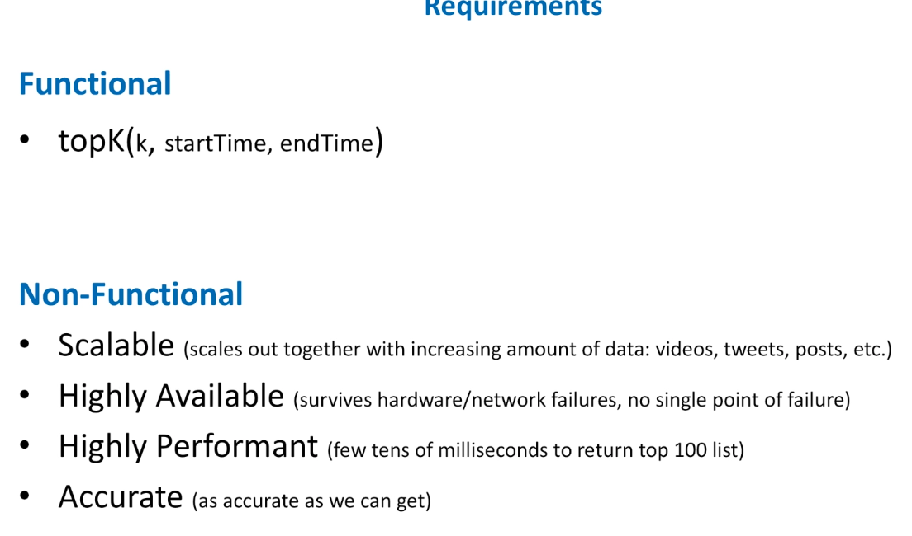

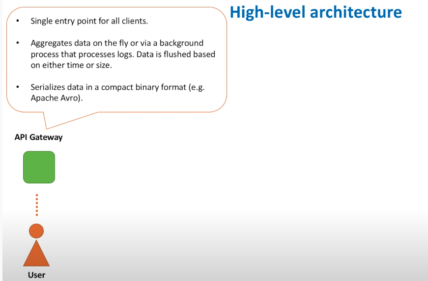

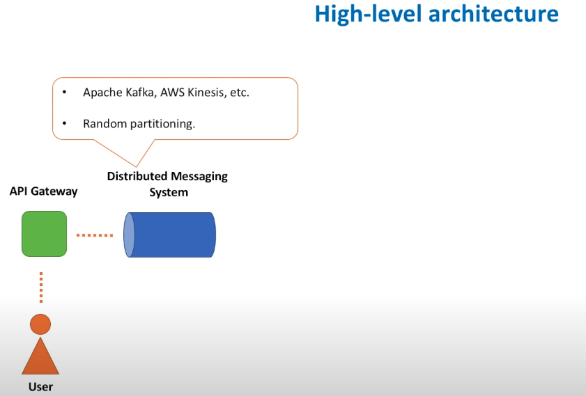


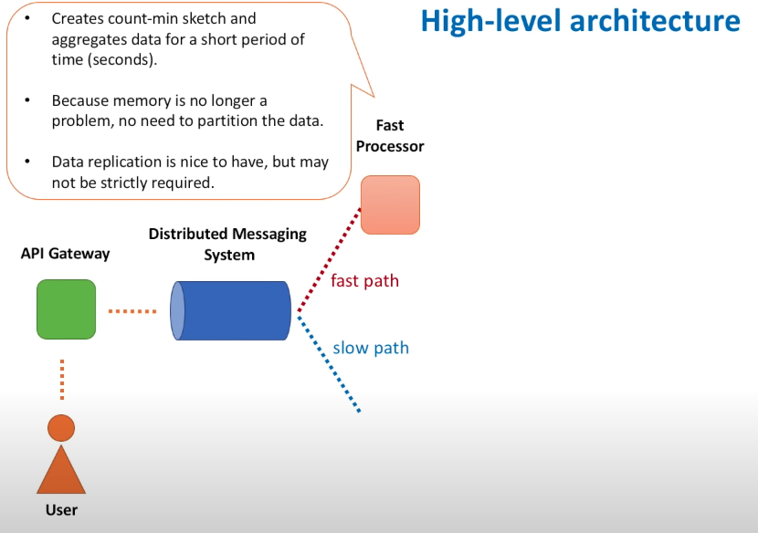


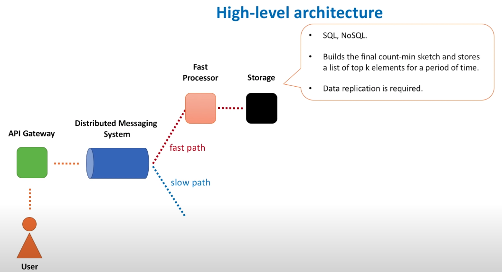


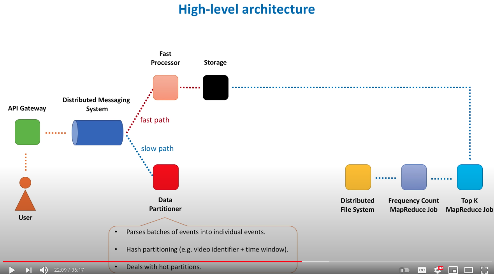


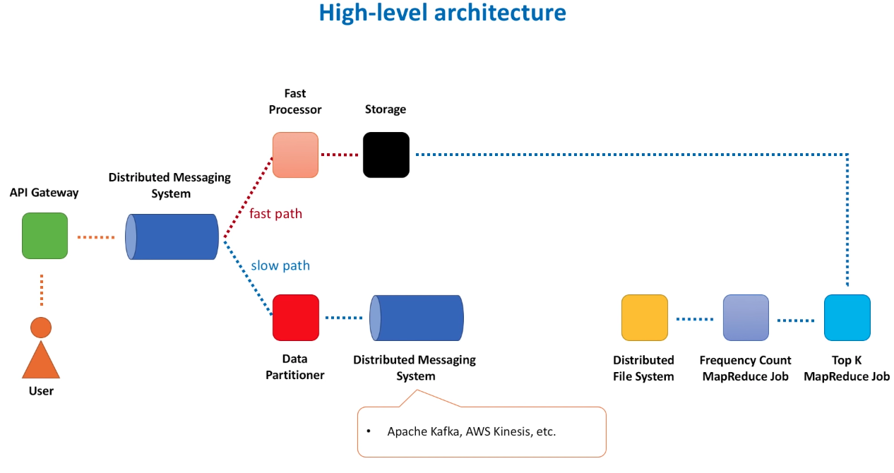


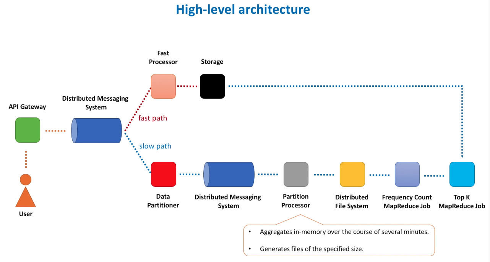


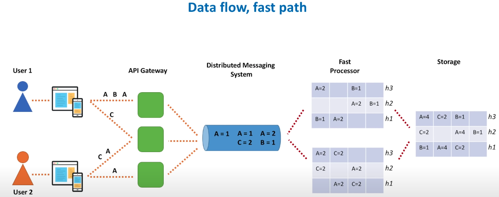


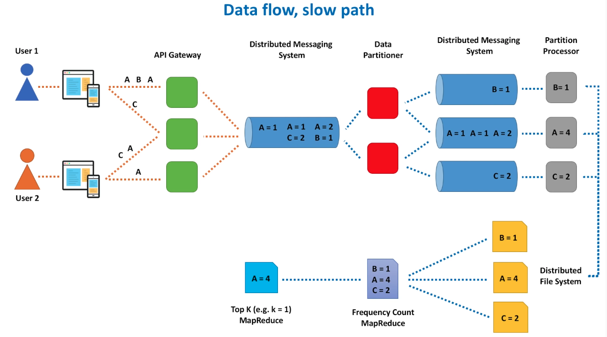


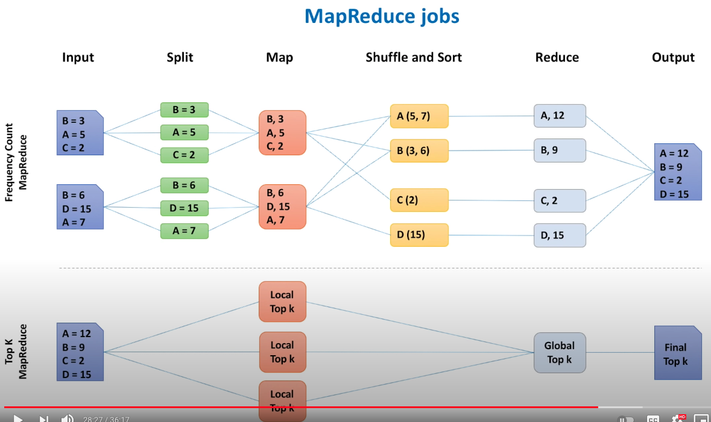


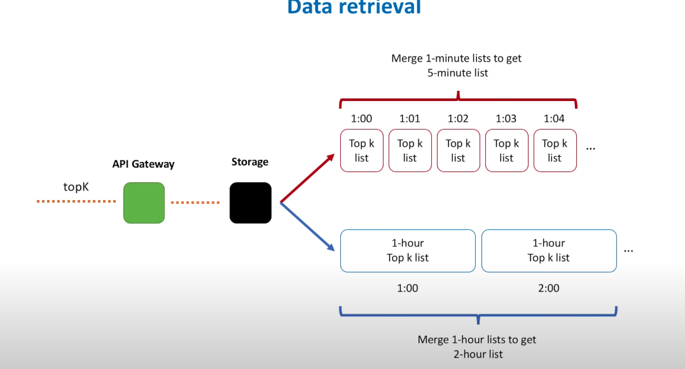


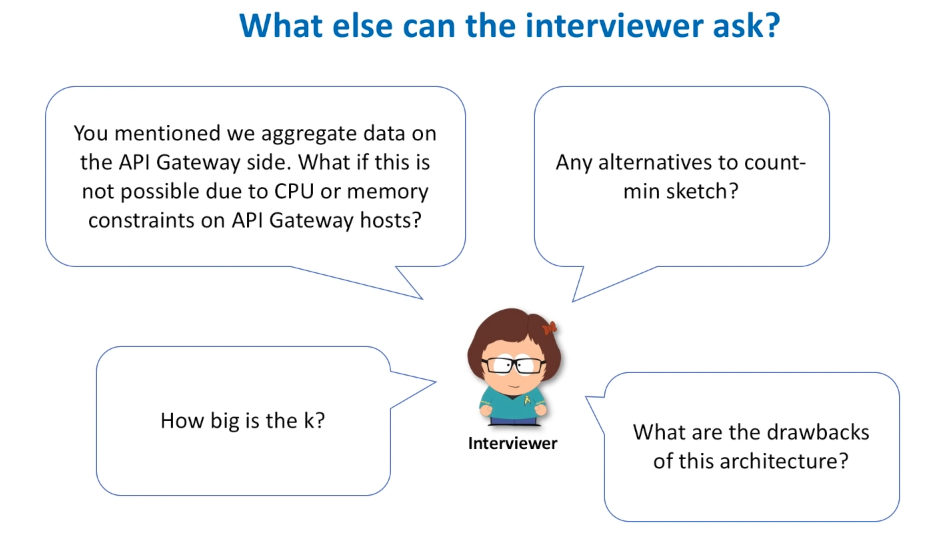


```
# Rate limiting: 
```


```
# 
```


```
# 设计一个KV store，包含文件存储格式.
```

