Stanford Courses: http://cs149.stanford.edu/fall20/lecture/

CMU Courses: http://www.cs.cmu.edu/~418/


- Manycore & Multicore

multicore每个core都可以处理复杂的逻辑。

manycore相比之下，可以进行更多路的并发。

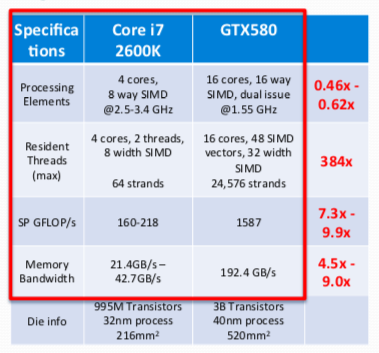

- Why GPU

SIMT. 很多并发，需要进行很多memory的处理 -> roofline model

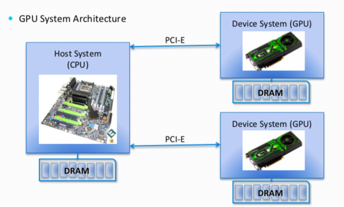


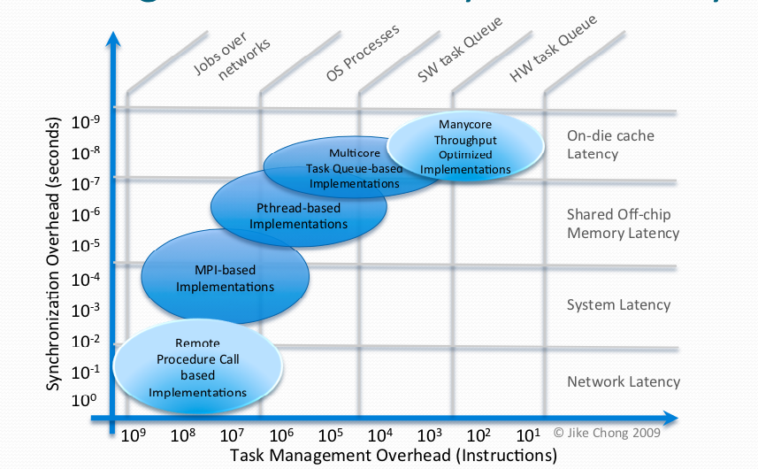

memory wall -> increase gap between processor & DRAM.


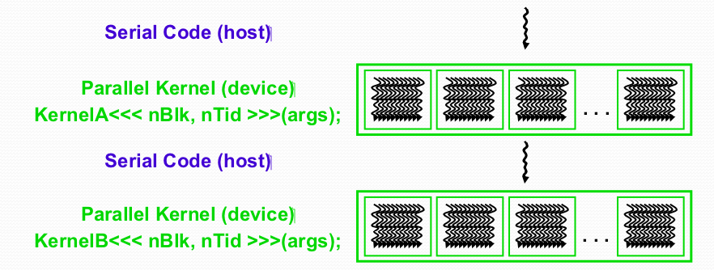


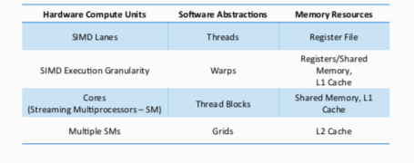


- Maximize memory throughput

1. SoA vs AoS: struct of arrawy vs array of struct 
2. Memory coalescing: combining multi-threads data requirement together to fetch an transaction of data.
3. Use of shared memory: load from DRAM to shared memory; work on shared memory.
4. Memory bank conflict: permutation.
5. Padding: with cache size.


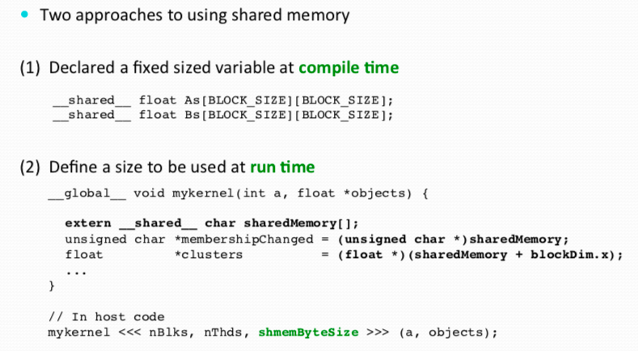


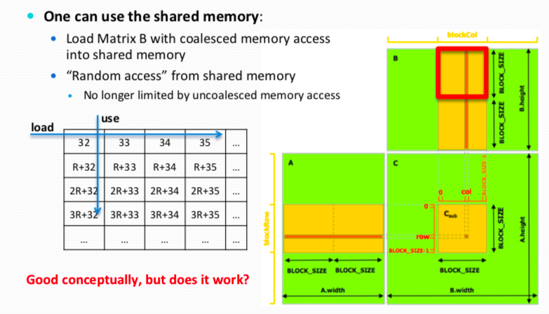

- Maximize instruction throughput

1. Branch divergence
2. Optimize instruction mix

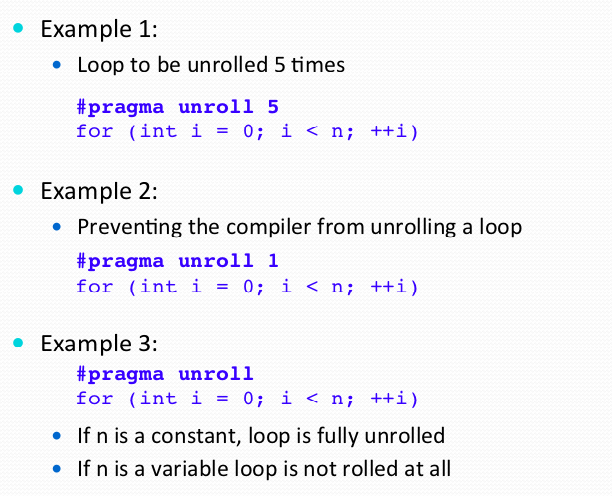

- Maximize scheduling throughput


- More optimization

1. Map 
2. Reduce

- Example

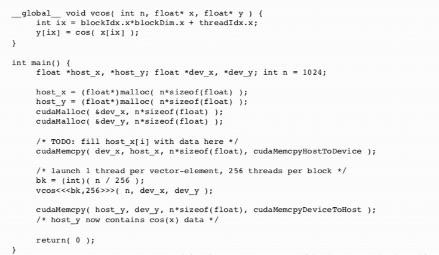


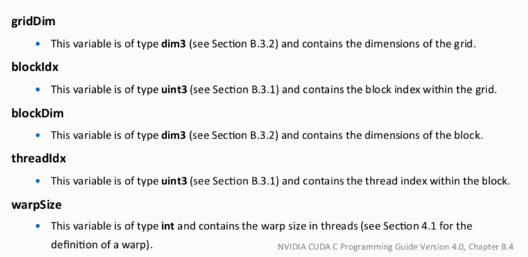


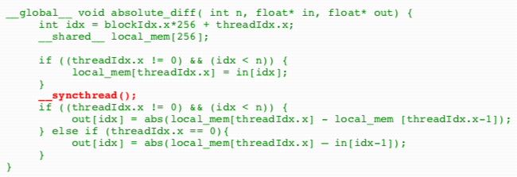


- Array reduce

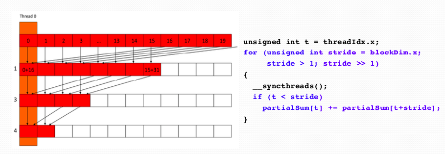


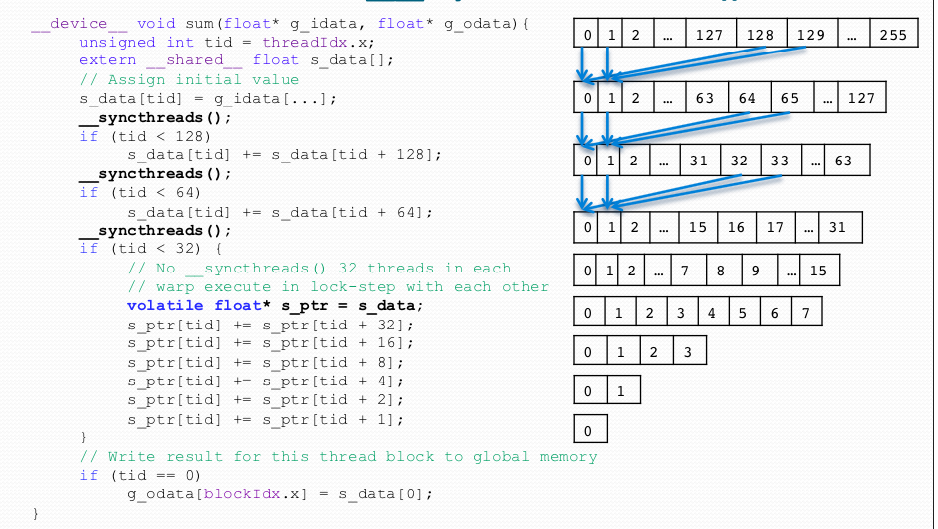


Map reduce of some tasks:

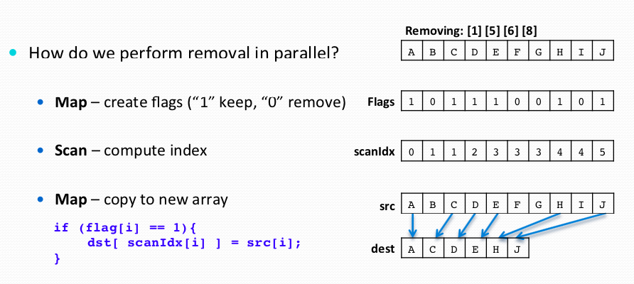


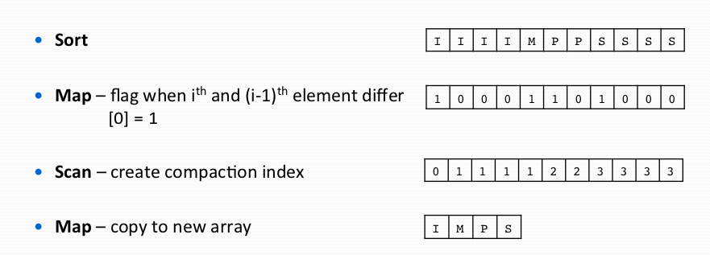


```c++
// Vector Cosine of CUDA
__global__ void VCos(int n, float* x, float* y) {
  int ix = blockIdx.x * blockDim.x + threadIdx.x;
  if (ix < n)
    y[ix] = cos(x[ix]);
}

int main() {
  float* host_x = (float*)malloc(n * sizeof(float));
  float* host_y = (float*)malloc(n * sizeof(float));
  float* dev_x;
  float* dev_y;
  const int n = 1024;
  
  cudaMalloc(&dev_x, n * sizeof(float));
  cudaMalloc(&dev_y, n * sizeof(float));
  
  cudaMemcpy(dev_x, host_x, n * sizeof(float), cudaMemcpyHostToDevice);
  cudaMemcpy(dev_y, host_y, n * sizeof(float), cudaMemcpyHostToDevice);
  
  const int blk = (n+255)/256;
  VCos<<<blk, 256>>>(n, dev_x, dev_y);
  
  cudaMemcpy(host_y, dev_y, n * sizeof(float), cudaMemcpyDeviceToHost);
  cudaFree(dev_x);
  cudaFree(dev_y);
  free(host_x);
  free(host_y);
  
  return 0;
}
```


```c++
// Array Reduction
// No shared memory bank conflict
__global__ void VCos(int n, float* x) {
  int tid = threadIdx.x;
  for (unsigned int s = blockDim.x/2; s > 0; s >>= 1) {
    x[tid] += x[tid+s];
  }
  __synchthreads();
}

static const int arraySize = 10000;
static const int blockSize = 1024;

__global__ void sumCommSingleBlock(const int *a, int *out) {
    int idx = threadIdx.x;
    int sum = 0;
    for (int i = idx; i < arraySize; i += blockSize)
        sum += a[i];
    __shared__ int r[blockSize];
    r[idx] = sum;
    __syncthreads();
    for (int size = blockSize/2; size>0; size/=2) { //uniform
        if (idx<size)
            r[idx] += r[idx+size];
        __syncthreads();
    }
    if (idx == 0)
        *out = r[0];
}

sumCommSingleBlock<<<1, blockSize>>>(dev_a, dev_out);

// Ref: https://sodocumentation.net/cuda/topic/6566/parallel-reduction--e-g--how-to-sum-an-array-
// https://developer.download.nvidia.com/assets/cuda/files/reduction.pdf

// CUDA: max pooling; convolution; average pooling.
// Convolution: FFT; with matrix multiply.
// High Performance Convolutional Neural Networks forDocument Processing
// make the feature map, each windon data as line W * W * M, and the output kernel with matrix: W * W * M * N 
```


```c++
// Matrix multiply
#define BLOCK_SIZE 25

#include <stdio.h>
#include <cuda.h>
#include <cuda_runtime.h>
#include "matrix_mul.h"
#define TILE_WIDTH 2

namespace cuda
{
	__device__ float* get_sub_matrix(float *sq_matrix, int sq_dimension, int row, int col){
		float *sub_matrix;
		sub_matrix = &sq_matrix[sq_dimension*row*BLOCK_SIZE + BLOCK_SIZE*col];
		return sub_matrix;
	}
  
	void padding_reverse(float *sq_matrix, float *new_matrix, unsigned int sq_dimension, unsigned int new_dimension) {
		for(int i=0; i<sq_dimension; i++) {
			for(int j=0; j<sq_dimension; j++) {
				sq_matrix[i*sq_dimension + j] = new_matrix[i*new_dimension + j];
			}
		}
	}
	void padding(float *sq_matrix, float *new_matrix, unsigned int sq_dimension, unsigned int new_dimension) {
		for(int i=0; i<new_dimension; i++) {
			for(int j=0; j<new_dimension; j++) {
				if(i<sq_dimension && j<sq_dimension) {
					new_matrix[i*new_dimension + j] = sq_matrix[i*sq_dimension + j];
				}
				else {
					new_matrix[i*new_dimension + j] = 0;
				}
			}
		}
	}
	__global__ 
		void 
		small_matrix_mul_kernel(float *sq_matrix_1, float *sq_matrix_2, float *sq_matrix_result, int sq_dimension)
		{
			int row = blockIdx.y*blockDim.y+threadIdx.y;
			int col = blockIdx.x*blockDim.x+threadIdx.x;

			float sum = 0.0f;

			for(int k = 0; k < sq_dimension; k++)
			{
				sum += sq_matrix_1[row*sq_dimension + k] * sq_matrix_2[k*sq_dimension + col];
			}
			sq_matrix_result[row*sq_dimension + col] = sum;

		}
	__global__ 
		void 
		matrix_mul_kernel(float *sq_matrix_1, float *sq_matrix_2, float *sq_matrix_result, int sq_dimension)
		{

			int b_col = blockIdx.x;
			int b_row = blockIdx.y;
			int t_col = threadIdx.x;
			int t_row = threadIdx.y;

			float *sub_matrix = get_sub_matrix(sq_matrix_result, sq_dimension, b_row, b_col);

			float sum = 0.0f;

			for(int i = 0; i < sq_dimension/BLOCK_SIZE; i++)
			{
				float *sub_1 = get_sub_matrix(sq_matrix_1, sq_dimension, b_row, i);
				float *sub_2 = get_sub_matrix(sq_matrix_2, sq_dimension, i, b_col);
				__shared__ float A[BLOCK_SIZE][BLOCK_SIZE];
				__shared__ float B[BLOCK_SIZE][BLOCK_SIZE];

				A[t_row][t_col] = sub_1[t_row*sq_dimension+t_col];
				B[t_row][t_col] = sub_2[t_row*sq_dimension+t_col]; 

				__syncthreads();

				for (int j = 0; j < BLOCK_SIZE ; ++j){
					sum += A[t_row][j] * B[j][t_col]; 
				}

				__syncthreads();


			}
			sub_matrix[t_row*sq_dimension + t_col] = sum;
		}

	void 
		matrix_multiplication(float *sq_matrix_1, float *sq_matrix_2, float *sq_matrix_result, unsigned int sq_dimension)
		{

			/* padded dimension*/
			unsigned int new_dimension = (sq_dimension%BLOCK_SIZE == 0? sq_dimension:(sq_dimension/BLOCK_SIZE+1)*BLOCK_SIZE);
			unsigned int size = new_dimension * new_dimension * sizeof(float);
			float *sq_matrix_1_d, *sq_matrix_2_d, *sq_matrix_result_d;
			/***************************************************
			  0st Part: padding, if necessary
			 ****************************************************/
			float *padded_matrix_1, *padded_matrix_2, *padded_matrix_result;
			if(sq_dimension ^ new_dimension){
				padded_matrix_1 = (float *)malloc(size);
				padded_matrix_2 = (float *)malloc(size);
				padded_matrix_result = (float *)malloc(size);

				padding(sq_matrix_1, padded_matrix_1, sq_dimension, new_dimension);
				padding(sq_matrix_2, padded_matrix_2,  sq_dimension, new_dimension);
			}else{
				padded_matrix_1 = sq_matrix_1;
				padded_matrix_2 = sq_matrix_2;
				padded_matrix_result = sq_matrix_result;
			}
			/***************************************************
			  1st Part: Allocation of memory on device memory  
			 ****************************************************/

			/* copy sq_matrix_1 and sq_matrix_2 to device memory */
			cudaMalloc((void**) &sq_matrix_1_d, size);
			cudaMemcpy(sq_matrix_1_d, padded_matrix_1, size, cudaMemcpyHostToDevice);
			cudaMalloc((void**) &sq_matrix_2_d, size);
			cudaMemcpy(sq_matrix_2_d, padded_matrix_2, size, cudaMemcpyHostToDevice);

			/*allocate sq_matrix_result on host */
			cudaMalloc((void**) &sq_matrix_result_d, size);

			/***************************************************
			  2nd Part: Inovke kernel 
			 ****************************************************/
			dim3 dimBlock(BLOCK_SIZE, BLOCK_SIZE);
			dim3 dimGrid(new_dimension / dimBlock.x, new_dimension / dimBlock.y);
			if(sq_dimension > BLOCK_SIZE){
				matrix_mul_kernel<<<dimGrid, dimBlock, dimBlock.x * dimBlock.x * sizeof(float)>>>(sq_matrix_1_d, sq_matrix_2_d, sq_matrix_result_d, new_dimension);
			}
			else{
				small_matrix_mul_kernel<<<dimGrid, dimBlock, dimBlock.x * dimBlock.x * sizeof(float)>>>(sq_matrix_1_d, sq_matrix_2_d, sq_matrix_result_d, new_dimension);
			}
			/***************************************************
			  3rd Part: Transfer result from device to host 
			 ****************************************************/
			cudaMemcpy(padded_matrix_result, sq_matrix_result_d, size, cudaMemcpyDeviceToHost);

			/***************************************************
			  4th Part: free the padded matrices, if padding is necessary
			 ****************************************************/
			if(sq_dimension ^ new_dimension){
				padding_reverse(sq_matrix_result, padded_matrix_result, sq_dimension, new_dimension);
				free(padded_matrix_1);
				free(padded_matrix_2);
				free(padded_matrix_result);
			}
			cudaFree(sq_matrix_1_d);
			cudaFree(sq_matrix_2_d);
			cudaFree(sq_matrix_result_d);
		}  
} // namespace cuda
```

