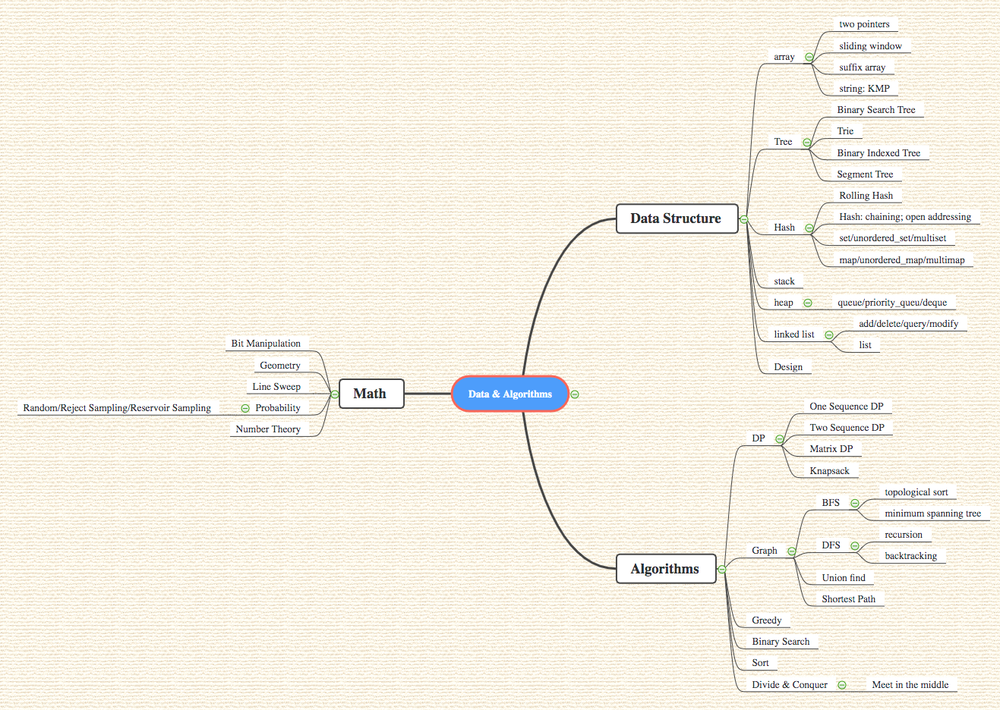

程序由数据结构和算法组成，一个程序的输入和输出已经给定，剩余的就是如何排列组合数据结构和算法进行一个图搜索来找到最佳组合。

**目前构造的思维导图如下：**

# Data Structure

数据结构基本上分为**数组、链表、树、哈希、栈、堆、设计**。

## Array 

数组类知识点主要在于如何对于随机读取的线性结构进行数据的过滤处理，请看[Array Introduction](http://yuchenspace.info/array/)

## Linked List

链表主要是对于数据合并可以进行很好的操作，不过如果是unordered_map + list这种双链表结构，是可以实现O(1)读取的。请看 [Linked List Summary](http://yuchenspace.info/linked-list-summary/)

## Tree

树是进行二分搜索查找极好的数据结构。比较高阶的就有：binary search tree，trie，binary indexed tree，segment tree。请看总结：[Tree](http://yuchenspace.info/tree/)

## Hash 

哈希本质就是进行快速索引，以及对键值进行某种程度的管理。具体情况：[Hash](http://yuchenspace.info/hash/)

## Stack

Stack栈，是一种后进先出的数据结构，在进行递归的时候，很适合使用，请看 [Stack]()。

## Heap

Heap是一种先进先出的数据结构，当然经过了改进，后面有了双向的deque和极值在堆顶的特殊结构，请看[Heap]()。

## Design

# Algorithms

算法涉及大类，DP、greedy、graph、binary search、sort、divide & conquer。

 

## DP

## Greedy

## Graph

## Greedy

## Binary Search

## Sort

## Divide & Conquer

# Math

## Bit manipulation

## Geometry

## Line Sweep

## Probability 

## Number Theory

