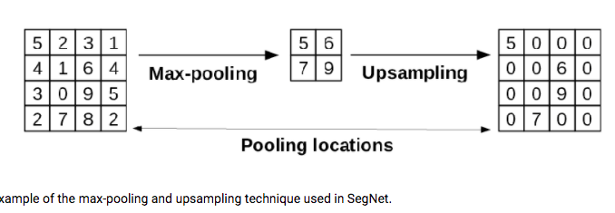

### Loss

- Cross entropy: see the ML part.
- Regression loss: MSE


### Forward & Backward Propagation

[Convolution Backward Update](https://medium.com/@pavisj/convolutions-and-backpropagations-46026a8f5d2c) [2](https://www.jefkine.com/general/2016/09/05/backpropagation-in-convolutional-neural-networks/)


[Excellent Material](https://www.zhihu.com/question/314879954)

[LeNet code](https://github.com/SnailWalkerYC/-c-)

More ref: [BP!](https://zhuanlan.zhihu.com/p/33802329), [cs231n](https://cs231n.github.io/convolutional-networks/), [BP2](https://zhuanlan.zhihu.com/p/61863634), [BP3](https://zhuanlan.zhihu.com/p/61898234), [BP4](https://blog.csdn.net/liuweiyuxiang/article/details/100068947)


[Pooling layer forward & backward](https://zhuanlan.zhihu.com/p/258604402)

就是对于max pooling，那就是只有max的地方才有梯度，其它是0。对于average pooling那就是平均梯度。


Max pooling forward & backward:


Average pooling forward & backward:


[ReLU](https://blog.csdn.net/qq_39575835/article/details/89090923)

取0或者1.


[Batch Normalization](https://www.zhihu.com/question/38102762)

解决internal covariance shift的问题，处理梯度爆炸或者梯度消失。对于batch要求，越大越好，16 -》8，性能下降严重。


对于其它函数，可以通过导数的定义得到。


**More ref:**

https://www.jianshu.com/p/e160983d601a

https://www.zdaiot.com/MachineLearning/%E5%8D%B7%E7%A7%AF%E7%A5%9E%E7%BB%8F%E7%BD%91%E7%BB%9C/%E5%8D%B7%E7%A7%AF%E7%A5%9E%E7%BB%8F%E7%BD%91%E7%BB%9C%E5%89%8D%E5%90%91%E4%B8%8E%E5%8F%8D%E5%90%91%E4%BC%A0%E6%92%AD/

https://zhuanlan.zhihu.com/p/343564175

https://www.zhihu.com/question/465918667

https://zhuanlan.zhihu.com/p/358220419

https://zhuanlan.zhihu.com/p/359524837

https://zhuanlan.zhihu.com/p/360441891

https://github.com/godweiyang/NN-CUDA-Example

###  Component

[Batch Normalization](https://www.zhihu.com/question/38102762)

解决internal covariance shift的问题，处理梯度爆炸或者梯度消失。对于batch要求，越大越好，16 -》8，性能下降严重。


**ReLU**

实现非线性化的部分。


**Upsampling**



[**Transposed convolution**](https://naokishibuya.medium.com/up-sampling-with-transposed-convolution-9ae4f2df52d0)

Fractionally-strided convolution; deconvolution.

To decode the learning parameters and reconstruct information.


### Best Network Architecture Recently

- **Conv method**: EfficientNet: Rethinking Model Scaling for Convolutional Neural Networks
- **DETR** ：End-to-End Object Detection with Transformers
- **MLP:**  MLP-Mixer: An all-MLP Architecture for Vision 


### Unbalance Label

-  Re-sampling: over sampling on small size label
- Synthetic Samplings: add Gaussian noise into this data; interpolation. **SMOTE**
- Re-weighting: according to the inverse label size -> Focal loss.
- Transfer leaning: large sampling to train the network, small network, use the large sampling model to teach the samll network
- **metric learning** 
- Decoupling of representation & classifier.

[如何处理稀疏学习](https://www.zhihu.com/question/372186043)


#### Deep Learning Fin-tune skills

```c++
// Net depth will decide the learn ability. And width will decide the infomraiton of this layer.

// Perception field will be larger in the end.

// The pooling will be in the previous layers with higher frequency.

// Initialization is very important, the normal initialization will be much better than xavier.
// https://zhuanlan.zhihu.com/p/69026430

// 1 x N convolution, could improve the perception field.

// Learning first -> add BN/data augmentation -> adjust layers/convolution.

// Loss is better than accuracy

// receptive field decide.

// Training set & validation set, early stop, over-fitting/under-fitting.

// ReLU/Leaky-ReLU/Sigmoid/Tanh.

// Overfitting -> L1, L2 norm.

// Optimizer choose: Adagrad, Adadelta, RMSprop, Adam -> Adam

// Residual block & BN layer.

// relu激活函数初始化推荐使用He normal，tanh初始化推荐使用Glorot normal，其中Glorot normal也称作Xavier normal初始化；数据预处理方法一般也就采用数据归一化即可。

// Data Preprocessing

// New scenarios will cause the covariate shift. Training set distribution change; cross validation; expand test set; https://www.zhihu.com/question/289025990 
```

