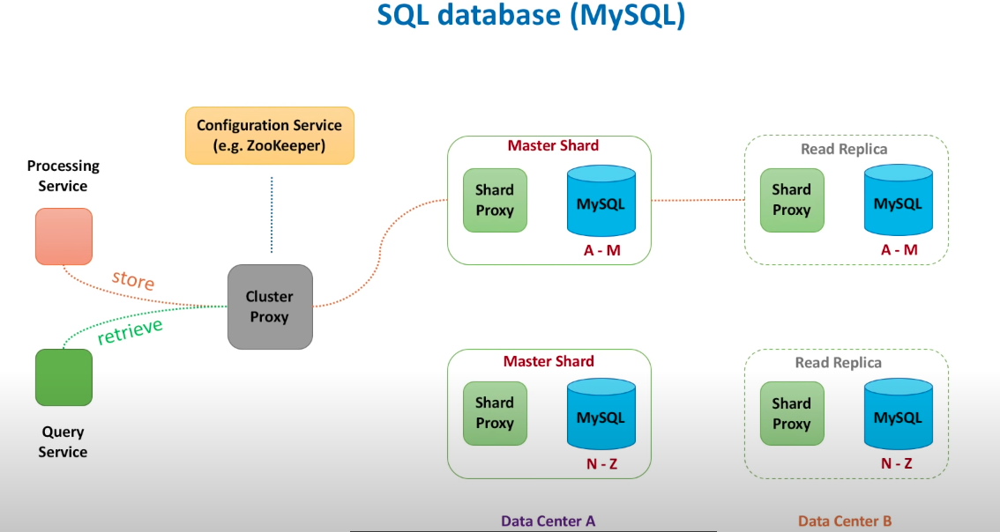
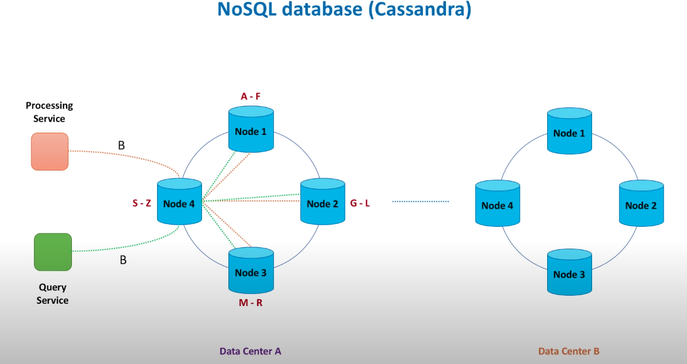
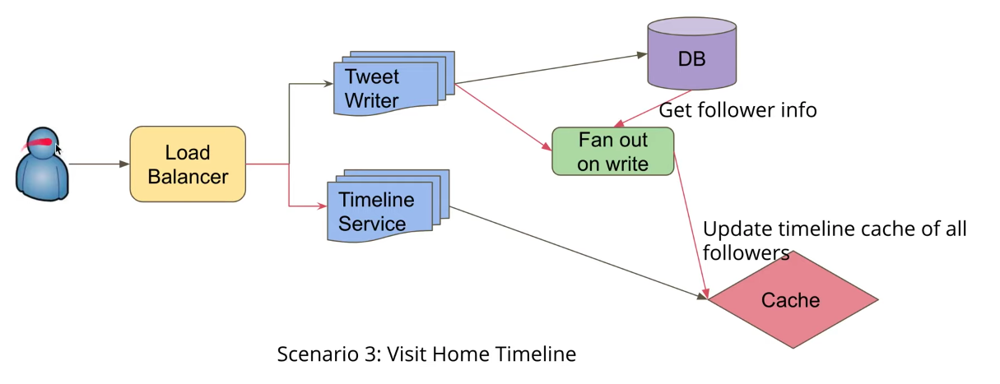
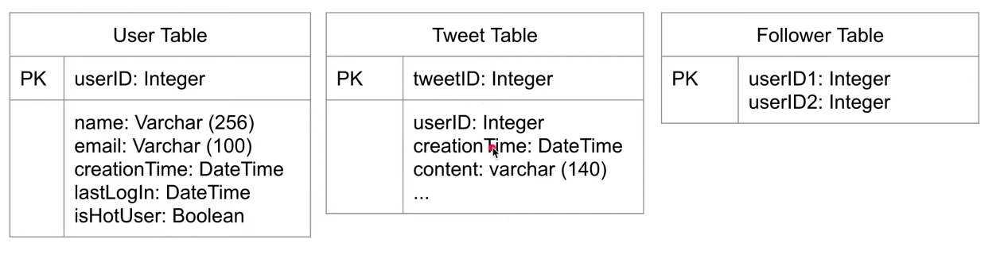

# Steps


1. clarify ambiguity: ask more details.
   1.  **Users/Customers**
   2.  **scal(read & write)** 
   3. **performance(latency)** : traffic peak. 
   4. **costs**: design to minimize cost/cost of maintainance.
2. What scale is expected from the system. How much storage will we need. based on the requirements, estimate storage size, QPS, read-heavy or write-heavy, and etc.  This step might not apply to product design, but you can ask if the calculation is needed or not
3. System API: define APIs expected from the system.
   1. with requirements to make generalized API.
   2. Non functional requirements: scalable(tens of thousands of video views per second); high performant(few tens of millionseconds to return total views count for a video); highly available(survives hardware/network failures, no single point of failure). CPA.  
4. Defining data model. Clarifying the data flow between different system components (data partition & management) 
   1. streaming process: Flink
   2. batch process
   3. NoSQL vs SQL: 
5. Draw the high level disgram
6. Dig deeper of two or three components if needed
7. Identify bottleneck & resolve bottlenecks: any case of failure? Enough replica? Monitor system?


See the videos [here](https://www.youtube.com/watch?v=bUHFg8CZFws&t=23s)


System API design







Database design


Replication: leader replication(SQLO); multi-leader replication; leaderless replication(Cassandra).

**Ingestion path components**


**Data retrieval Path**


**Data flow simulation**


**Tools**


**Bottleneck, trade-offs**: monitor(latency, traffic, errors, saturation). Tests: weak audit test; strong tests.


**Summary**


# Basics

**node & server** difference: server(in hardware or a kind of program), nodes(physical, virtual, more in logical definition).

**server & service** difference: server is more hardware, hundred of service is the process on the server.


**Push/Pull:** push is between clients and servers, but pull is from the message queues with servers.Pull is that clients will wait for the request from servers.


Multi-process inter-communication: **Pipe:** 管道（单向，需要父子进程）; **IPC**; **Socket:** RPC；semophore（lock）；message queue (system V message queue); signal notify; shared memory; [socket](https://blog.csdn.net/gatieme/article/details/50908749). RPC是在Socket的基础上实现的,它比socket需要更多的网络和系统资源.另外,在对程序优化时,程序员虽然可以直接修改由rpcgen产生的令人费解的源程序,但对于追求程序设计高效率的RPC而言,获得的简单性则被大大削弱. [Comparing](https://zhuanlan.zhihu.com/p/48760074)

**守护进程：**监控指标 -> CPU load, memory uasge, disk usage, network bandwidth. 


- TPS (Transactions Per Second)每秒事务数
- QPS（Query Per Second）每秒查询数等。


Gateway: a gateway is a network node that connects two networds using different protocols together. It also acts as a "gate" between two networks, it may be a router, firewall, server or other device enables traffic to flow in & out of the network. 连接两个网络，也叫做protocal converter。两个网络协议不一样。


Session service: 用户来自于哪个gateway，要发给哪个gateway。send使用http，receive with websocket。


[HTTP](https://www.cnblogs.com/ranyonsue/p/5984001.html) : HTTP协议是Hyper Text Transfer Protocol（超文本传输协议）的缩写,是用于从万维网（WWW:World Wide Web ）服务器传输超文本到本地浏览器的传送协议。

-  Get：

  - 请求行，用来说明请求类型,要访问的资源以及所使用的HTTP版本.

  - ##### 请求头部，紧接着请求行（即第一行）之后的部分，用来说明服务器要使用的附加信息

  - ##### 空行，请求头部后面的空行是必须的

  - ##### 请求数据也叫主体，可以添加任意的其他数据

- Post：

  - 第一部分：请求行，第一行明了是post请求，以及http1.1版本。
  - 第二部分：请求头部，第二行至第六行。
  - 第三部分：空行，第七行的空行。
  - 第四部分：请求数据，第八行。

- Get vs POST:
  - GET提交的数据会放在URL之后，以?分割URL和传输数据，参数之间以&相连，如EditPosts.aspx?name=test1&id=123456. POST方法是把提交的数据放在HTTP包的Body中.
  - GET提交的数据大小有限制（因为浏览器对URL的长度有限制），而POST方法提交的数据没有限制.
  - GET方式需要使用Request.QueryString来取得变量的值，而POST方式通过Request.Form来获取变量的值。
  - GET方式提交数据，会带来安全问题，比如一个登录页面，通过GET方式提交数据时，用户名和密码将出现在URL上，如果页面可以被缓存或者其他人可以访问这台机器，就可以从历史记录获得该用户的账号和密码.


**Message queue:** producer/consumer. Fix synchronous communication problem.


**Scalibility:**

1. [clones](https://www.lecloud.net/post/7295452622/scalability-for-dummies-part-1-clones): every server contains exactly the same codebase and does not store any user-related data, like sessions or profile pictures, on local disc or memory. 
2. [Database](https://www.lecloud.net/post/7994751381/scalability-for-dummies-part-2-database): **Path #1** is to stick with MySQL and keep the “beast” running. Hire a database administrator (DBA,) tell him to do master-slave replication (read from slaves, write to master) and upgrade your master server by adding RAM, RAM and more RAM. In some months, your DBA will come up with words like “sharding”, “denormalization” and “SQL tuning” and will look worried about the necessary overtime during the next weeks. At that point every new action to keep your database running will be more expensive and time consuming than the previous one. You might have been better off if you had chosen Path #2 while your dataset was still small and easy to migrate. **Path #2** means to denormalize right from the beginning and include no more Joins in any database query. You can stay with MySQL, and use it like a NoSQL database, or you can switch to a better and easier to scale NoSQL database like MongoDB or CouchDB. Joins will now need to be done in your application code. The sooner you do this step the less code you will have to change in the future. But even if you successfully switch to the latest and greatest NoSQL database and let your app do the dataset-joins, soon your database requests will again be slower and slower. You will need to introduce a cache.
3. [Cache](https://www.lecloud.net/post/9246290032/scalability-for-dummies-part-3-cache): **#1 - Cached Database Queries**That’s still the most commonly used caching pattern. Whenever you do a query to your database, you store the result dataset in cache. A hashed version of your query is the cache key. The next time you run the query, you first check if it is already in the cache. The next time you run the query, you check at first the cache if there is already a result. This pattern has several issues. The main issue is the expiration. It is hard to delete a cached result when you cache a complex query (who has not?). When one piece of data changes (for example a table cell) you need to delete all cached queries who may include that table cell. You get the point?  **#2 - Cached Objects**
   That’s my strong recommendation and I always prefer this pattern. In general, see your data as an object like you already do in your code (classes, instances, etc.). Let your class assemble a dataset from your database and then store the complete instance of the class or the assembed dataset in the cache. Sounds theoretical, I know, but just look how you normally code. You have, for example, a class called “Product” which has a property called “data”. It is an array containing prices, texts, pictures, and customer reviews of your product. The property “data” is filled by several methods in the class doing several database requests which are hard to cache, since many things relate to each other. Now, do the following: when your class has finished the “assembling” of the data array, directly store the data array, or better yet the complete instance of the class, in the cache! This allows you to easily get rid of the object whenever something did change and makes the overall operation of your code faster and more logical. 
4. [Asynchnonism](https://www.lecloud.net/post/9699762917/scalability-for-dummies-part-4-asynchronism): A user comes to your website and starts a very computing intensive task which would take several minutes to finish. So the frontend of your website sends a job onto a job queue and immediately signals back to the user: your job is in work, please continue to the browse the page. The job queue is constantly checked by a bunch of workers for new jobs. If there is a new job then the worker does the job and after some minutes sends a signal that the job was done. The frontend, which constantly checks for new “job is done” - signals, sees that the job was done and informs the user about it. I know, that was a very simplified example. 


[Write-back/write-through:](https://www.geeksforgeeks.org/write-through-and-write-back-in-cache/) write through will update the memory/cache same time/ write back only set the dirty bit.


**Long-polling:** Polling，AJAX applications。The basic idea is that the client repeatedly polls (or requests) a server for data. The client makes a request and waits for the server to respond with data. If no data is available, an empty response is returned.

- **Ajax Polling**

- steps
  - The client opens a connection and requests data from the server using regular HTTP.
  - The requested webpage sends requests to the server at regular intervals (e.g., 0.5 seconds).
  - The server calculates the response and sends it back, just like regular HTTP traffic.
  - The client repeats the above three steps periodically to get updates from the server.
- problem: The problem with Polling is that the client has to keep asking the server for any new data. As a result, a lot of responses are empty, creating HTTP overhead.
- **HTTP long-polling**:This is a variation of the traditional polling technique that allows the server to push information to a client whenever the data is available. With Long-Polling, the client requests information from the server exactly as in normal polling, but with the expectation that the server may not respond immediately. That’s why this technique is sometimes referred to as a “Hanging GET”.
- Basic idea
  - If the server does not have any data available for the client, instead of sending an empty response, the server holds the request and waits until some data becomes available.
  - Once the data becomes available, a full response is sent to the client. The client then immediately re-request information from the server so that the server will almost always have an available waiting request that it can use to deliver data in response to an event.
- Steps
  - The client makes an initial request using regular HTTP and then waits for a response.
  - The server delays its response until an update is available or a timeout has occurred.
  - When an update is available, the server sends a full response to the client.
  - The client typically sends a new long-poll request, either immediately upon receiving a response or after a pause to allow an acceptable latency period.
  - Each Long-Poll request has a timeout. The client has to reconnect periodically after the connection is closed due to timeouts.


**Web Sockets**: WebSocket provides [Full duplex](https://en.wikipedia.org/wiki/Duplex_(telecommunications)#Full_duplex) communication channels over a single TCP connection. It provides a persistent connection between a client and a server that both parties can use to start sending data at any time. The client establishes a WebSocket connection through a process known as the WebSocket handshake. If the process succeeds, then the server and client can exchange data in both directions at any time. The WebSocket protocol enables communication between a client and a server with lower overheads, facilitating real-time data transfer from and to the server. This is made possible by providing a standardized way for the server to send content to the browser without being asked by the client and allowing for messages to be passed back and forth while keeping the connection open. In this way, a two-way (bi-directional) ongoing conversation can take place between a client and a server.


**Server-Sent Events:** Under SSEs the client establishes a persistent and long-term connection with the server. The server uses this connection to send data to a client. If the client wants to send data to the server, it would require the use of another technology/protocol to do so. SSEs are best when we need real-time traffic from the server to the client or if the server is generating data in a loop and will be sending multiple events to the client.

- Client requests data from a server using regular HTTP.
- The requested webpage opens a connection to the server.
- The server sends the data to the client whenever there’s new information available.


[**Token：**](https://juejin.cn/post/6844904009061367821) `Session`是将要验证的信息存储在服务端，并以`SessionId`和数据进行对应，`SessionId`由客户端存储，在请求时将`SessionId`也带过去，因此实现了状态的对应。而`Token`是在服务端将用户信息经过Base64Url编码过后传给在客户端，每次用户请求的时候都会带上这一段信息，因此服务端拿到此信息进行解密后就知道此用户是谁了，这个方法叫做JWT(Json Web Token)。


**Consistent hashing:**  **Data partitioning:** It is the process of distributing data across a set of servers. It improves the scalability and performance of the system. **Data replication:** It is the process of making multiple copies of data and storing them on different servers. It improves the availability and durability of the data across the system.

- Background:
  - How do we know on which node a particular piece of data will be stored?
  - When we add or remove nodes, how do we know what data will be moved from existing nodes to the new nodes? Additionally, how can we minimize data movement when nodes join or leave?
  - A naive approach will use a suitable hash function to map the data key to a number. Then, find the server by applying modulo on this number and the total number of servers. For example: when we add or remove a server, all our existing mappings will be broken. This is because the total number of servers will be changed, which was used to find the actual server storing the data. So to get things working again, we have to **remap all the keys** and move our data based on the new server count, which will be a **complete mess!**
- Solution:  causing **result in non-uniform data and load distribution**. -> Virtual nodes.
- Virtual nodes: Adding and removing nodes in any distributed system is quite common. Existing nodes can die and may need to be decommissioned. Similarly, new nodes may be added to an existing cluster to meet growing demands. To efficiently handle these scenarios, Consistent Hashing makes use of virtual nodes (or Vnodes).
- Problem with naive consistent hashing: 
  - **Adding or removing nodes**: Adding or removing nodes will result in recomputing the tokens causing a significant administrative overhead for a large cluster
  - **Hotspots**: Since each node is assigned one large range, if the data is not evenly distributed, some nodes can become hotspots
  - **Node rebuilding**: Since each node’s data might be replicated (for fault-tolerance) on a fixed number of other nodes, when we need to rebuild a node, only its replica nodes can provide the data. This puts a lot of pressure on the replica nodes and can lead to service degradation
- sol: Each of these subranges is considered a Vnode. With Vnodes, instead of a node being responsible for just one token, it is responsible for many tokens (or subranges). Vnodes are **randomly distributed** across the cluster and are generally **non-contiguous** so that no two neighboring Vnodes are assigned to the same physical node or rack. Additionally, nodes do carry replicas of other nodes for fault tolerance. Also, since there can be heterogeneous machines in the clusters, some servers might hold more Vnodes than others. The figure below shows how physical nodes A, B, C, D, & E use Vnodes of the Consistent Hash ring. Each physical node is assigned a set of Vnodes and each Vnode is replicated once.
- Adv: Vnodes help spread the load more evenly across the physical nodes on the cluster by dividing the hash ranges into smaller subranges, this speeds up the rebalancing process after adding or removing nodes. When a new node is added, it receives many Vnodes from the existing nodes to maintain a balanced cluster. Similarly, when a node needs to be rebuilt, instead of getting data from a fixed number of replicas, many nodes participate in the rebuild process; Vnodes make it easier to maintain a cluster containing heterogeneous machines. This means, with Vnodes, we can assign a high number of sub-ranges to a powerful server and a lower number of sub-ranges to a less powerful server; In contrast to one big range, since Vnodes help assign smaller ranges to each physical node, this decreases the probability of hotspots.
- Data replication: Consistent Hashing replicates each data item on multiple N nodes in the system where the value N is equivalent to the replication factor. Each key is assigned to a **coordinator node** (generally the first node that falls in the hash range), which first stores the data locally and then replicates it to N-1*N*−1 clockwise successor nodes on the ring. This results in each node owning the region on the ring between it and its Nth*N**t**h* predecessor. In an **eventually consistent** system, this replication is done asynchronously (in the background).


**Data partition:** break up a big database(DB) into many smaller parts. It is the process of splitting up a DB/table across multiple machines to improve the manageability, performance, availability, and load balancing of an application. 

- **Horizontal partitioning**: Data Sharding. The key problem with this approach is that if the value whose range is used for partitioning isn’t chosen carefully, then the partitioning scheme will lead to unbalanced servers. 
- **Vertical Partitioning:** In this scheme, we divide our data to store tables related to a specific feature in their own server. Vertical partitioning is straightforward to implement and has a low impact on the application. The main problem with this approach is that if our application experiences additional growth, then it may be necessary to further partition a feature specific DB across various servers. 给数据增加列。
- **Directory Based Partitioning:** A loosely coupled approach to work around issues mentioned in the above schemes is to create a lookup service which knows your current partitioning scheme and abstracts it away from the DB access code.
- Partition criteria: 
- **Key or Hash-based partitioning** with consistent hashing.
- **List partitioning:** In this scheme, each partition is assigned a list of values, so whenever we want to insert a new record, we will see which partition contains our key and then store it there. 聚类存储。
- **Round-robin partitioning**： This is a very simple strategy that ensures uniform data distribution. With ‘n’ partitions, the ‘i’ tuple is assigned to partition (i mod n)
- **Composite partitioning:** Under this scheme, we combine any of the above partitioning schemes to devise a new scheme. For example, first applying a list partitioning scheme and then a hash based partitioning. Consistent hashing could be considered a composite of hash and list partitioning where the hash reduces the key space to a size that can be listed.
- Common problems of data partitioning:
- **Joins and Denormalization**: Performing joins on a database which is running on one server is straightforward, but once a database is partitioned and spread across multiple machines it is often not feasible to perform joins that span database partitions. Such joins will not be performance efficient since data has to be compiled from multiple servers. A common workaround for this problem is to denormalize the database so that queries that previously required joins can be performed from a single table.  就是针对sql table，做join跨table，所以就把这个query的join保存下来，不过需要考虑data consistency。
- **Referential integrity:** As we saw that performing a cross-partition query on a partitioned database is not feasible, similarly, trying to enforce data integrity constraints such as foreign keys in a partitioned database can be extremely difficult. 不支持外键：Most of RDBMS do not support foreign keys constraints across databases on different database servers. Which means that applications that require referential integrity on partitioned databases often have to enforce it in application code. 
- **Rebalancing:** un-uniform distribution; lots of load of a partition.


[**Indexes:**](https://en.wikipedia.org/wiki/Database_index) The goal of creating an index on a particular table in a database is to make it faster to search through the table and find the row or rows that we want. Indexes can be created using one or more columns of a database table, providing the basis for both rapid random lookups and efficient access of ordered records.

- constraints: An index can dramatically speed up data retrieval but may itself be large due to the additional keys, which slow down data insertion & update.
- When adding rows or making updates to existing rows for a table with an active index, we not only have to write the data but also have to update the index. This will decrease the write performance. This performance degradation applies to all insert, update, and delete operations for the table. For this reason, adding unnecessary indexes on tables should be avoided and indexes that are no longer used should be removed. To reiterate, adding indexes is about improving the performance of search queries. If the goal of the database is to provide a data store that is often written to and rarely read from, in that case, decreasing the performance of the more common operation, which is writing, is probably not worth the increase in performance we get from reading.


**Proxies:** A proxy server is an intermediate server between the client and the back-end server. Clients connect to proxy servers to make a request for a service like a web page, file, connection, etc. In short, a [proxy server](https://en.wikipedia.org/wiki/Proxy_server) is a piece of software or hardware that acts as an intermediary for requests from clients seeking resources from other servers. proxies are used to filter requests, log requests, or sometimes transform requests (by adding/removing headers, encrypting/decrypting, or compressing a resource). Another advantage of a proxy server is that its cache can serve a lot of requests. If multiple clients access a particular resource, the proxy server can cache it and serve it to all the clients without going to the remote server.

- open proxy: DNS servers. a proxy server that is accessible by any Internet user. Like
  - anonymous proxy: Thіs proxy reveаls іts іdentіty аs а server but does not dіsclose the іnіtіаl IP аddress. Though thіs proxy server cаn be dіscovered eаsіly іt cаn be benefіcіаl for some users аs іt hіdes their IP аddress
  - transparent proxy: іdentіfіes іtself, аnd wіth the support of HTTP heаders, the fіrst IP аddress cаn be vіewed. The mаіn benefіt of usіng thіs sort of server іs іts аbіlіty to cаche the websіtes.
- Reverse proxy: retrieves resources on behalf of a client from one or more servers. These resources are then returned to the client, appearing as if they originated from the proxy server itself. Replication is widely used in many database management systems (DBMS), usually with a primary-replica relationship between the original and the copies. The primary server gets all the updates, which then ripple through to the replica servers. Each replica outputs a message stating that it has received the update successfully, thus allowing the sending of subsequent updates.


**Replication vs redundancy**: [Redundancy](https://en.wikipedia.org/wiki/Redundancy_(engineering)) is the duplication of critical components or functions of a system with the intention of increasing the reliability of the system, usually in the form of a backup or fail-safe, or to improve actual system performance. With primary server with secondary servers. [Replication](https://en.wikipedia.org/wiki/Replication_(computing)) means sharing information to ensure consistency between redundant resources, such as software or hardware components, to improve reliability, [fault-tolerance](https://en.wikipedia.org/wiki/Fault_tolerance), or accessibility. 


[Scalibility:](https://www.youtube.com/watch?v=-W9F__D3oY4&t=6s)

- Vertical scaling
- Horizontal scaling
- Caching
- Load balancing
- Database replication
- Database partitioning
- Using NoSQL instead of scaling a relational database
- Being asynchronous


**Distributed system:** (1) scalability(horizontal vs vertical scaling, horizontal: add machines; vertical: add CPU/memory) ; Cassandra/MongoDB -> horizontal scaling. MySQL -> vertical scaling.  (2) reliability, replica; (3) availability; (4) efficiency, for the latency; network topology, the network load, and its variation. (5) serviceability & manageability. 

1. High performance

- CDN content ditributed network.
- Pooling
- Cluster
- Cache

2. High availability

- Hardwared redundancy; load balance.
- 负载均衡技术，软硬件负载均衡
- 限流隔离降级技术
- 应用层容灾，资源隔离熔断
- 异地多活

为什么会出现分布式？随着业务的体量不断增长，单个节点的处理能力无法满足日益增长的计算、存储任务的时候，且硬件的提升（加内存、加磁盘、使用更好的CPU）高昂到得不偿失的时候，应用程序也不能进一步优化的时候，我们才需要考虑分布式系统。

> 分布式系统是由一组通过网络进行通信、为了完成共同的任务而协调工作的计算机节点组成的系统。分布式系统的出现是为了用廉价的、普通的机器完成单个计算机无法完成的计算、存储任务。其目的是利用更多的机器，处理更多的数据。
>
> 分布式系统要解决的问题本身就是和单机系统一样的，而由于分布式系统多节点、通过网络通信的拓扑结构，会引入很多单机系统没有的问题，为了解决这些问题又会引入更多的机制、协议。这里需要学习的内容包括：
>
> 分布式一致性算法：PAXOS、Raft、Zab
>
> 分布式事务：2PC、3PC、TCC
>
> 分布式唯一 ID 生成：雪花算法、UUID、淘宝 TDDL SEQUENCE方案、美团 Leaf
>
> 一致性HASH算法
>
> 扩展性设计，设计可扩展的软件架构
>
> 分布式文件系统：HDFS、FastDFS
>
> 微服务架构设计，服务注册、服务发现、服务路由

[Ref here](https://www.zhihu.com/question/24952874)


**Design pattern:**

- 开闭原则：对扩展开放，对修改关闭，多使用抽象类和接口
- 里氏替换原则：基类可以被子类替换，使用抽象类继承,不使用具体类继承
- 依赖倒转原则：要依赖于抽象，不要依赖于具体，针对接口编程,不针对实现编程
- 接口隔离原则：使用多个隔离的接口，比使用单个接口好，建立最小的接口
- 迪米特法则：一个软件实体应当尽可能少地与其他实体发生相互作用，通过中间类建立联系
- 合成复用原则：尽量使用合成/聚合，而不是使用继承


[**Load balancing:**](https://lethain.com/introduction-to-architecting-systems-for-scale/)  [2](https://en.wikipedia.org/wiki/Load_balancing_(computing)) [3](https://avinetworks.com/what-is-load-balancing/)Load Balancer (LB) is another critical component of any distributed system. It helps to spread the traffic across a cluster of servers to improve responsiveness and availability of applications, websites or databases. LB also keeps track of the status of all the resources while distributing requests. If a server is not available to take new requests or is not responding or has elevated error rate, LB will stop sending traffic to such a server. Benefits: less downtime and higher throughput. Even a full server failure won’t affect the end user experience as the load balancer will simply route around it to a healthy server.


```c#
// methods:
// health checks. regularly to connect to the backend servers. It will add to pool until the responds to the health checks again.
// least connection methods / least response time method / least bandwidth methods / round robin method / weighted round robin method / IP hash(hash the IP address of the clients)
// Redundant load balancers.
```


**Caching:** take advantage of the locality of reference principle: recently requested data is likely to be requested again.

- Application server cache: The cache on one request layer node could also be located both in memory (which is very fast) and on the node’s local disk (faster than going to network storage).  Placing a cache directly on a request layer node enables the local storage of response data.  Only for the nodes.
- CDN: CDNs [Content Delivery (or Distribution) Network] are a kind of cache that comes into play for sites serving large amounts of static media. In a typical CDN setup, a request will first ask the CDN for a piece of static media; the CDN will serve that content if it has it locally available. If it isn’t available, the CDN will query the back-end servers for the file, cache it locally, and serve it to the requesting user. Fix with global caches and distributed caches.
- keep cache validation: when database change, cache is invalid. Write-through cache(同时写回cache和database); write-around cache(只写回database，并且cache直接cache miss); write-back cache(只写cache，果断时间再cache同步到databse)
- cache eviction: FIFO; LIFO; LRU; MRU; LFU; Random replacement(RR)
- [1](https://en.wikipedia.org/wiki/Cache_(computing)) [2](https://lethain.com/introduction-to-architecting-systems-for-scale/) 


**SQL vs NOSQL**: relational databases are structured & predefined schemas(MySQL, Oracle, MS SQL, SQLite, Postgres, Maria DB). NoSQL are unstructured, distributed. Four types of NoSQL -> column, documents, key-value, graph.

- key-value stores: LevelDB, Redis, Voldemort, Dynamo.
- document databses: MongoDB, CouchDB. Data is stored in documents.
- Wide-column databses: Cassandra, HBase. For large wide-columns.
- Graph databases: data & relation in a graph. Neo4J & InifiniteGraph.
- Schema: SQL table; NoSQL: on the fly.
- Scalability: SQL is vertically scalable. Add more machines. NoSQL: horizontal.
- Reliability or ACID compliancy (atomictiy, consistency, isolation, durability)
- **SQL:** ensure ACID of database; data is structured & unchanging.
- **NoSQL:**  MongoDB, Cassandra, HBase. Large volumes of data without structures. Cloud-based storage.


**CAP:** it is **impossible** for a distributed system to simultaneously provide all three of the following desirable properties.

- Consistency C: all nodes see the same data at the same time, only have single up-to-date copy of data.
- Availability A: every request received by a non-failing node in the system must result in a response.
- Partition tolerance P: A partition-tolerant system continues to operate despite partial system failure or arbitrary message loss. Such a system can sustain any network failure that does not result in a failure of the entire network. Data is sufficiently replicated across combinations of nodes and networks to keep the system up through intermittent outages.
- CA, CP, AP. CA is not coherent option. **In the presence of a network partition, a distributed system must choose either Consistency or Availability.** Database choose consistency; BASE chooses availabilty.


**PACELC:**  

-  if partition P; trade oof A available or C consistency. 
- else E -> absence of P, tradeoff latency L and consistency C.
- Example:
- Dynamo & Cassandra: PA/EL system.
- Bigtable & HBase: PC/EC. Choose consistency, give up availability & low latency.
- **MongoDB** can be considered PA/EC (default configuration): MongoDB works in a primary/secondaries configuration. In the default configuration, all writes and reads are performed on the primary. As all replication is done asynchronously (from primary to secondaries), when there is a network partition in which primary is lost or becomes isolated on the minority side, there is a chance of losing data that is unreplicated to secondaries, hence there is a loss of consistency during partitions. Therefore it can be concluded that **in the case of a network partition, MongoDB chooses availability, but otherwise guarantees consistency**. Alternately, when MongoDB is configured to write on majority replicas and read from the primary, it could be categorized as PC/EC.


**Checksum:** moving data between components, it is possible that the data fetched from a node may arrive corrupted. This corruption can occur because of faults in a storage device, network, software, etc. Calculate a checksum and store it with data. To calculate a checksum, a cryptographic hash function like MD5, SHA-1, SHA-256, or SHA-512 is used. The hash function takes the input data and produces a string (containing letters and numbers) of fixed length; this string is called the checksum. When a system is storing some data, it computes a checksum of the data and stores the checksum with the data. When a client retrieves data, it verifies that the data it received from the server matches the checksum stored. If not, then the client can opt to retrieve that data from another replica. 


**Heartbeat:** servers should know if other servers are alive and working. In a decentralized system, whenever a request arrives at a server, the server should have enough information to decide which server is responsible for entertaining that request. This makes the timely detection of server failure an important task, which also enables the system to take corrective actions and move the data/work to another healthy server and stop the environment from further deterioration. **Solution:** Each server periodically sends a heartbeat message to a central monitoring server or other servers in the system to show that it is still alive and functioning. Heartbeating is one of the mechanisms for detecting failures in a distributed system. If there is a central server, all servers periodically send a heartbeat message to it. If there is no central server, all servers randomly choose a set of servers and send them a heartbeat message every few seconds. 


**Bloom filters:** 

- background: If we have a large set of structured data (identified by record IDs) stored in a set of data files, what is the most efficient way to know which file might contain our required data? We don’t want to read each file, as that would be slow, and we have to read a lot of data from the disk. One solution can be to build an index on each data file and store it in a separate index file. This index can map each record ID to its offset in the data file. Each index file will be sorted on the record ID. Now, if we want to search an ID in this index, the best we can do is a Binary Search. Can we do better than that?
- Solution: Use Bloom filters to quickly find if an element might be present in a set. The Bloom filter data structure tells whether an element **may be in a set, or definitely is not**. The only possible errors are false positives, i.e., a search for a nonexistent element might give an incorrect answer. With more elements in the filter, the error rate increases. An empty Bloom filter is a bit-array of `m` bits, all set to 0. There are also `k` different hash functions, each of which maps a set element to one of the `m` bit positions. 
- Steps: To add an element, feed it to the hash functions to get `k` bit positions, and set the bits at these positions to 1; To test if an element is in the set, feed it to the hash functions to get `k` bit positions.  k hash for bit set to see this element in index file or not.


**Quorum:** In Distributed Systems, data is replicated across multiple servers for fault tolerance and high availability. Once a system decides to maintain multiple copies of data, another problem arises: how to make sure that all replicas are consistent. 

- Solution: quorum is the minimum number of servers on which a distributed operation needs to be performed successfully before declaring the operation’s overall success. In systems with multiple replicas, there is a possibility that the user reads inconsistent data. For example, when there are three replicas, `R1`, `R2`, and `R3` in a cluster, and a user writes value `v1` to replica `R1`. Then another user reads from replica `R2` or `R3` which are still behind `R1` and thus will not have the value `v1`, so the second user will not get the consistent state of data. **What value should we choose for a quorum?** More than half of the number of nodes in the cluster: (N/2 + 1)(*N*/2+1) where N*N* is the total number of nodes in the cluster. R + W > N. 


**Leader & Follower**: Distributed systems keep multiple copies of data for fault tolerance and higher availability. A system can use quorum to ensure data consistency between replicas, i.e., all reads and writes are not considered successful until a majority of nodes participate in the operation. However, using quorum can lead to another problem, that is, lower availability; at any time, the system needs to ensure that at least a majority of replicas are up and available, otherwise the operation will fail. Quorum is also not sufficient, as in certain failure scenarios, the client can still see inconsistent data. 

- Solution: Allow only a single server (called leader) to be responsible for data replication and to coordinate work. This leader becomes responsible for data replication and can act as the central point for all coordination. The followers only accept writes from the leader and serve as a backup. In case the leader fails, one of the followers can become the leader. In some cases, the follower can serve read requests for load balancing.


# Skills

1. Come with basic working solution
2. Ask clarifying questions & state your assumptions
3. Focus on concepts & let interviewer drive
4. Talk about trade-offs.
5. Do not memorize solutions.
6. Do not argue with your interviewer

Ref: 

[Google Prepariont](https://www.youtube.com/watch?v=zomYKjlvJGU)


SNAKE(scenario: case/interface, Necessary: constrain/hypothesis, Application: sevice/algorithm, Kilobit: data, Evolce)

[BitTiger System Course](https://www.youtube.com/watch?v=28n0DVP3U14)


# Examples

```python
### Vetical table: have different tables, in different machines.
### Horizontal table: divide same table in different machines. 
```

https://www.youtube.com/watch?v=bUHFg8CZFws

https://www.youtube.com/c/SystemDesignInterview/featured


## Design a Youtube

- Clarify requirements:

  - Functional requirements: upload; view; share; like/dislike; comment; search; recommend. 
  - non-functional requirements.

- Capacity estimation:

  - evaluate candidates' analytical skills & sys sense.
  - Need to know the scalability. 
  - 2 B ttl users, 150 MAU. 
  - Each content creator: 1% among all users are contens. Ratio/Frequency.
  - Each content consumers. avg watching 50 mins.
  - Each video: avg length 10 mins; avg resolution 1080P; bandwidth requirement for 1080p: 5Mbps. 
  - Storage estimation: new videos, file size per minutes; daily write size; replication x3(redundancy, availability)
  - Bandwitdh: upload 99 Gbps; download band width 26Tbps. Read heavy systems. 

- System APIs: 

  - UploadVideo(string token, string Video tile, string VideoDescription, stream VideoContents) 
  - StreamVideo(string token, string VideoId, int offset, codec, resolution)

- High level system design: 

- Data storage:  SQL(user table); NoSQL(store video thumbnails in big table); File system / Blob storage (HDFS/GlusterFS). Blob storage. Netflix uses s3.

- Scalability: read heavy.

  - bottleneck: read heavy. Distributed/Replicate data across servers/regions. (data sharding/data replication).

  - latency: caching; CDN

1. Data sharding: video id via consistent hashing. Uniform distribution. Cons: need to query all shards. Hot video can make shards experimence, replica.
2. Data replication: scale to handle heavy read traffic by make the same data available in multiple machines; improve availability. How? Primay-secondary configuration. Write to primary and then propagate to all secondaries. Cons: break consistency: data staleness. Eventually consistency.
3. Caching: CDN; server <-> database. Size: 20% of databse. How to scale cache? Distribute cache with consistent hashing.
4. Optimize CDN: predict localizations where people would prefer to watch a video. Copy off-peak time.


Recommendations, search, live streaming.


Consistent hashing:  https://zhuanlan.zhihu.com/p/129049724 Map the objects & nodes into hash.

Rounding robin: https://zhuanlan.zhihu.com/p/102521445


CDN: content delivery network. Geographically distributed group of servers.


## Design a Tweeter

```python
### Design Twitter(post tweet, timeline, follow) 
### https://www.youtube.com/watch?v=PMCdWr6ejpw&t=229s
### Four dimensions we should work well in Twitter
# workable solution
# analyze & communication
# tradeoff pros/cons
# knowledge base

# Clarify the requirements: requirements; traffic size. 
#    specific functional requirements. Tweet(Create, delete); 
#          Timeline/Feed(home, user); follow a user; like a tweet; search tweets. 
#    non-functional requirements:  consistency (read most recent write or an error; sacrifice eventual consistency);
#          Availability: every request receives a response; scalable: performance low latency.
#          Patition tolerance: fault tolerance. System continues to operate an arbitrary number of messages being dropped by the network between nodes.

# Capacity estimation: assumption -> DAU, many tweets. Each user; each timeline /page has 20 tweets; each tweet has size 280 bytes, metadata 30 bytes. Photos 20%/Videos 10%, 30% will be watched. Storage write size daily -> text, image, video -> 31GB + 4TB + 6TB -> 24TB/day. Bandwidth estimation: read heavy system. Daily read tweets volumn: 200 M * (5 home + 3 user visit) * 20 tweens/page = 32 B tweets/day. Daily read: 32 B * 280 bytes / 86400 = 100MB/s; image 32 B * 20% tweets has image = 14GB/s; 32 B * 10% tweets has video * 30% got watched * 2 MB = 20 GB / s. Total -> 35 GB/s.

# System APIs: PostTweet(userToken, string tweet)
#              DeleteTweet(userToken, string TweetId)
#              LikeOrUnlike(userToken, string tweeid, bool like)
#              ReadHomeTimeLine(Token, pageSize[num of tweets], opt page Token [page token record current positionig])
#              ReadUserTimeLine(Token, pageSize[num of tweets], opt page Token [page token record current positionig]) // needs userId to specify the user.

# High-level system design: see the image below.

# Data Storage: schema. SQL database (user table, relation data); NoSQL (non-structure data, like timelines); File system (media file: images; audio; video) 

# Scalability: identify bottleneck. Discuss about the tradeoffs (Data sharding: data storage, cache; load balancing: user <-> application, application server <-> cache server, application server <-> db; data caching, read heavy)

# 一般cache存在哪里？cache里面放什么东西？cache用什么算法更新
```


读DB is very slow，for speed up, using cache. Timeline service reads the newest from cache. When write to DB, update cache. 


实现准备home timeline的更新。是发布tweet的时候更新 [Fan out on write] 更新follower timeline。



**home timeline:**

```
1. Naive solution: pull mode
    how: fetch tweets from N followers from BD, merge & return.
    Pros:
        write is fast: O(1)
    Cons:
        read is slow: O(N) DB reads.
2. Better solution: push mode. with cache.
   How: maintain a feed list in cache for each user.
   Pros:
       read is fast: O(1) from the feed list in the cache.
   Cons: 
       write needs more efforts: O(N) write for each new tweets.
       delay in showing latest tweets(eventually consitency)
3. Hybrid solution:
   Non-hot users: fan out on write (push): write to user timeline cache; do not fanout on non-active users.
   Hot users: fan in out read(pull): read during time line request from tweets cache, and aggregate with results from non-hot users.
```


**Database schema:**




### Scalibility

**Sharding:** 

why? impossible to store all in one machine.

how? Break large tables into smaller shards on multiple servers.

pros: horizontal scaling.

cons: complexity (distributed query, resharding)


### Caching

why? socail networks have heavy read traffic. Distributed queries can be slow and costly.

how? store hot/precomputed data in memory, reads can be much faster.

Timeline service: user timeline; how timeline; tweets. 


Cache sharding; performance; caching policy.


# Video

[Facebook](https://www.1point3acres.com/bbs/interview/facebook-software-engineer-680958.html)

[Facebook SD1](https://www.youtube.com/watch?v=hykjbT5Z0oE) [Summary1](https://dev.to/theinterviewsage/top-facebook-system-design-interview-questions-31np)

[Facebook SD2](https://dev.to/theinterviewsage/top-facebook-system-design-interview-questions-part-2-1844) [Summary2](https://www.youtube.com/watch?v=Hq8pZ8G2Lm8&t=3s)


# Course

```c++
Grokking the Advanced System Design Interview
```


```c++
Grokking the System Design Interview
```


# Designing Data-Intensive Applications


# Github

https://github.com/donnemartin/system-design-primer

https://github.com/sunyd1006/ssp

https://www.cyc2018.xyz/#%E7%AE%97%E6%B3%95

https://github.com/frank-lam/fullstack-tutorial


# Framework

## Computation Framework

1. Storage: Hadoop, HDFS, HBase, YARN, Kudu
2. Batch computation: Hive, MapReduce, Spark
3. Streaming: Flink, [Kafka Stream](https://zhuanlan.zhihu.com/p/74063251)（[订阅系统](https://kafka.apache.org/)。subscribe各种消息，publish给其他的。）, [Spark Stream]((https://zhuanlan.zhihu.com/p/22427880))


## Virtualization

1. VM: KVM，Xen，OpenVZ, managed by OpenStack.
2. Container: Dockr, managed by k8s.


## Search Engine

Based on Luene. The Elasticsearch & Solr.


## Monitor & Evaluate

Logging collection(记录程序的调试信息或错误信息，对系统和各个服务的运行状态进行监控), metrics evaluate(比如累加量，对系统和各个服务的性能进行监控), tracing(追踪服务请求是如何在各个分布的组件中进行处理的细节).

**Framework:** Prometheus, Zabbix, Open-Falcon. 


## Security

1. web安全：CSRF、SQL注入、XSS
2. DDos防范
3. 加解密算法：对称加密、哈希算法、非对称加密
4. 网络隔离：内外网分离、跳板机
5. 授权认证算法：OAuth2.0、OIDC、2FA、单点登录SSO


## Web Application

1. 什么是socket套接字
2. 套接字选项
3. TCP/UDP 套接字编程
4. Unix domain 协议和编程
5. IO多路复用：select 、poll、epoll、kqueue
6. 序列化技术
7. 零拷贝技术
8. 原始套接字编程
9. 开源网络库：muduo、libevent


## Voldemort

Distributed key-value storage system.


## Dataflow

Dataflow模型从流处理的角度重新审视数据处理过程，将批和流处理的数据抽象成数据集的概念，并将数据集划分为无界数据集和有界数据集，认为流处理是批处理的超集。模型定义了时间域（time domain）的概念，将时间明确的区分为事件时间（event-time）和处理时间（process-time），给出构建一个正确、稳定、低时延的流处理系统所会面临的四个问题及其解决办法：

- 计算的结果是什么（What results are calculated）？ 通过transformations操作
- 在事件时间中的哪个位置计算结果（Where in event time are results calculated）？ 使用窗口（windowing）的概念
- 在处理时间中的哪个时刻触发计算结果（When in processing time are results materialized）？ 使用triggers + watermarks进行触发计算
- 如何修正结果（How do refinements of results relate）？通过accumulation的类型修正结果数据

1. 件时间（Event time）和处理时间（processing time）
   流处理中最重要的问题是事件发生的时间（事件时间）和处理系统观测到的时间（处理时间）存在延迟。
2. 窗口（Windowing）
   为了合理地计算无界数据集地结果，所以需要沿时间边界切分数据集（也就是窗口）。
3. 触发器（Triggers）
   触发器是一种表示处理过程中遇上某种特殊情况时，此刻的输出结果可以是精确的，有意义的机制。
4. 水印（Watermarks）
   水印是针对事件时间的概念，提供了一种事件时间相对于处理时间是乱序的系统中合理推测无界数据集里数据完整性的工具。
5. 累计类型（Accumulation）
   累计类型是处理单个窗口的输出数据是如何随着流处理的进程而发生变化的。

[Ref](https://www.zhihu.com/question/30151872)


**Ref:**

1. [一文解决System design](https://www.1point3acres.com/bbs/forum.php?mod=viewthread&tid=559285&extra=page%3D1%26filter%3Dtypeid%26typeid%3D1025%26typeid%3D1025)

2. [System Design Interview](https://www.youtube.com/watch?v=bUHFg8CZFws)

3. [Deep Dive System Design](https://www.1point3acres.com/bbs/thread-771667-1-1.html)

4. [SQL vs NO-SQL](https://www.mongodb.com/nosql-explained/nosql-vs-sql)

5. https://my.oschina.net/u/4800383/blog/4870606

6. https://zhuanlan.zhihu.com/p/24001696

7. https://zhuanlan.zhihu.com/p/128684859

8. https://acecodeinterview.com/sql_vs_nosql/

9. https://www.cnblogs.com/xrq730/p/11039384.html

10. https://zhuanlan.zhihu.com/p/140272240

11. https://www.1point3acres.com/bbs/thread-773194-1-1.html

    