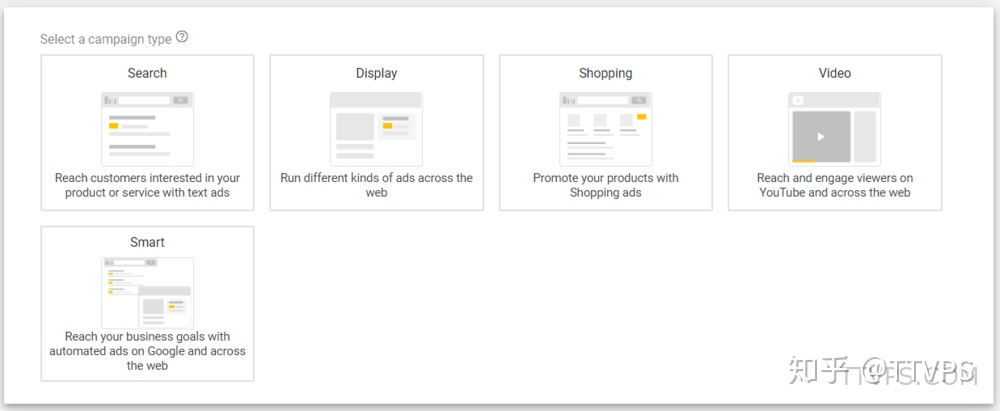

**Search engine optimization** (SEO) 

**Campaign广告系列**

Campaign直译为“活动”，即一个广告系列。实际操作中可设置为一个网站对应一个Campaign，或者一类商品对应一个Campaign。

广告的每日预算，目标位置，语言选择等都在campaign中进行设置。其下所有的Ads Group都共享这些属性。

**Campaign的类型**

#### 投放广告

商家准备：goal（想要做什么类型的广告）；message（商品/产品信息）；keywords（关键词，和搜索匹配的）；location（投放地址）；bueget（预算）

- Goal

[Set goal]

Business name

落地页

- 1、**确保设计简单**，不要将一堆的视频，动画，炫酷设计填充到页面，那样将会耗费大量的时间来加载页面，导致用户体验极差。
- 2、**确保标题突出并且有力**，标题是用户打开网页第一眼看到的信息，决定了用户是否有兴趣读其他内容。
- 3、**文案清晰**，不要视图用复杂的词汇让用户迷惑，像平常说话一样写文案，仅可能简洁明了。
- 4、**使用要点并结合图片和其他视觉元素，但不要过量**。这些信息存在的前提是可以辅助访问者更好的明白你的意思，而不仅仅是为了抓住眼球。

write the Ads

- Keywords

- 1、Broad 广泛匹配，相关即匹配。
- 2、Phrase 词组匹配，词组包含即匹配。
- 3、Exact 准确匹配，完全一致才匹配。

- Localization

With zip code, cities, regions

- Budget

#### 账号维护

- 1、找出哪些具有潜力的关键词，并加入到你的campaign中。
- 2、找出哪些不符合我们要求的关键词，加入到negative keyword中，不让他们再出现。
- 3、检查你的广告展示位置，如果一直处于第一位，那么可以适当调低一些bid价格，反之，如果位置在3-4位，那么适当调高一些bid，以获取更好的位置。
- 4、创建更多的广告，不断改变一些参数进行测试（如时间段，目标国家等），理想情况下，可以获得8%以上的CTR点击率，当然这个数据非常惊人了，毕竟平均的CTR才1%。

专有词汇：

### Google Display Network (GDN)

The GDN is Google’s network of sites and apps. **Google has agreements with millions of websites and applications**, wherein the site receives revenue for allowing Google to advertise there. The GDN is where your display ads appear to users throughout the internet.

### Retargeting

This is the practice of showing your ads to users who have previously visited your site, and are now being shown the ads in your display campaign through cookie tracking.

### Audiences

Your audiences are built by you, to tell Google which users you want to show your ads to. There are a few types of audiences:

#### In-market

Pretty straightforward. A user had broken their normal behavior online, sending a signal to Google saying “I’m in the market for something”

#### Affinity

These audiences are people who have a predisposed interest in your product or service, like “landscaping” or “video production”

#### Custom intent

These audiences are defined by you, the ads manager. They usually consist of giving Google some specific webpages and saying: *“Show an ad to everyone that has been to one of these pages.”* 

### Bid modifications

Bid modifications allow you to automatically adjust your bids if/when certain conditions are met. Some advertisers like to bid up on mobile devices, or on certain aspects of the audiences that they’ve built.

### Placements

Where you tell Google you want you ads to show.

OK, now that you've got those terms jangling around in the ol' noggin, let's talk about Google display ads.

Ref：

1. [Google Ads](https://ads.google.com/home/#!/step/2?substep=5)
2. [Procedure](https://zhuanlan.zhihu.com/p/76964972)
3. [Step](https://ads.google.com/home/how-it-works/)
4. [SEO](https://zhuanlan.zhihu.com/p/404100405)
5. [Zhihu AdWords](https://www.zhihu.com/topic/19582245/top-answers)
6. [Display Ads](https://ads.google.com/home/campaigns/display-ads/)
7. [Display Ads blog](https://blog.google/products/ads-commerce/display-campaigns-made-easy/)
8. [Display Ads Intro](https://www.wordstream.com/blog/ws/2019/05/23/google-display-ads)
9. [Display Ads Intro 2](https://www.impactplus.com/blog/what-are-google-display-ads)
10. [How to use Google Ads](https://support.google.com/google-ads/answer/172627?hl=en)
11. [New Campaign](https://ads.google.com/home/campaigns/display-ads/#!#%3Fmodal_active=none)
12. [When to use](https://support.google.com/google-ads/answer/7020281?hl=en)
13. [Google Ads Help](https://support.google.com/google-ads/?hl=en#topic=9803759)

