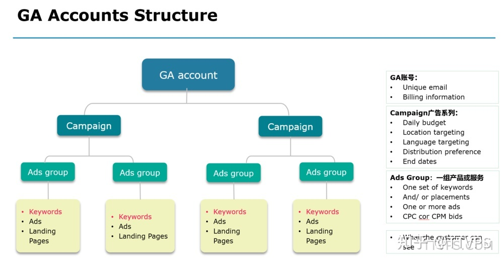

**Search engine optimization** (SEO) 

**Campaign广告系列**

Campaign直译为“活动”，即一个广告系列。实际操作中可设置为一个网站对应一个Campaign，或者一类商品对应一个Campaign。

广告的每日预算，目标位置，语言选择等都在campaign中进行设置。其下所有的Ads Group都共享这些属性。

**Campaign的类型**

#### 投放广告

商家准备：goal（想要做什么类型的广告）；message（商品/产品信息）；keywords（关键词，和搜索匹配的）；location（投放地址）；bueget（预算）

- Goal

[Set goal]

Business name

落地页

- 1、**确保设计简单**，不要将一堆的视频，动画，炫酷设计填充到页面，那样将会耗费大量的时间来加载页面，导致用户体验极差。
- 2、**确保标题突出并且有力**，标题是用户打开网页第一眼看到的信息，决定了用户是否有兴趣读其他内容。
- 3、**文案清晰**，不要视图用复杂的词汇让用户迷惑，像平常说话一样写文案，仅可能简洁明了。
- 4、**使用要点并结合图片和其他视觉元素，但不要过量**。这些信息存在的前提是可以辅助访问者更好的明白你的意思，而不仅仅是为了抓住眼球。

write the Ads

- Keywords

- 1、Broad 广泛匹配，相关即匹配。
- 2、Phrase 词组匹配，词组包含即匹配。
- 3、Exact 准确匹配，完全一致才匹配。

- Localization

With zip code, cities, regions

- Budget

#### 账号维护

- 1、找出哪些具有潜力的关键词，并加入到你的campaign中。
- 2、找出哪些不符合我们要求的关键词，加入到negative keyword中，不让他们再出现。
- 3、检查你的广告展示位置，如果一直处于第一位，那么可以适当调低一些bid价格，反之，如果位置在3-4位，那么适当调高一些bid，以获取更好的位置。
- 4、创建更多的广告，不断改变一些参数进行测试（如时间段，目标国家等），理想情况下，可以获得8%以上的CTR点击率，当然这个数据非常惊人了，毕竟平均的CTR才1%。

Ref：

1. [Google Ads](https://ads.google.com/home/#!/step/2?substep=5)
2. [Procedure](https://zhuanlan.zhihu.com/p/76964972)
3. [Step](https://ads.google.com/home/how-it-works/)