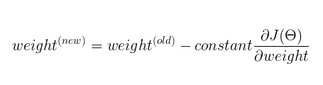
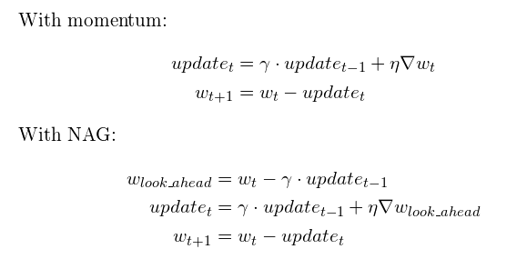

### definition

**Gradient descent** is a [first-order](https://en.wikipedia.org/wiki/Category:First_order_methods) [iterative](https://en.wikipedia.org/wiki/Iterative_algorithm) [optimization](https://en.wikipedia.org/wiki/Mathematical_optimization) [algorithm](https://en.wikipedia.org/wiki/Algorithm) for finding a [local minimum](https://en.wikipedia.org/wiki/Local_minimum) of a [differentiable function](https://en.wikipedia.org/wiki/Differentiable_function). The idea is to take repeated steps in the opposite direction of the [gradient](https://en.wikipedia.org/wiki/Gradient) (or approximate gradient) of the function at the current point, because this is the direction of steepest descent. Conversely, stepping in the direction of the gradient will lead to a [local maximum](https://en.wikipedia.org/wiki/Local_maximum) of that function; the procedure is then known as **gradient ascent**.

In optimization, if the function is convex, there is closed form solution. Like least square solution. But for some complex non-convex function, to find the potenail max/min state, we must use some iterative methods.

### type

#### Momentum Based Gradient Descent

In order to avoid drawbacks of vanilla Gradient Descent, we introduced momentum based Gradient Descent where the goal is to lower the computation time and that can be achieved when we introduce the concept of experience i.e. the confidence using previous steps.

#### Nesterov Accelerated Gradient Descent(NAG)

Nesterov accelerated Gradient(NAG) is a way to provide history to our momentum. 

Other GD methods like: Adam, RMSprop, Adadelta, AdaGrad. See ref 3. 

### strategy

- Stochastic Gradient Descent. Shuffle training data & partition training data into m examples. Adv: easy; efficient; but noisy.
- Batch gradient descent: sum all. Less noisy; produce stable convergence. Compuational high.
- Mini-batch: easy to fit; stable.

Ref:

1. [Gradient descent](https://en.wikipedia.org/wiki/Gradient_descent)
2. [More clear definition](https://towardsdatascience.com/gradient-descent-explained-9b953fc0d2c)
3. [Summary of all gradient descent](https://zhuanlan.zhihu.com/p/81048198)