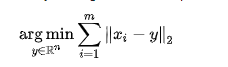
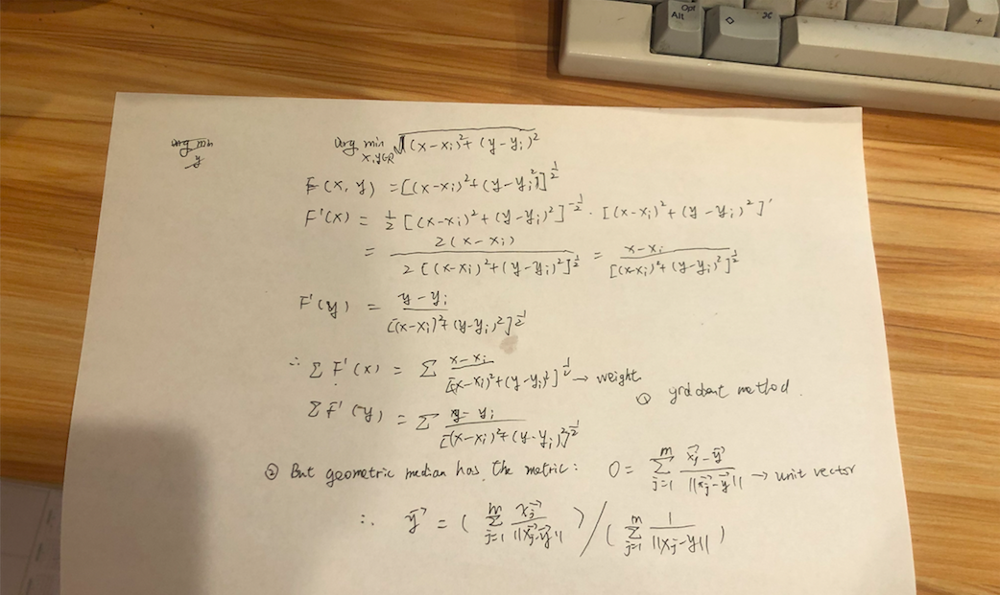

### definition

The **geometric median** of a discrete set of sample points in a [Euclidean space](https://en.wikipedia.org/wiki/Euclidean_space) is the point minimizing the sum of distances to the sample points. This generalizes the [median](https://en.wikipedia.org/wiki/Median), which has the property of minimizing the sum of distances for one-dimensional data, and provides a [central tendency](https://en.wikipedia.org/wiki/Central_tendency) in higher dimensions. It is also known as the **1-median**,[[1\]](https://en.wikipedia.org/wiki/Geometric_median#cite_note-1) **spatial median**,[[2\]](https://en.wikipedia.org/wiki/Geometric_median#cite_note-dksw-2) **Euclidean minisum point**,[[2\]](https://en.wikipedia.org/wiki/Geometric_median#cite_note-dksw-2) or **Torricelli point**.

### calculate

**Ref:**

1. [Wiki of GM](https://en.wikipedia.org/wiki/Geometric_median)

2. [Code](http://yuchenspace.info/geometry/)

   