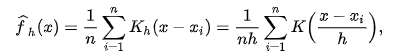
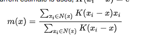

### definition

**kernel density estimation** (**KDE**) is a [non-parametric](https://en.wikipedia.org/wiki/Non-parametric_statistics) way to [estimate](https://en.wikipedia.org/wiki/Density_estimation) the [probability density function](https://en.wikipedia.org/wiki/Probability_density_function) of a [random variable](https://en.wikipedia.org/wiki/Random_variable). Kernel density estimation is a fundamental data smoothing problem where inferences about the [population](https://en.wikipedia.org/wiki/Statistical_population) are made, based on a finite data [sample](https://en.wikipedia.org/wiki/Statistical_sample). In some fields such as [signal processing](https://en.wikipedia.org/wiki/Signal_processing) and [econometrics](https://en.wikipedia.org/wiki/Econometrics) it is also termed the **Parzen–Rosenblatt window** method, after [Emanuel Parzen](https://en.wikipedia.org/wiki/Emanuel_Parzen) and [Murray Rosenblatt](https://en.wikipedia.org/wiki/Murray_Rosenblatt), who are usually credited with independently creating it in its current form.[[1\]](https://en.wikipedia.org/wiki/Kernel_density_estimation#cite_note-Ros1956-1)[[2\]](https://en.wikipedia.org/wiki/Kernel_density_estimation#cite_note-Par1962-2) One of the famous applications of kernel density estimation is in estimating the class-conditional marginal densities of data when using a [naive Bayes classifier](https://en.wikipedia.org/wiki/Naive_Bayes_classifier),[[3\]](https://en.wikipedia.org/wiki/Kernel_density_estimation#cite_note-:0-3)[[4\]](https://en.wikipedia.org/wiki/Kernel_density_estimation#cite_note-4) which can improve its prediction accuracy.[[3\]](https://en.wikipedia.org/wiki/Kernel_density_estimation#cite_note-:0-3)

where *K* is the [kernel](https://en.wikipedia.org/wiki/Kernel_(statistics)#In_non-parametric_statistics) — a non-negative function — and *h* > 0 is a [smoothing](https://en.wikipedia.org/wiki/Smoothing) parameter called the *bandwidth*. A kernel with subscript *h* is called the *scaled kernel* and defined as *Kh*(*x*) = 1/*h K*(*x*/*h*). Intuitively one wants to choose *h* as small as the data will allow; however, there is always a trade-off between the bias of the estimator and its variance. The choice of bandwidth is discussed in more detail below.

How to calculate KDE faster? With KD tree.

### find maximum in KDE

mean-shift: using the mean of window in the selected aread, and with kernel function. To find the local maximum.

 

### summay 

To fetch a distribution from samples, we can use paramter model estimation & non-paramter model estimation. For the param model, we have generative model(MLE) & discriminative model(MAP). 

KDE is a kind of the non-parameter model, if we could find the model is not easy for use to construct the model. 

**Ref:**

1. [KDE](https://en.wikipedia.org/wiki/Kernel_density_estimation)
2. [Kernel choosing](https://en.wikipedia.org/wiki/Kernel_(statistics)#Kernel_functions_in_common_use)
3. [discriminative model](https://en.wikipedia.org/wiki/Discriminative_model)
4. [mean-shift](https://en.wikipedia.org/wiki/Mean_shift)

