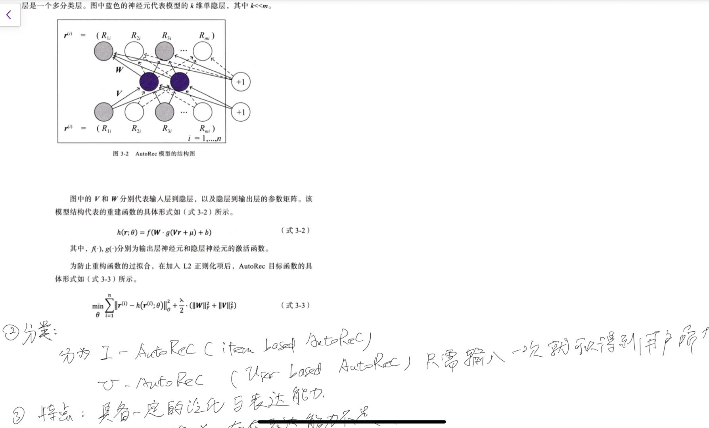
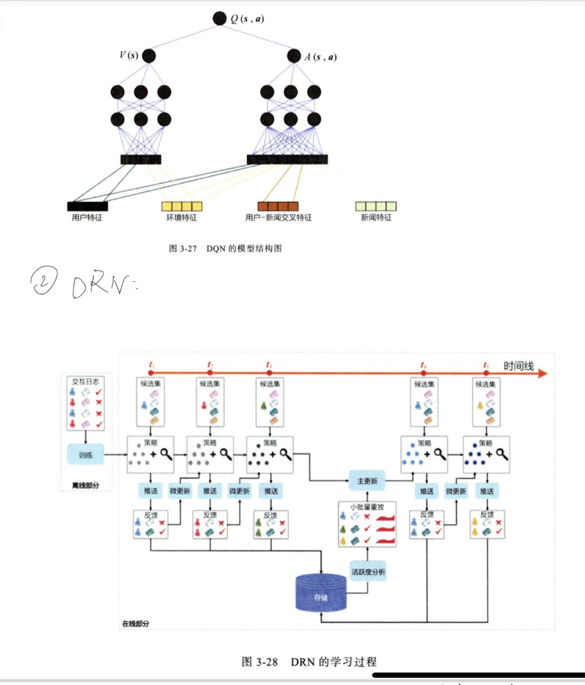

#### 点评

这本书可以说是概述了推荐系统的历史，尤其是深度学习在推荐系统上的应用。需要对推荐的业务具有很深刻的理解，同时对于用户心理需要很好的把握。才能把很多特征进行提取融合~

同时，这个领域需要对大数据处理的工具比较熟练，大数据的处理，以及大数据的训练，非常让人激动的事情。需要对algorithm & infra具有比较好的掌握。

#### 摘录

最好从实际问题和需求出发，来进行算法革新。算法系统协同设计是需要的，需要进行革新。比如对于粗排的更新，使用蒸馏的模型，而不是原先的LR、FM这些。

#### 为什么推荐系统是互联网增长的引擎

#### 传统方法

#### 深度学习

#### Embedding

#### Ref

> Deep Neural Networks for Youtube Recommendaers

> Using Collaborative filtering to weave an information tapestry

> Amazon.com Recommenders: item-to-item collaborative filtering

> Matrix factorization techniques for recommender systems

> Factorization machine

> Field-aware factorization machines for CTR prediction

> Practical lessons from predicting clicks on Ads at Facebook

> Learning piece-wise linear 

