### Particle filter intro

The state estimation filtering will use the KF, PF, memberfship fitlers to fix like below.

 

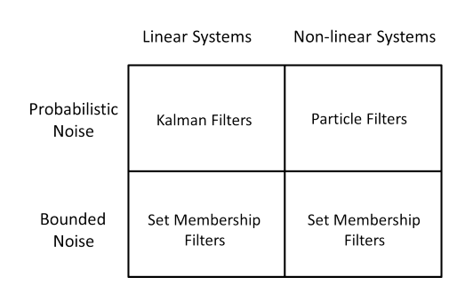

PF could be used in both linear system and non-linear system. For the linear system, it required that:

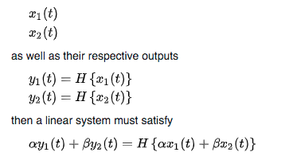

Why PF? Most of systems are non-linear, and Gaussian noise will be violated sometimes. PF uses the Monte Carlo methods to simulate the samples, according to the large number theory, as particles get large, the empirical distribution gets close to the true distribution.

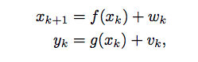

### Steps

x: state variable; u: inputs; z: observations; d: data.

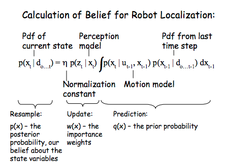

- Prediction:  

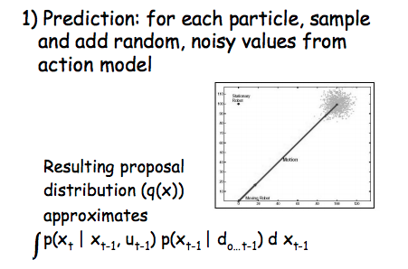

- Update:

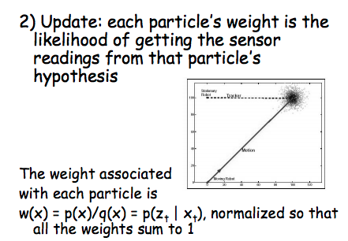

- Resample: sample importance sampling. (particle deletion; high probability in MAP not represent well; density could not represent the real pdf) Importance resampling. poster / prior with observation model. 

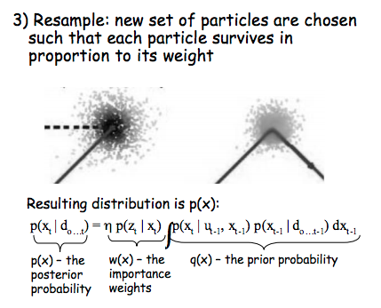

- Output estimate state

This process could be wrote as:

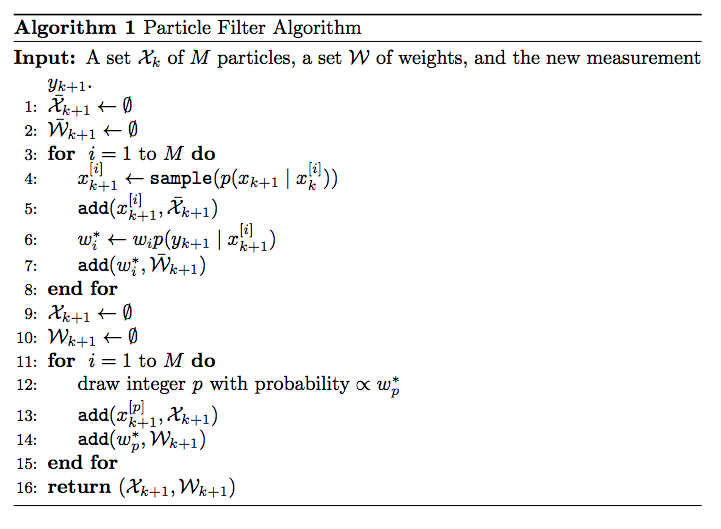

Improve: **Rao-Blackwellised Particle Filter**

The aim of Rao-Blackwellised Particle Filtering is to find an estimator of the conditional distribution  such that less particles will be required to reach the same accuracy as a typical particle filter. 

split the posterior probability into two sets, one could be calculated by closed form(margin probability accumlated) and other could be calculated by the PF.

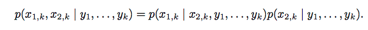

### Application

- Monte Carlo Localization in ref. 4.

- [Realtime Monte Carlo Localization](https://papers.nips.cc/paper/2002/file/2d2ca7eedf739ef4c3800713ec482e1a-Paper.pdf)

  

### Summary

1. Why PF? Advantage & disadvantages.
2. How to do with PF?
3. Improve of PF?

### Histogram filter

Another non-parameter method, and using the grid to represent the state. The formula very similar to PF.

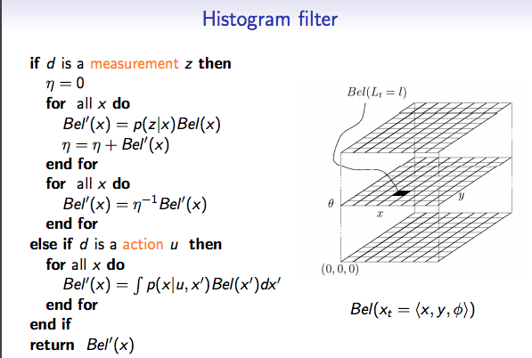

More state estimation with parametric filters are:

[KF & EKF](https://calvinfeng.gitbook.io/probabilistic-robotics/basics/recursive-state-estimation) and [summary](https://asa.scitation.org/doi/pdf/10.1121/1.3292596)

KL divergence: Consider two probability distributions  and . Usually,  represents the data, the observations, or a probability distribution precisely measured. Distribution represents instead a theory, a model, a description or an approximation of . The Kullback–Leibler divergence is then interpreted as the average difference of the number of bits required for encoding samples of  using a code optimized for  rather than one optimized for .  To measure the observe distribute P is similar to guess Q. Is the same as cross entropy in [wiki](https://en.wikipedia.org/wiki/Kullback%E2%80%93Leibler_divergence).

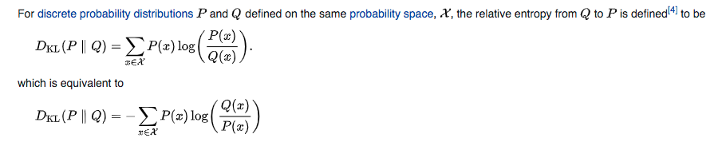

KLD sample:

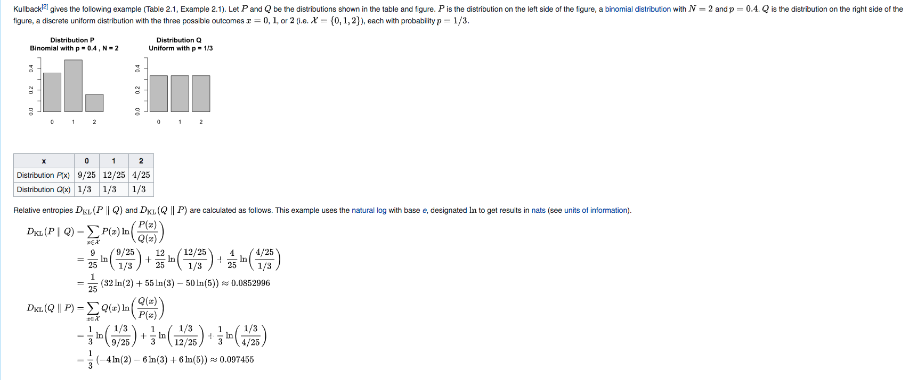

With relationship with cross-entropy:

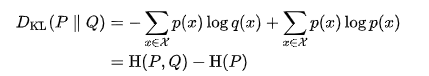

**Ref:**

1. [State Estimation Summary](https://www.seas.upenn.edu/~rivanov/opub/wpe.pdf)

2. [Linear System](https://en.wikipedia.org/wiki/Linear_system#:~:text=In%20systems%20theory%2C%20a%20linear,simpler%20than%20the%20nonlinear%20case.)

3. [MIT particle filter PF and application](https://web.mit.edu/16.412j/www/html/Advanced%20lectures/Slides/Hsaio_plinval_miller_ParticleFiltersPrint.pdf)

4. [Monte Carlo Localization](https://rse-lab.cs.washington.edu/projects/mcl/ )

5. [Real-time PF](Real-time Particle Filters)

6. [Rao-Blackwellised PF](https://wiki.ubc.ca/Course:CPSC522/Rao_Blackwellized_Particle_Filtering#Rao_Blackwellized_Particle_Filtering_for_Grid_Mapping)

7. [Histogram filter](https://calvinfeng.gitbook.io/probabilistic-robotics/basics/nonparametric-filters/01-histogram-filter)

8. [HF2](https://calvinfeng.gitbook.io/probabilistic-robotics/basics/nonparametric-filters/01-histogram-filter)

   